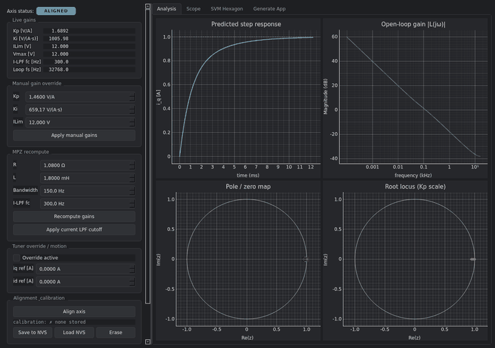

# espFoC

Field Oriented Control (FOC) library for PMSM / BLDC motors on the
ESP32 family, built on ESP-IDF.


[](https://opensource.org/licenses/MIT)


espFoC covers the inner control chain: inverter drive, current
sensing, rotor feedback and the Id/Iq torque loop. Velocity and
position loops live in the application's regulation callback; the
library stays focused and the hot path runs without floating-point
math. Gains can be synthesised at build time, retuned live from the
firmware API, persisted to NVS, or dialled in interactively through
the bundled TunerStudio GUI.

Targets: ESP32, **ESP32-C6**, ESP32-S3, ESP32-P4 (ESP-IDF v5+). The
reference bring-up target is **ESP32-C6** (fixed-point hot path sized for
smaller MCUs).

> **3.0 is a breaking release.** The legacy continuous-time PI
> formula and the `motor_resistance / motor_inductance / motor_inertia`
> fields are gone — gains come from the build-time autotuner or the
> runtime tuner. The 3-PWM LEDC driver was also dropped. The former
> `esp_foc_controls.h` tunables are Kconfig options (`CONFIG_ESP_FOC_LOW_SPEED_DOWNSAMPLING`,
> `CONFIG_ESP_FOC_ISENSOR_CALIBRATION_ROUNDS`). The motor regulation callback
> is three arguments only (`id_ref`, `iq_ref`). See [`changelog.txt`](changelog.txt) for
> the full migration list.

---

## Install

Via the IDF component registry:

```bash
idf.py add-dependency "ulipe/espfoc^3.0.0"
```

Or clone the repo and add it to your project:

```cmake
set(EXTRA_COMPONENT_DIRS "path/to/espFoC")
```

Then pick an example as a starting point:

```bash
cd examples/axis_tuning
idf.py set-target esp32c6    # reference target (UART bridge)
idf.py build flash monitor
```

Also supported: `esp32s3` (UART), `esp32p4` (USB-CDC via TinyUSB).

---

## Architecture


Each axis owns one inverter, one rotor sensor and (optionally) one
current sensor. You implement a **regulation callback** that updates
`id_ref` / `iq_ref` each outer-loop tick; espFoC runs Clarke/Park, the
current PIs, inverse Park, SVPWM and PWM updates. The inner current loop
and modulation run in the **PWM ISR** at carrier frequency; a dedicated
task reads the encoder (~2 kHz by default) and feeds an **encoder PLL**
(`esp_foc_estimator_q16`) that integrates mechanical angle at **PWM rate**
(20 kHz). Only the PWM ISR writes `rotor_elec_angle`; your regulation
callback runs on the slow task at roughly **PWM rate ÷
`CONFIG_ESP_FOC_LOW_SPEED_DOWNSAMPLING`** (see *espFoC Settings → Control
loop* in `menuconfig`). Platform primitives (tasks, critical sections,
timers) go through **`include/espFoC/osal/os_interface.h`** so motor code
does not depend on FreeRTOS headers.

Inverter and rotor drivers are pluggable:

- Inverters: 3-PWM MCPWM, 6-PWM MCPWM (hardware dead-time).
- Rotor sensors: AS5600, AS5048A, quadrature via PCNT, simulated rotor (`rotor_sensor_simu` + optional `rotor_sensor_simu_wire_ud_uq` for open-loop bring-up).
- Current sensing: ADC shunt (continuous or one-shot).

---

## Tuning



espFoC ships with **TunerStudio**, a PySide6 + pyqtgraph desktop app
that speaks the runtime tuner protocol over UART or USB-CDC. In a
single window you get:

- live axis state and gain readout with in-place editing;
- one-click rotor alignment with auto-detected natural direction;
- align / run / stop lifecycle and store / erase calibration to NVS;
- predicted step response, Bode, pole-zero and root-locus plots;
- firmware scope stream with per-channel colour, toggle and cursor;
- SVPWM hexagon with the three phase projections and the resultant
  voltage vector rotating as the motor is driven.

### Launch TunerStudio

```bash
pip install -r tools/espfoc_studio/requirements.txt
PYTHONPATH=tools python3 -m espfoc_studio.gui --port /dev/ttyACM0
```

### Talk to a real target

**`axis_tuning`** is the reference bring-up firmware: it boots, auto-loads
NVS calibration when present, attaches the tuner, and waits for the host
(`align` → `run` → tune → `store` → `stop`). It advertises `TSGX` for host
identification.

```bash
cd examples/axis_tuning
idf.py set-target esp32c6    # reference target (UART; sdkconfig.defaults.esp32c6)
idf.py menuconfig            # pin map + AS5600 vs rotor_sensor_simu
idf.py build flash monitor
```

On ESP32-S3, use `idf.py set-target esp32s3`. On ESP32-P4, USB-CDC via
`sdkconfig.defaults.esp32p4`.

For your own firmware, enable a transport bridge in `menuconfig`
(`CONFIG_ESP_FOC_BRIDGE_UART` or `CONFIG_ESP_FOC_BRIDGE_USBCDC`) and set
`CONFIG_ESP_FOC_TUNER_ENABLE=y`.

Then:

```bash
PYTHONPATH=tools python3 -m espfoc_studio.gui --port /dev/ttyACM0
```

### Scripted tuning

A companion CLI (`tunerctl`) drives align, run, stop, gain writes,
target id/iq, store, and erase from scripts. Details in
[`doc/TUNING.md`](doc/TUNING.md).

---

## Minimal example

Encoder-based current mode with a 6-PWM MCPWM inverter, an AS5600 encoder
and an ADC shunt. PI gains default to bypass at init; NVS or the runtime
tuner can supply tuned values.

The snippet below is **illustrative** (placeholders for pins and ADC
config will not compile until you fill them in). For a **complete,
buildable** wiring and init sequence, use
[`examples/axis_tuning/main/main.c`](examples/axis_tuning/main/main.c).

```c
#include "esp_log.h"
#include "esp_err.h"
#include "espFoC/inverter_6pwm_mcpwm.h"
#include "espFoC/current_sensor_adc.h"
#include "espFoC/rotor_sensor_as5600.h"
#include "espFoC/esp_foc.h"
#include "espFoC/utils/esp_foc_q16.h"

static esp_foc_axis_t axis;
static esp_foc_motor_control_settings_t settings = {
    .motor_pole_pairs  = 4,
    .natural_direction = ESP_FOC_MOTOR_NATURAL_DIRECTION_CW,
    .motor_unit        = 0,
};

static void regulation_callback(esp_foc_axis_t *axis_cb,
                                esp_foc_d_current_q16_t *id_ref,
                                esp_foc_q_current_q16_t *iq_ref)
{
    (void)axis_cb;
    id_ref->raw = 0;
    iq_ref->raw = q16_from_float(2.0f);
}

void app_main(void)
{
    esp_foc_inverter_t     *inv    = inverter_6pwm_mpcwm_new(/* pins... */);
    esp_foc_rotor_sensor_t *rotor  = rotor_sensor_as5600_new(/* i2c... */);
    esp_foc_isensor_t      *shunts = /* ... ADC shunt config ... */;

    esp_foc_initialize_axis(&axis, inv, rotor, shunts, settings);
    esp_foc_align_axis(&axis);
    esp_foc_run(&axis);
    esp_foc_set_regulation_callback(&axis, regulation_callback);
}
```

At init, shunt calibration uses **`CONFIG_ESP_FOC_ISENSOR_CALIBRATION_ROUNDS`**
averages (same *Control loop* menu as downsampling).

---

## Examples

- `examples/axis_tuning` — reference firmware for live tuning (tuner +
  scope + NVS; AS5600 or `rotor_sensor_simu`).
- `examples/unit_test_runner` — Unity suite for CI / QEMU.
- `examples/test_drivers` — inverter / encoder / shunt bring-up.

---

## Numerical format

Q16.16 fixed-point (`q16_t`) is used everywhere in the hot path:
currents, voltages, angles, PID, filters, SVPWM. A Q1.31 (IQ31) LUT
backs sin/cos for Park transforms. Float is reserved for setup-time
conversions via `q16_from_float()` / `q16_to_float()`; the control
loop contains no floating-point operations.

---

## Repository layout

```
espFoC/
├── doc/
│   ├── images/         # architecture, TunerStudio screenshot, demo gif
│   └── TUNING.md       # deep dive: autogen, runtime API, protocol, CLI
├── examples/           # axis_tuning / unit_test_runner / test_drivers
├── include/espFoC/     # public API
├── scripts/
│   └── motors/*.json   # motor profiles consumed by the autotuner
├── source/
│   ├── calibration/    # NVS calibration format and axis helpers
│   ├── drivers/        # inverters, encoders, shunts, tuner bridges
│   ├── gui_link/       # binary link codec, scope, tuner reactor
│   ├── motor_control/  # axis core (FOC ISR + slow loop), MPZ, Q16 helpers
│   └── osal/           # OS abstraction (tasks, critical sections, esp_timer)
├── test/               # Unity unit tests (run via examples/unit_test_runner)
└── tools/espfoc_studio # PySide6 + pyqtgraph GUI, CLI, host protocol
```

---

## Changelog

Per-release notes live in [`changelog.txt`](changelog.txt) (consumed
by the GitHub release notes generator).

---

## License

MIT — see `LICENSE`.

## Contributing

Issues, feature requests and pull requests are welcome.

Maintainer: **Felipe Neves** — `ryukokki.felipe@gmail.com`
