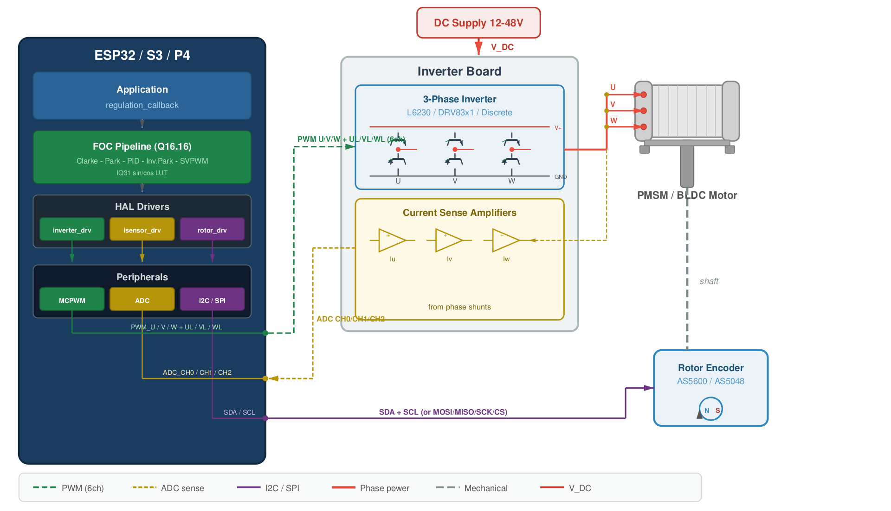
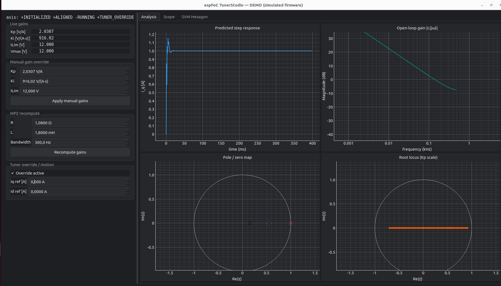

# espFoC

Field Oriented Control (FOC) library for PMSM / BLDC motors on the
ESP32 family, built on ESP-IDF.


[](https://opensource.org/licenses/MIT)


espFoC covers the inner control chain: inverter drive, current
sensing, rotor feedback and the Id/Iq torque loop. Velocity and
position loops live in the application's regulation callback; the
library stays focused and the hot path runs without floating-point
math. Gains can be synthesised at build time, retuned live from the
firmware API, persisted to NVS, or dialled in interactively through
the bundled TunerStudio GUI.

Targets: ESP32, ESP32-S3, ESP32-P4 (ESP-IDF v5+).

> **3.0 is a breaking release.** The legacy continuous-time PI
> formula and the `motor_resistance / motor_inductance / motor_inertia`
> fields are gone — gains come from the build-time autotuner or the
> runtime tuner. The 3-PWM LEDC driver and the WIP `axis_sensorless`
> example were also dropped. See [`changelog.txt`](changelog.txt) for
> the full migration list.

---

## Install

Via the IDF component registry:

```bash
idf.py add-dependency "ulipe/espfoc^2.0.0"
```

Or clone the repo and add it to your project:

```cmake
set(EXTRA_COMPONENT_DIRS "path/to/espFoC")
```

Then pick an example as a starting point:

```bash
cd examples/axis_sensored
idf.py set-target esp32s3
idf.py build flash monitor
```

---

## Architecture



Each axis owns one inverter, one rotor sensor and (optionally) one
current sensor. The application sets Id/Iq references in a
regulation callback; espFoC handles Clarke/Park transforms, the PI
current loop, SVPWM modulation and the PWM duty outputs. Control
timing is driven by the PWM peripheral — the ADC samples are
PWM-synchronised and the Id/Iq loop runs in a deterministic task.

Inverter and rotor drivers are pluggable:

- Inverters: 3-PWM MCPWM, 6-PWM MCPWM (hardware dead-time).
- Rotor sensors: AS5600, AS5048A, quadrature via PCNT, open-loop.
- Current sensing: ADC shunt (continuous or one-shot).

---

## Tuning



espFoC ships with **TunerStudio**, a PySide6 + pyqtgraph desktop app
that speaks the runtime tuner protocol over UART or USB-CDC. In a
single window you get:

- live axis state and gain readout with in-place editing;
- MPZ recompute from motor R/L/bandwidth on the fly;
- one-click rotor alignment with auto-detected natural direction;
- save / load / erase calibration to NVS so the next boot comes up
  already tuned;
- predicted step response, Bode, pole-zero and root-locus plots;
- firmware scope stream with per-channel colour, toggle and cursor;
- SVPWM hexagon with the three phase projections and the resultant
  voltage vector rotating as the motor is driven;
- a Hardware tab plus a Generate App tab that turn the live tuning
  state into a ready-to-build IDF project for production.

### Try it without hardware

```bash
pip install -r tools/espfoc_studio/requirements.txt
PYTHONPATH=tools python3 -m espfoc_studio.gui --demo
```

`--demo` embeds a simulated firmware so the whole pipeline — tuner
protocol, scope stream, hexagon — exercises end-to-end with zero
boards attached.

### Talk to a real target

Two paths:

1. **`tuner_studio_target` (recommended for bring-up).** A dedicated
   service-mode firmware that boots, parks the motor, and waits for
   the GUI. Advertises a `TSGX` firmware-type so the Generate App tab
   lights up automatically.

   ```bash
   cd examples/tuner_studio_target
   idf.py set-target esp32s3        # USB-CDC default
   idf.py menuconfig                # adjust the pin map
   idf.py build flash monitor
   ```

2. **Your own firmware.** Enable a transport bridge in `menuconfig`
   (`CONFIG_ESP_FOC_BRIDGE_UART` for plain ESP32,
   `CONFIG_ESP_FOC_BRIDGE_USBCDC` for S2/S3/P4) and set
   `CONFIG_ESP_FOC_TUNER_ENABLE=y`.

Then:

```bash
PYTHONPATH=tools python3 -m espfoc_studio.gui --port /dev/ttyACM0
```

### Scripted tuning

A companion CLI (`tunerctl`) lets you drive the same protocol from
scripts and CI jobs. Build-time autotuning from motor profiles, the
runtime C API, the wire-level protocol and the CLI commands are
covered in [`doc/TUNING.md`](doc/TUNING.md).

---

## Minimal example

Sensored current mode with a 6-PWM MCPWM inverter, an AS5600 encoder
and an ADC shunt. PI gains come from the build-time autotuner for the
motor profile selected via `CONFIG_ESP_FOC_MOTOR_PROFILE`; the runtime
tuner / TunerStudio can rewrite them later.

```c
#include "esp_log.h"
#include "esp_err.h"
#include "espFoC/inverter_6pwm_mcpwm.h"
#include "espFoC/current_sensor_adc.h"
#include "espFoC/rotor_sensor_as5600.h"
#include "espFoC/esp_foc.h"
#include "espFoC/utils/esp_foc_q16.h"

static esp_foc_axis_t axis;
static esp_foc_motor_control_settings_t settings = {
    .motor_pole_pairs  = 4,
    .natural_direction = ESP_FOC_MOTOR_NATURAL_DIRECTION_CW,
    .motor_unit        = 0,
};

static void regulation_callback(esp_foc_axis_t *axis_cb,
                                esp_foc_d_current_q16_t *id_ref,
                                esp_foc_q_current_q16_t *iq_ref,
                                esp_foc_d_voltage_q16_t *ud_ff,
                                esp_foc_q_voltage_q16_t *uq_ff)
{
    (void)axis_cb;
    ud_ff->raw = 0;
    uq_ff->raw = 0;
    id_ref->raw = 0;
    iq_ref->raw = q16_from_float(2.0f);
}

void app_main(void)
{
    esp_foc_inverter_t     *inv    = inverter_6pwm_mpcwm_new(/* pins... */);
    esp_foc_rotor_sensor_t *rotor  = rotor_sensor_as5600_new(/* i2c... */);
    esp_foc_isensor_t      *shunts = /* ... ADC shunt config ... */;

    esp_foc_initialize_axis(&axis, inv, rotor, shunts, settings);
    esp_foc_align_axis(&axis);
    esp_foc_run(&axis);
    esp_foc_set_regulation_callback(&axis, regulation_callback);
}
```

---

## Examples

- `examples/axis_sensored` — reference bring-up (sensored current mode).
- `examples/tuner_studio_target` — service-mode firmware for live
  tuning + Generate App.
- `examples/tuner_demo` — runs in QEMU, exercises autogen gains,
  runtime retune, the tuner protocol and signal injection.
- `examples/unit_test_runner` — Unity suite for CI / QEMU.
- `examples/test_drivers` — inverter / encoder / shunt bring-up.

---

## Numerical format

Q16.16 fixed-point (`q16_t`) is used everywhere in the hot path:
currents, voltages, angles, PID, filters, SVPWM. A Q1.31 (IQ31) LUT
backs sin/cos and the observers. Float is reserved for setup-time
conversions via `q16_from_float()` / `q16_to_float()`; the control
loop contains no floating-point operations.

---

## Repository layout

```
espFoC/
├── doc/
│   ├── images/         # architecture, TunerStudio screenshot, demo gif
│   └── TUNING.md       # deep dive: autogen, runtime API, protocol, CLI
├── examples/           # axis_sensored / tuner_studio_target /
│                       # tuner_demo / unit_test_runner / ...
├── include/espFoC/     # public API
├── scripts/
│   ├── gen_pi_gains.py # build-time MPZ autotuner
│   └── motors/*.json   # motor profiles consumed by the autotuner
├── source/
│   ├── drivers/        # platform drivers (inverters, encoders, shunts)
│   ├── motor_control/  # axis core, MPZ design, calibration, tuner,
│   │                   # injection, link codec
│   └── osal/           # OS abstraction
├── test/               # Unity unit tests (run via examples/unit_test_runner)
└── tools/espfoc_studio # PySide6 + pyqtgraph GUI, CLI, codegen, templates
```

---

## Changelog

Per-release notes live in [`changelog.txt`](changelog.txt) (consumed
by the GitHub release notes generator).

---

## License

MIT — see `LICENSE`.

## Contributing

Issues, feature requests and pull requests are welcome.

Maintainer: **Felipe Neves** — `ryukokki.felipe@gmail.com`
