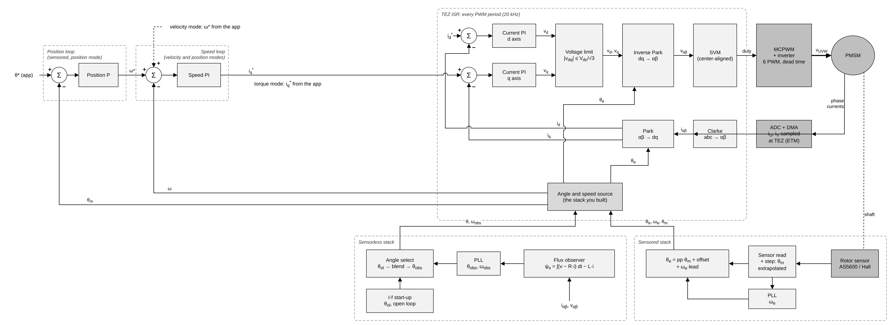
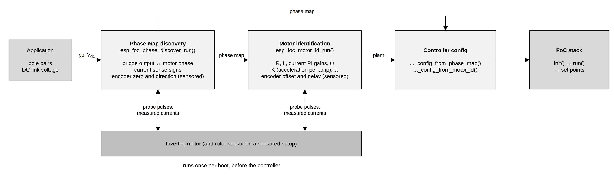
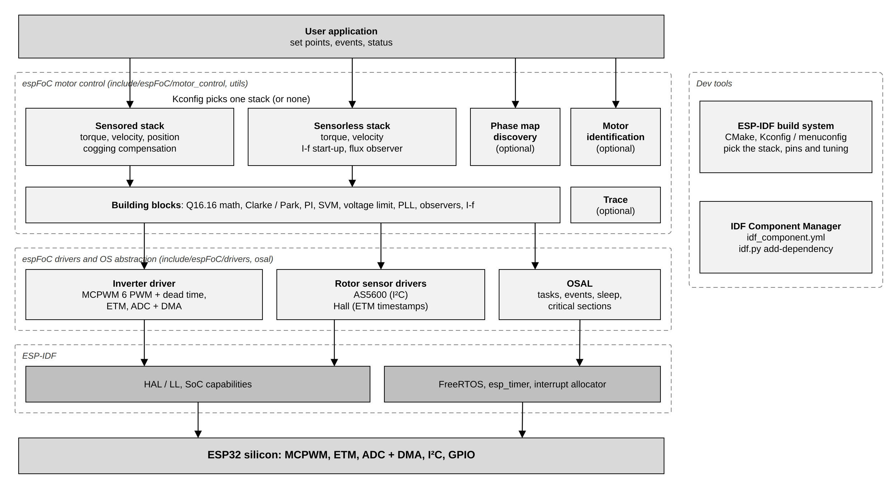
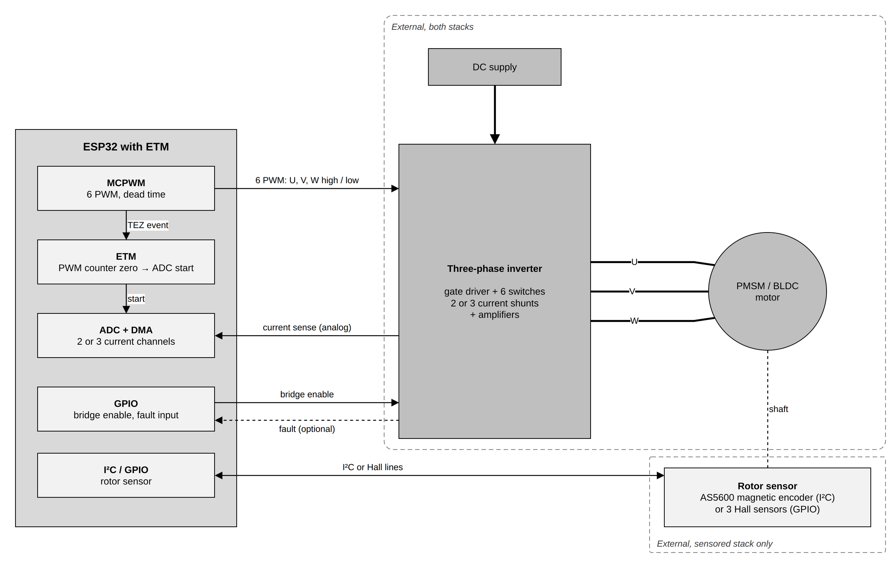

# espFoC

Field-oriented control (FoC) of PMSM and BLDC motors on the ESP32, as an
ESP-IDF component.

espFoC runs the whole FoC current loop in one interrupt per PWM period, in
Q16.16 fixed point, and wraps it in two ready-to-use controllers: a
**sensored** stack that reads a rotor sensor, and a **sensorless** stack that
estimates the rotor angle with a flux observer. Before either one runs, espFoC
can find how the motor is wired and measure the motor's parameters, so a new
motor needs only its pole pairs and the supply voltage.

espFoC is built for the ESP32 chips that have **ETM**, **MCPWM** and an
**ADC with DMA**, and it leans on all three. The MCPWM makes the six
center-aligned PWM outputs with hardware dead time. Its counter-zero event
starts the ADC conversion through the ETM, with no CPU in the path. The DMA
moves the current samples into memory, and the control loop runs in the same
counter-zero interrupt. No conversion is started or polled in software, so the
sampling instant is fixed by hardware and the CPU only does the math.

New to motor control? The [user manual](doc/manual/README.md) starts from
the basics and covers every subsystem in detail.

## Features

| Area | What espFoC provides |
|------|----------------------|
| Sensored stack | Torque, velocity and position control on a rotor sensor. Position mode takes joint samples (position, speed and current feedforward) for smooth trajectories, and can learn and cancel cogging torque. |
| Sensorless stack | Torque and velocity control on a flux observer with a PLL. Automatic start-up: rotor alignment, I-f (or V/f) open-loop spin-up, observer lock and handoff, then the loop runs on the observer angle. Guards for overspeed, lock loss and back EMF. |
| Phase map discovery | Finds which bridge output drives which motor phase and the current sense signs, so the motor leads can go in any order. With a rotor sensor it also zeroes the sensor on the rotor axis and checks its direction. |
| Motor identification | Measures phase resistance, inductance and flux linkage and designs the current loop. With a rotor sensor it also measures acceleration per amp, inertia, and the sensor's angle offset and delay. |
| Inverter driver | MCPWM, 6 complementary center-aligned PWM outputs with dead time, ETM-triggered ADC with DMA, 2 or 3 inline shunts (low-side sensing is not implemented; 3 shunts not yet validated on hardware), bridge enable, optional fault input, current trip. |
| Rotor sensor drivers | AS5600 magnetic encoder over I²C. Hall-effect sensors with ETM-timestamped edges (driver validated on its own; the examples use the AS5600). |
| Real-time design | Q16.16 fixed point on the hot path, hot path placed in IRAM by a linker fragment, no heap in the drivers (static pools), the speed and position loops decimated inside the same interrupt. |
| Portability | Common code talks to the chip through the driver layer and to the RTOS through an OS abstraction layer (OSAL). Driver support is gated on SoC capabilities, not target names. The math blocks can be used on their own with no stack built. |
| Testing | Unit tests for the common layer run on the Linux host in CI and on the chip with `examples/unit_test_runner`. Every example is validated on an ESP32-C6 with a motor. |

**Targets.** Validated on the ESP32-C6 with ESP-IDF v5.5. The component
manifest also lists the ESP32-C5, ESP32-H2 and ESP32-P4, which have the same
peripheral set; they are not yet validated on hardware. Chips without ETM
(such as the original ESP32 and the ESP32-S3) are not supported: the build
stops with an error.

## Principle of operation

### The FoC loop



FoC controls the motor's torque by controlling the stator current in a frame
that turns with the rotor. Every PWM period, inside the counter-zero (TEZ)
interrupt:

1. **Sample.** The ADC samples the phase currents (two or three shunts) at
   the PWM counter zero, started by the ETM, and the DMA stores them.
2. **Clarke.** The three phase currents become two stator-frame currents
   `i_αβ`.
3. **Park.** `i_αβ` is rotated by the electrical rotor angle `θ_e` into the
   rotor frame: `i_d` along the magnet flux and `i_q`, the current that makes
   torque. At steady state both are DC.
4. **Current PI.** One PI per axis drives `i_d` to `i_d*` and `i_q` to `i_q*`,
   giving the voltages `v_d`, `v_q`.
5. **Voltage limit.** The voltage vector is clamped to what the bridge can
   make, `|v_dq| ≤ V_dc/√3`, and the PIs are told so they do not wind up.
6. **Inverse Park and SVM.** `v_dq` is rotated back into the stator frame and
   space-vector modulation turns it into three duty cycles for the MCPWM.

The outer loops set `i_q*`. In **torque** mode the application sets it
directly. In **velocity** mode a speed PI sets it from the speed error. In
**position** mode (sensored stack only) a position P sets the speed reference
for the speed PI. The outer loops run inside the same interrupt, decimated,
on the same angle and speed the current loop just used.

The angle `θ_e` is what tells the two stacks apart:

- **Sensored.** A task reads the rotor sensor (AS5600 over I²C at 2.5 kHz by
  default) and updates a PLL that gives the electrical speed. Between reads
  the sensor driver extrapolates its angle every PWM period so Park never uses
  a stale reading. The Park angle adds the pole pairs, the sensor's identified
  offset, and a lead (PLL speed times the sensor delay) that cancels the delay.
- **Sensorless.** A flux observer integrates the stator voltage minus the
  resistive drop, `ψ_s = ∫(v − R·i) dt − L·i`. What is left points along the
  rotor magnet, and a PLL turns it into `θ_obs` and `ω_obs`. At rest there is
  no back EMF to observe, so the stack aligns the rotor and spins it up open
  loop (I-f, angle `θ_ol`). Once the observer has locked, a short blend moves
  Park from `θ_ol` to `θ_obs`, and from then on the loop runs on the observer.
  A sensorless motor never runs at zero speed: below the minimum the stack
  stops it, and the next request starts it again from rest.

### Commissioning: phase map and motor identification



The controllers need to know how the motor is wired and what it is. Both are
measured at boot, with the shaft free, before the controller runs:

- **Phase map discovery** (`esp_foc_phase_discover_run()`) pulses voltage at
  standstill through every candidate wiring and keeps the one where the
  measured current lines up with the applied voltage. The result is the
  bridge-output-to-phase permutation and the current sense signs. With a rotor
  sensor it then holds the rotor on the electrical zero, zeroes the sensor
  there, and checks which way the sensor counts. It takes a few seconds.
- **Motor identification** (`esp_foc_motor_id_run()`) measures resistance and
  inductance at standstill, designs the current loop from them, and measures
  the flux linkage on an open-loop spin. With a rotor sensor it also measures
  acceleration per amp and inertia, and fits the sensor's angle offset and
  delay. With a sensor it takes about 90 s.

`esp_foc_sensored_config_from_phase_map()` / `..._config_from_motor_id()`
(and the sensorless equivalents) fold both results into the controller
configuration, and the controller designs its gains from them. An application
that already knows its motor can fill the configuration by hand and skip
either step.

## Architecture



espFoC is layered, and the application can use every layer:

- **Motor control.** The sensored and sensorless stacks, chosen in Kconfig
  (one stack, or none to use only the building blocks), plus the optional
  phase map discovery and motor identification. They are built from the
  **building blocks**: Q16.16 math, Clarke and Park transforms, PI, SVM,
  voltage limit, PLL, observers and the I-f generator, each usable on its own.
  An optional binary **trace** records hot-path signals for debugging.
- **Drivers.** The inverter driver owns the MCPWM, ETM and ADC with DMA, and
  calls the control loop from its counter-zero interrupt. Rotor sensor
  drivers share one interface, so a stack does not care which sensor it
  reads. Both are written on the ESP-IDF HAL and LL layers, not the
  high-level drivers, so the hot path stays short. The drivers are public and
  can be brought up on their own, for example to check the wiring.
- **OSAL.** Tasks, events, sleeps and critical sections. Only the OSAL talks to
  FreeRTOS; everything above it is RTOS-agnostic.
- **Dev tools.** The ESP-IDF build system and Kconfig (`idf.py menuconfig`,
  menu **espFoC Settings**) select the stack and tune it, and the IDF
  Component Manager pulls espFoC into a project.

For a detailed reference of each subsystem in the diagram, see the
[user manual](doc/manual/README.md). It opens with a chapter on FoC theory
for readers new to motor control, then gives every subsystem its own
chapter: how it works, how to use it, configuration and use cases.

## Getting started

### Add espFoC to your project

**With the IDF Component Manager**, from your project directory:

```bash
idf.py add-dependency "ulipe/espfoc^3.0.0"
```

This adds espFoC to `main/idf_component.yml`, and the build downloads it into
`managed_components/` on the next `idf.py build`.

**Manually**, put the repository in your project's `components/` directory,
for example as a git submodule:

```bash
git submodule add https://github.com/uLipe/espFoC.git components/espFoC
```

or keep it anywhere and point the project at it in the top-level
`CMakeLists.txt`, before `project()`:

```cmake
set(EXTRA_COMPONENT_DIRS "path/to/espFoC")
```

Then list it in your component's requirements:

```cmake
idf_component_register(SRCS "main.c"
                       PRIV_REQUIRES espFoC)
```

### Configure

In `idf.py menuconfig`, under **espFoC Settings**, pick the **FoC stack**
(sensored or sensorless) and leave **phase map discovery** and **machine
identification** on. Or put the same in `sdkconfig.defaults`:

```text
CONFIG_IDF_TARGET="esp32c6"
# Phase discovery times its probe pulses in 1 ms sleeps.
CONFIG_FREERTOS_HZ=1000
CONFIG_ESP_FOC_PWM_RATE_HZ=20000
CONFIG_ESP_FOC_STACK_SENSORED=y
CONFIG_ESP_FOC_ENABLE_MOTOR_ID=y
# The control loop runs in an interrupt at the PWM rate.
CONFIG_COMPILER_OPTIMIZATION_PERF=y
```

### A first application: sensored torque control

This is the shape of every espFoC application: create the drivers,
commission the motor, start the controller, send set points. The snippets
below spin a motor with an AS5600 encoder at a fixed torque current; the pins
match the [board connection](#hardware-connection) of the examples.

Headers:

```c
#include "esp_err.h"
#include "espFoC/drivers/esp_foc_inverter_mcpwm.h"
#include "espFoC/drivers/esp_foc_rotor_as5600.h"
#include "espFoC/motor_control/esp_foc_motor_id.h"
#include "espFoC/motor_control/esp_foc_phase_discover.h"
#include "espFoC/motor_control/esp_foc_sensored.h"
#include "espFoC/osal/esp_foc_osal.h"

#define AXIS       0
#define POLE_PAIRS 13
#define VDC        12.0f
```

**1. Inverter and encoder.** Drivers come from static pools; `acquire()` hands
out an instance and `init()` configures it.

```c
esp_foc_inverter_t *inverter = esp_foc_inverter_mcpwm_acquire(0);
const esp_foc_inverter_mcpwm_config_t inverter_config = {
    .gpio_uh = 18, .gpio_ul = 19,
    .gpio_vh = 20, .gpio_vl = 21,
    .gpio_wh = 22, .gpio_wl = 23,
    .gpio_enable = -15,            /* negative: GPIO 15, active low */
    .pwm_hz = CONFIG_ESP_FOC_PWM_RATE_HZ,
    .deadtime_ns = 500,
    .dc_link_volts = VDC,
    .shunt_ohm = 0.010f,
    .amp_gain = 20.0f,
    .shunt_count = 2,
    .sense_topology = ESP_FOC_SENSE_INLINE,
    .gpio_iu = 5, .gpio_iv = 4, .gpio_iw = -1,
    .i_limit_amps = 4.0f,
    .gpio_fault = -1,
};
ESP_ERROR_CHECK(esp_foc_inverter_mcpwm_init(inverter, &inverter_config));

esp_foc_rotor_sensor_t *encoder = esp_foc_rotor_as5600_acquire(0);
const esp_foc_rotor_as5600_config_t encoder_config = {
    .sda = 2, .scl = 3, .i2c_port = 0, .i2c_hz = 400000,
    .dt_seconds = 1.0f / CONFIG_ESP_FOC_SD_FETCH_HZ,
    .invert = false,               /* phase discovery measures the direction */
    .pole_pairs = POLE_PAIRS,
    .pwm_hz = CONFIG_ESP_FOC_PWM_RATE_HZ,
};
ESP_ERROR_CHECK(esp_foc_rotor_as5600_init(encoder, &encoder_config));
```

**2. Phase map discovery.** Finds the wiring, zeroes the encoder and measures
its direction.

```c
esp_foc_phase_discover_t discovery;
esp_foc_phase_discover_config_t discovery_config;
esp_foc_phase_discover_result_t phase_map = {0};

esp_foc_phase_discover_default_config(&discovery_config);
ESP_ERROR_CHECK(esp_foc_phase_discover_init(&discovery, inverter, encoder, &discovery_config));
ESP_ERROR_CHECK(esp_foc_phase_discover_run(&discovery, &phase_map));
esp_foc_phase_discover_cleanup(&discovery);
esp_foc_rotor_as5600_set_invert(encoder, phase_map.sensor_reversed);
```

**3. Motor identification.** Pole pairs and supply voltage in, the motor's
parameters out. Pass `NULL` as the sensor for a sensorless motor.

```c
esp_foc_motor_id_config_t id_config;
esp_foc_motor_id_result_t plant = {0};

esp_foc_motor_id_default_config(&id_config);
id_config.pole_pairs = POLE_PAIRS;
id_config.vdc = VDC;
ESP_ERROR_CHECK(esp_foc_motor_id_run(inverter, encoder, &id_config, &plant));
```

**4. Start the controller.** The configuration starts from the Kconfig
defaults, takes in both measurements, and `init()` designs the gains.
`run()` turns the bridge on with zero current.

```c
esp_foc_sensored_config_t config;
esp_foc_sensored_default_config(&config);
config.axis = AXIS;
config.control = ESP_FOC_SD_CONTROL_TORQUE;
config.pole_pairs = POLE_PAIRS;
config.fetch_hz = CONFIG_ESP_FOC_SD_FETCH_HZ;
esp_foc_sensored_config_from_motor_id(&config, &plant);
esp_foc_sensored_config_from_phase_map(&config, &phase_map);
config.i_max_a = 0.5f;             /* set points above this are refused */

ESP_ERROR_CHECK(esp_foc_sensored_init(inverter, encoder, &config));
ESP_ERROR_CHECK(esp_foc_sensored_run(AXIS));
```

**5. Set points.** Setters take engineering units (amps, hertz, radians).
Stop the controller and turn the bridge off when done.

```c
esp_foc_sensored_set_iq(AXIS, 0.3f);   /* 0.3 A of torque current */
esp_foc_sleep_ms(3000);
esp_foc_sensored_set_iq(AXIS, 0.0f);

esp_foc_sensored_stop(AXIS);
esp_foc_sensored_deinit(AXIS);
inverter->disable(inverter);
```

With a free shaft, a held torque current keeps accelerating the motor; keep
the current low and the run short. For velocity and position control,
events, status, error handling and the sensorless stack, see the examples:

| Example | What it shows |
|---------|---------------|
| [foc_sensored_torque](examples/foc_sensored_torque) | Torque cycle on an AS5600 encoder |
| [foc_sensored_velocity](examples/foc_sensored_velocity) | Speed cycle, speed loop designed from the measured encoder noise |
| [foc_sensored_servo](examples/foc_sensored_servo) | Position servo with minimum-jerk moves, cogging compensation and a console (`servo.py`) |
| [foc_sensorless_torque](examples/foc_sensorless_torque) | Sensorless torque cycle with the start-up events printed |
| [foc_sensorless_velocity](examples/foc_sensorless_velocity) | Sensorless speed cycle |

Each example README has its own control loop diagram, wiring, build steps
and the console output to expect.

### Hardware connection



The ESP32 provides the control side:

- **MCPWM**: six PWM outputs, high and low side of each phase, with dead time.
- **ETM**: links the PWM counter-zero event to the ADC start.
- **ADC with DMA**: two or three current sense inputs.
- **GPIO**: the bridge enable, and an optional fault input from the power
  stage.
- **I²C or GPIO**: the rotor sensor, on a sensored setup.

The rest is external:

- **Both stacks** need a three-phase inverter (gate driver and six power
  switches), two or three current shunts with amplifiers, a DC supply, and a
  PMSM or BLDC motor. The motor phases can go to the bridge in any order.
- **The sensored stack** also needs a rotor sensor: an AS5600 magnetic
  encoder on the shaft end (over a diametral magnet), or three Hall sensors.
- **The sensorless stack** needs nothing else. Leave any rotor sensor the
  motor has disconnected.

Every pin, the dead time, the shunt value and the amplifier gain are
configuration, not fixed. The examples use the pinout in
[their READMEs](examples/foc_sensored_torque/README.md#board-interconnection).

## License

espFoC is released under the [MIT License](LICENSE). You may use, copy,
modify, merge, publish, distribute, sublicense and sell copies of it, in open
or closed projects, as long as the copyright notice and the license text are
kept with it. The software comes with no warranty of any kind.

## Contributing

If espFoC is useful to you, give the repository a star: it helps other people
find it. Issues and pull requests are welcome.

Contact: Felipe Neves, [ryukokki.felipe@gmail.com](mailto:ryukokki.felipe@gmail.com)
