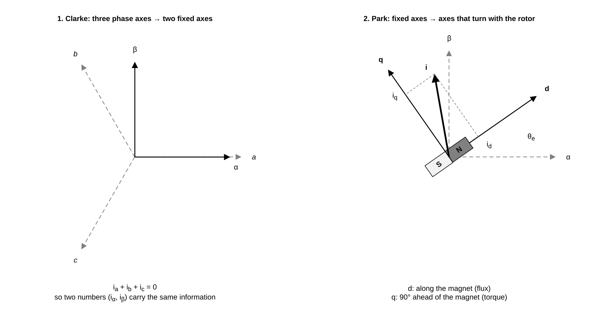
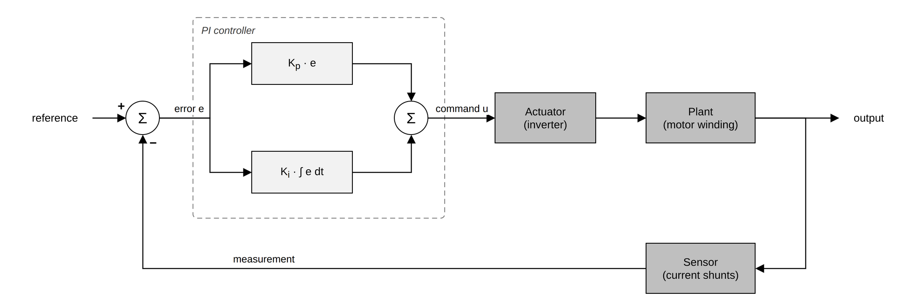
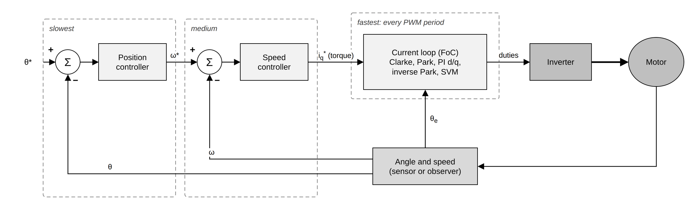

# 1. Field-oriented control in plain words

This chapter explains what field-oriented control (FoC) is and why it works, for a reader
who has never controlled a motor. It takes shortcuts: the goal is a mental model that makes
the rest of the manual easy to follow, not a full derivation. If you already know FoC, skim
the [summary](#summary) at the end and move on to [How espFoC runs](02_execution_model.md).

## The motor

espFoC drives **permanent magnet synchronous motors** (PMSM) and **brushless DC motors**
(BLDC). Electrically they are the same machine:

- the **rotor** (the part that turns) carries permanent magnets;
- the **stator** (the fixed part) carries three coils of copper wire, called the
  **phases** U, V and W, with three wires coming out of the motor.

Current flowing in the stator coils creates a magnetic field. The rotor magnets are pulled
by that field, the same way a compass needle is pulled by a magnet you move around it. If
the stator field keeps turning, the rotor follows it. That is all a synchronous motor is:
the rotor turns in step ("in sync") with a rotating field that the electronics create.

### Torque comes from a right angle

The pull between the stator field and the rotor magnet only produces **torque** (turning
force) when the two are not aligned. Think of opening a door: pushing towards the hinge does
nothing, pushing at a right angle to the door does the most. In the motor:

- stator field **along** the magnet: no torque, the rotor is just held in place;
- stator field **90 degrees ahead** of the magnet: maximum torque for that current.

So to get the most torque out of every amp, the electronics must know where the rotor magnet
is at every instant and place the stator field a quarter turn ahead of it. Field-oriented
control is the method that does exactly that, continuously.

### Pole pairs: electrical and mechanical angle

Most motors have several magnet pairs on the rotor. A motor with 7 **pole pairs** has
7 north and 7 south poles around the rotor. For the stator, one north-south pair passing by
is one full electrical cycle, so one mechanical turn of the shaft is 7 electrical turns.

- **Mechanical angle** `θm`: where the shaft is, 0 to 2π per turn.
- **Electrical angle** `θe = pole_pairs · θm` (wrapped): where the magnets are as seen by
  the coils. FoC works with the electrical angle.

The same applies to speed: electrical speed is pole pairs times mechanical speed. The espFoC
API states which one each call uses; most speed references are in **electrical Hz**.

### Back EMF: the motor is also a generator

A magnet moving past a coil induces a voltage in it. When the rotor spins, each phase
produces a voltage that grows with speed, called the **back EMF** (back electromotive force):

```
e = ω_e · ψ
```

where `ω_e` is the electrical speed and `ψ` (psi, the **flux linkage**) is a constant of the
motor that says how strong the magnets are as seen by the coils. Two consequences matter
here:

- the back EMF opposes the supply, so the faster the motor turns, the less voltage is left to
  push current. This sets the top speed for a given supply voltage;
- the back EMF carries the rotor angle. Measuring it lets you know where the rotor is
  without a sensor. This is the basis of [sensorless control](08_sensorless_stack.md), and also
  why it only works while the motor is turning: at standstill there is no back EMF.

### The three numbers that describe a motor electrically

| Parameter | Symbol | What it means |
|---|---|---|
| Phase resistance | `R` | Resistance of the copper; turns current into heat |
| Phase inductance | `L` | How much the coil resists a change of current; sets how fast current can rise |
| Flux linkage | `ψ` | Strength of the magnets; sets torque per amp and back EMF per unit of speed |

For a surface-magnet motor, torque is proportional to the useful current:

```
torque = 1.5 · pole_pairs · ψ · i_q
```

`i_q` is the "90 degrees ahead" part of the current, explained below. Controlling torque is
therefore the same as controlling one current. espFoC measures `R`, `L` and `ψ` for you;
see [Motor identification](06_motor_identification.md).

## Feeding the motor: the inverter

The supply is a DC voltage (a battery or a power supply), but the motor needs three voltages
that change all the time. The circuit in between is the **inverter**, also called the bridge:

- three **half bridges**, one per phase, each made of two power switches (transistors) in
  series between the supply and ground;
- the middle point of each half bridge connects to one motor wire;
- turning the high switch on connects the phase to the supply, turning the low switch on
  connects it to ground. Never both at once: that would short the supply. The short pause
  between turning one off and the other on is the **dead time**.

A switch is either on or off, so the inverter cannot output "4.2 V" directly. It switches
very fast instead and varies the fraction of time each phase is high. This is **pulse width
modulation** (PWM); the fraction of time is the **duty cycle**. Because the coil inductance
smooths the current, the motor only sees the average: a 12 V supply at 35 % duty looks like
4.2 V. espFoC switches at `CONFIG_ESP_FOC_PWM_RATE_HZ` (20 kHz by default), so one PWM
period lasts 50 µs.

To know what the motor is doing, the inverter also measures the phase **currents**, usually
with small resistors called **shunts** and an amplifier, read by the chip's ADC
(analog-to-digital converter). The [Inverter driver](03_inverter_driver.md) chapter covers
how espFoC times those readings.

## The problem FoC solves

To spin the motor smoothly, the three phase currents must be three sine waves, shifted by a
third of a cycle from each other, whose frequency follows the rotor speed. Controlling three
fast-changing sine waves directly is hard: the target keeps moving, and any controller that
lags a little produces less torque and more noise.

FoC's trick is a change of point of view. Instead of looking at the currents from the fixed
stator, it looks at them from the rotor, as if you were sitting on the magnet. From there,
in steady state, the currents do not change at all: they are two constant numbers. Constant
numbers are easy to control.

The change of point of view is done in two steps, Clarke and Park.



### Clarke: from three phases to two axes

The three phase currents always add up to zero (what flows in through one wire flows out
through the others), so only two of them are independent. The **Clarke transform** rewrites
the three currents `i_a`, `i_b`, `i_c` as two currents on perpendicular axes, `i_α` and
`i_β`, fixed to the stator. Nothing is lost; it is just a tidier way to write the same thing.
In steady state `i_α` and `i_β` are still sine waves.

### Park: from fixed axes to axes that turn with the rotor

The **Park transform** rotates the `α, β` axes by the electrical angle `θe`, so the new axes
turn with the rotor:

- **d axis** (direct): along the rotor magnet. Current here does not make torque. It is kept
  at zero in normal operation;
- **q axis** (quadrature): 90 degrees ahead of the magnet. Current here makes torque.

The result is two currents, `i_d` and `i_q`. With a correct angle and steady load they are
constant. This is why the rotor angle is critical: Park needs it at every PWM period, and an
angle error mixes `i_d` and `i_q`, wasting current and reducing torque.

## Controlling a number: the feedback loop

Now the task is simple to state: make `i_d` equal 0 and `i_q` equal the torque you want.
This is done with a **feedback loop**, the basic idea of control engineering:

1. compare the **reference** (what you want) with the **measurement** (what you have); the
   difference is the **error**;
2. compute a **command** from the error;
3. apply the command to the system (the **plant**), measure again, repeat.



espFoC uses **PI controllers** (proportional-integral):

- the **P** part reacts to the error now: big error, big push. Alone it leaves a small
  steady error;
- the **I** part accumulates the error over time and keeps pushing until the error is zero.
  It is what makes the current settle exactly on the reference;
- the two gains, `Kp` and `Ki`, decide how fast and how calm the response is. Too low and
  the loop is slow; too high and it overshoots or oscillates.

The speed at which a loop can follow its reference is its **bandwidth**, given in Hz. A
current loop with a 1 kHz bandwidth follows changes that happen over about a millisecond.
espFoC computes the gains from the motor parameters (`R`, `L`) and a bandwidth you choose in
Kconfig, so you do not have to tune them by hand. Manual setters exist when you want to.

When the command hits a limit (the inverter cannot give more voltage than the supply), the
integrator must stop accumulating, otherwise it "winds up" and the loop overshoots badly
once the limit is released. This is **anti-windup**: the espFoC stacks tell each PI the
value that was actually applied after the limit, and the PI tracks that instead.

## Back to the motor: inverse Park, voltage limit, SVM

The two current PIs output two voltages, `v_d` and `v_q`, in the rotor axes. They have to
go back the way the currents came:

- **voltage limit**: the inverter can only produce so much voltage from the supply. The
  `(v_d, v_q)` pair is limited to that budget before it is used, so the controller knows
  when it is saturated;
- **inverse Park**: rotate `(v_d, v_q)` back by `θe` to the fixed `(v_α, v_β)` axes;
- **space vector modulation** (SVM): turn `(v_α, v_β)` into three duty cycles, one per half
  bridge. SVM shifts all three phases together (this does not change the voltage between
  phases, which is what the motor sees) so the supply is used better: it reaches about 15 %
  more voltage than plain sine duties.

The duties go to the PWM, the switches apply the voltages, the currents change, the ADC
measures them at the next PWM period, and the loop starts again.

## One full FoC step

Put together, one step of the current loop is:

1. read the phase currents;
2. Clarke: `(i_a, i_b, i_c)` to `(i_α, i_β)`;
3. Park with `θe`: to `(i_d, i_q)`;
4. two PIs: `(i_d, i_q)` versus `(i_d*, i_q*)` to `(v_d, v_q)`;
5. voltage limit;
6. inverse Park with `θe`: to `(v_α, v_β)`;
7. SVM: to three duty cycles;
8. write the duties to the PWM.


espFoC runs all eight steps in every PWM period, inside the PWM interrupt, so at 20 kHz the
whole step has a 50 µs budget. To make that cheap and predictable, all runtime math uses
fixed-point numbers instead of floating point; see [How espFoC runs](02_execution_model.md).

## Where the angle comes from

Park and inverse Park need the electrical angle at every step. There are two ways to get it.

**Sensored**: a sensor on the shaft measures the mechanical angle. espFoC supports a
magnetic encoder (AS5600, over I2C) and Hall sensors. The angle is converted to electrical
(`pole_pairs · θm` plus an offset that aligns the sensor zero with the magnet) and, because
the sensor is read less often than the PWM runs, it is predicted forward between readings
with a **PLL** (phase-locked loop, a small tracking filter that estimates angle and speed
from noisy samples). Sensored control works at any speed, including standstill, which is
what you need for holding a position. See [Rotor sensors](04_rotor_sensors.md) and
[Sensored stack](07_sensored_stack.md).

**Sensorless**: no sensor. An **observer** (a small model of the motor running in software)
uses the measured currents, the applied voltages and the motor parameters to reconstruct
the magnet flux, and from it the angle. Because it relies on back EMF, it only works above
a minimum speed. Starting from rest therefore needs a separate procedure: espFoC drives the
motor open loop first (a rotating current with a forced angle, called **I-f** start-up),
waits until the observer locks, then hands Park over to the observer angle. See
[Sensorless stack](08_sensorless_stack.md).

## Loops inside loops: torque, speed, position

The current loop controls torque. Speed and position are controlled by adding loops around
it, each one producing the reference of the next:



- **torque control**: the application sets `i_q*` directly;
- **velocity control**: a speed PI compares the speed reference with the measured speed and
  outputs `i_q*`;
- **position control**: a position controller compares the angle reference with the
  measured angle and outputs a speed reference.

Each outer loop must be clearly slower than the loop inside it, so that from its point of
view the inner loop "just does what it is told". That is why the current loop runs every PWM
period and the speed and position loops run at a lower, decimated rate. espFoC calls the
current loop the mechanism and the outer loops the policy: the sensored stack offers all
three levels, the sensorless stack offers torque and velocity.

Speed and position loops also need mechanical parameters: how much the shaft accelerates per
amp (`K`) and the rotating inertia (`J`). Motor identification measures them when a sensor
is present.

## Before the first spin: wiring and parameters

Two practical questions come before any of this works:

- **Which wire is which?** The three motor wires can be connected to the inverter in any
  order, current sense amplifiers may be inverted, and a shaft sensor has an arbitrary zero
  and direction. A wrong combination makes the motor shake or run backwards, and makes every
  measurement wrong. espFoC finds the right combination automatically: see
  [Phase map discovery](05_phase_map_discovery.md).
- **What motor is this?** The PI gains, the observer and the speed loop are designed from
  `R`, `L`, `ψ`, `K` and `J`. espFoC measures them at power-up: see
  [Motor identification](06_motor_identification.md).

The order is always the same: phase map, then identification, then the control stack.

## Summary

- A PMSM/BLDC turns because the stator field pulls the rotor magnets. Torque is maximum when
  the field is 90 electrical degrees ahead of the magnets.
- FoC looks at the currents from the rotor (Clarke, then Park with the rotor angle), where
  they are two constant numbers: `i_d` (along the magnet, kept at 0) and `i_q` (torque).
- Two PI controllers drive `i_d` and `i_q` to their references; their output voltages go
  back through inverse Park and SVM to three PWM duty cycles.
- All of this runs once per PWM period. The rotor angle comes from a sensor (sensored) or an
  observer (sensorless, needs speed and a start-up sequence).
- Speed and position loops wrap around the current loop and set its reference.

## Glossary

| Term | Meaning |
|---|---|
| Anti-windup | Stops a PI integrator from accumulating while its output is limited |
| Back EMF | Voltage a spinning motor generates, proportional to speed |
| Bandwidth | How fast a loop follows its reference, in Hz |
| Bridge, inverter | Six power switches that turn DC into three phase voltages |
| Clarke transform | Three phase quantities to two fixed axes `α, β` |
| d / q axes | Axes turning with the rotor: d along the magnet, q 90° ahead |
| Dead time | Pause between switching one transistor of a half bridge off and the other on |
| Duty cycle | Fraction of a PWM period a phase is connected to the supply |
| Electrical angle | Rotor angle times pole pairs, as seen by the stator coils |
| Flux linkage `ψ` | Magnet strength seen by the coils; torque per amp and volts per speed |
| I-f start-up | Open-loop start: a current of fixed size rotated at a forced frequency |
| Observer | Software model of the motor that estimates the rotor angle |
| Park transform | Fixed axes `α, β` to rotor axes `d, q`, using the rotor angle |
| PI controller | Controller with a proportional and an integral term |
| PLL | Tracking filter that estimates angle and speed from samples |
| Pole pairs | Number of north-south magnet pairs on the rotor |
| PWM | Fast switching whose average sets the output voltage |
| Shunt | Small resistor used to measure current |
| SVM | Space vector modulation: voltages to duty cycles, using the supply better |
