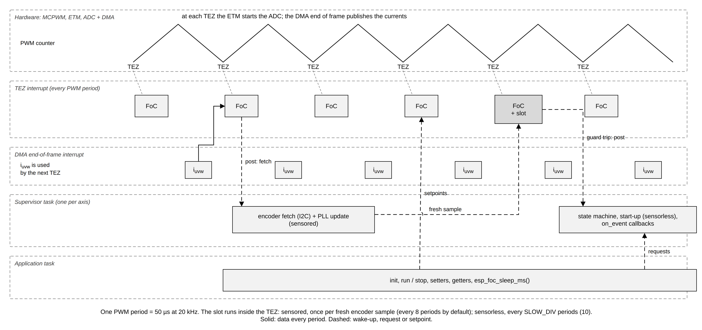

# 2. How espFoC runs

A motor controller is a program that has to answer on time, every time. This
chapter explains where each piece of espFoC runs, how often, and what that
means for your own code: the PWM period that paces everything, the interrupt
that runs the current loop, the slower "slot" for speed and position, the
supervisor task that drives the state machine, and the application task that
you write. It also covers the number format (Q16.16 fixed point), the units of
the public API, and how memory is laid out. Read it before writing an
application; most mistakes with a real-time controller come from calling the
right function from the wrong place.

## The PWM period is the clock

The inverter drives each motor phase by switching it between the two supply
rails many thousand times per second. This is PWM (pulse-width modulation):
the fraction of each period a phase spends on the high rail is its *duty*, and
the average voltage the winding sees follows the duty. The switching frequency
is the *PWM rate*.

In espFoC the PWM rate is also the control rate. Every PWM period the
controller measures the currents, computes new voltages and writes new duties.
Nothing in the fast path is driven by a software timer; the PWM hardware is
the heartbeat.

- The default rate is `CONFIG_ESP_FOC_PWM_RATE_HZ` (default 20000 Hz, range
  5000 to 40000). An inverter uses it when the `pwm_hz` field of
  `esp_foc_inverter_mcpwm_config_t` is 0; the examples set `pwm_hz` to this
  symbol explicitly.
- The stacks read the actual rate from the inverter
  (`inv->get_pwm_rate_hz(inv)`) at init and design every loop on it.
- At 20 kHz one period is 50 µs. All work of the fast path has to fit in that
  window, together with everything else the CPU core does.

The PWM counter counts up and then down (center-aligned PWM). The moment the
counter reaches zero is called **TEZ** (timer equals zero). At that instant no
switch is changing state, which makes it a clean point to sample current and
to update the duties. The same hardware event starts the current measurement
without software: the event system (ETM) starts the ADC, the DMA moves the
samples to memory, and the DMA end-of-frame interrupt publishes the new
phase currents.

Because the conversion runs in the background while the CPU computes, the
loop at TEZ uses the currents sampled for the previous period. This
one-period delay is deliberate: the sampling of the next period overlaps the
computation of this one. The sensored stack compensates the delay by rotating
the output voltage ahead (`pwm_delay_ts`, default
`CONFIG_ESP_FOC_SD_PWM_DELAY_PERMIL` = 1500, that is 1.5 PWM periods).

| At the default 20 kHz | Value |
|---|---|
| PWM period | 50 µs |
| Sensored slot (`CONFIG_ESP_FOC_SD_FETCH_HZ` = 2500 Hz) | every 8 PWM periods |
| Sensorless slot (`CONFIG_ESP_FOC_SL_SLOW_DIV` = 10) | every 10 PWM periods, 2000 Hz |

## Three execution contexts

espFoC splits its work into three places. Each place has a different rate and
different rules about what may run there.



### 1. The TEZ interrupt: the current loop

The TEZ interrupt runs once per PWM period. It is registered at the highest
interrupt level the drivers use (level 3) and marked IRAM-safe. It runs the
FoC current loop (field-oriented control: regulate the current in a frame
that turns with the rotor, so torque can be controlled like in a DC motor;
[chapter 1](01_foc_theory.md) explains each step):

1. **Clarke**: turn the three phase currents into two stationary components
   (α, β).
2. **Park**: rotate (α, β) by the electrical rotor angle into the rotor frame
   (d, q). `iq` makes torque, `id` does not.
3. **Current PI** on d and q (a proportional-integral regulator: output
   proportional to the error plus its accumulated sum), plus the user's
   voltage feedforward from `set_vdq_ff()`.
4. **vlim**: clamp the voltage vector to what the DC bus can produce.
5. **Inverse Park** and **SVM** (space vector modulation): turn the voltage
   vector back into three duties and write them to the inverter.

What differs between the stacks is where the angle comes from:

- **Sensored**: the TEZ first advances the rotor sensor estimate by one period
  (`esp_foc_rotor_sensor_step`), then builds the Park angle from the encoder
  angle plus `park_offset_rad` and a speed-proportional lead (`park_lead_s`).
  Every `PWM rate / fetch_hz` periods it also wakes the supervisor to read the
  encoder.
- **Sensorless**: the TEZ runs the flux observer (an estimator of the rotor
  angle from voltages and currents) every period. Park uses the open-loop
  startup angle until the startup hands off, then the observer angle.

The TEZ never blocks, never allocates, never prints and works only in fixed
point. Its duration is recorded by the hot-path trace when it is enabled
(`ESP_FOC_TRACE_TEZ_EXIT`, see [OS abstraction and trace](10_osal_and_trace.md)).

### 2. The slot: speed, position and guards, inside the same interrupt

The speed loop and the position loop are much slower than the current loop,
so they run only every Nth TEZ. espFoC calls this decimated call the *slot*.
It runs **inside the TEZ interrupt**, right after the current loop, on the
same angle and speed the current loop has just used. No task is woken for it.

- **Sensored**: the slot runs once per fresh encoder sample, that is at
  `fetch_hz` (default `CONFIG_ESP_FOC_SD_FETCH_HZ` = 2500 Hz, which must divide
  the PWM rate; `esp_foc_sensored_init()` returns `ESP_ERR_INVALID_ARG`
  otherwise). It runs the position P loop, the speed PI, the cogging
  feedforward by mechanical angle, and the overspeed guard. If no fresh sample
  arrives for `guard.sensor_stale_slots` sample periods (default 125, that is
  50 ms at the defaults), the TEZ aborts with `ESP_FOC_SD_ABORT_SENSOR_STALE`.
- **Sensorless**: the slot runs every `CONFIG_ESP_FOC_SL_SLOW_DIV` PWM periods
  (default 10). It filters the observer speed, slews the references, runs the
  speed PI (the user `iq` is added to its output) and the guards (back-EMF,
  current collapse, overspeed, observer lock loss).

A guard trip puts the three duties at mid scale (`Q16_HALF`, zero voltage
across the winding) and wakes the supervisor. The sensorless slot wakes the
supervisor only on a trip: a wake-up per slot would cost a context switch per
slot on a core the fast path already keeps busy.

### 3. The supervisor task: state machine and slow work

Each initialised axis has one supervisor task, created by `init()`. It does
everything that may take time or block:

- the state machine (`IDLE`, `ARMED`, `RUNNING`, ... ) and the requests from
  the API (`run`, `stop`, `clear_fault`, `cogging_learn`);
- **sensored**: the encoder read (`esp_foc_rotor_sensor_fetch`, a blocking I2C
  transfer on the AS5600) and the PLL update that consumes it (a
  phase-locked loop that estimates speed from successive angle samples), and
  the unwrapped multi-turn position. After the fetch it flags a fresh sample;
  the next TEZ runs the slot on it. With the bridge disabled there is no TEZ
  to pace the fetch, so the supervisor reads the encoder every 20 ms to keep
  track of a shaft turned by hand;
- **sensorless**: the startup sequence (align, I-f lock-in, observer
  acquire), the handoff to the observer, the catch, and the reversal ramps;
- every event callback (`on_event`).

The supervisor sleeps on its OSAL event and wakes on a post from the TEZ
(encoder fetch, guard trip), from the inverter fault callback, from an API
call, or after at most 20 ms.

| Supervisor | Task name | Priority | Stack |
|---|---|---|---|
| Sensored | `foc_sd0` .. `foc_sd3` | highest minus `CONFIG_ESP_FOC_SD_TASK_PRIO_BELOW_MAX` (default 0) | `CONFIG_ESP_FOC_SD_TASK_STACK` (4096 bytes) |
| Sensorless | `foc_sl0` .. `foc_sl3` | highest minus `CONFIG_ESP_FOC_SL_TASK_PRIO_BELOW_MAX` (default 2) | `CONFIG_ESP_FOC_SL_TASK_STACK` (4096 bytes) |

"Highest" is `esp_foc_task_max_priority()`. The sensored supervisor sits at
the top by default because it feeds the encoder: a late fetch is a late speed
sample.

### Interrupts that feed the loop

Two more driver interrupts run alongside the TEZ. You do not register them,
but they explain some behaviour (details in [Inverter driver](03_inverter_driver.md)):

- **DMA end of frame** (level 3, IRAM-safe): parses the ADC samples, applies
  the phase map and the current filter, checks the software current limit
  and the frozen-sense watchdog, then calls the stack's DMA callback, which
  stores the currents for the next TEZ.
- **Fault**: a current-limit trip (from the DMA interrupt), the fault pin, or
  a software trip disables the bridge and calls the stack's fault callback.
  That callback only records the reason and posts the supervisor; the
  `..._EV_FAULT` event is then emitted from the supervisor task.

### The application

Your code runs in ordinary tasks: `app_main` in the examples, or tasks you
create. It configures, starts and stops the controller, writes setpoints and
reads status. API calls do not run the control themselves; they write a value
that the TEZ or the slot picks up, or post a request to the supervisor and
wait for it.

```c
static bool ramp_torque_current(float from_a, float to_a, uint32_t duration_ms)
{
    const uint32_t steps = duration_ms / RAMP_STEP_MS;
    for (uint32_t step = 1; step <= steps; step++) {
        if (controller_tripped) {
            return false;
        }
        const float current_a = from_a + (to_a - from_a) * (float)step / (float)steps;
        esp_foc_sensored_set_iq(MOTOR_AXIS, current_a);
        esp_foc_sleep_ms(RAMP_STEP_MS);
    }
    return !controller_tripped;
}
```

This loop from [`foc_sensored_torque`](../../examples/foc_sensored_torque/README.md)
updates the setpoint every 10 ms (`RAMP_STEP_MS`) and sleeps in between.
`controller_tripped` is a `volatile bool` set by the event callback.

### Summary

| Context | Rate | Runs | May block |
|---|---|---|---|
| TEZ interrupt | PWM rate | current loop, angle, observer (sensorless), sensor step (sensored) | no |
| Slot (in the TEZ) | `fetch_hz` / PWM ÷ `SLOW_DIV` | speed PI, position P, cogging feedforward, guards | no |
| DMA interrupt | PWM rate | current sample, current limit | no |
| Supervisor task | on demand, at least every 20 ms | state machine, encoder fetch + PLL (sensored), startup (sensorless), event callbacks | yes |
| Application task | your choice | init, run/stop, setters, getters | yes |

## Fixed point

Inside the loops espFoC does not use `float`. Every runtime quantity is a
Q16.16 fixed-point number, declared in
[`esp_foc_q16.h`](../../include/espFoC/utils/esp_foc_q16.h):

```c
typedef int32_t q16_t;

#define Q16_ONE        ((q16_t)65536)
#define Q16_HALF       ((q16_t)32768)
#define Q16_MINUS_ONE  ((q16_t)-65536)
```

A `q16_t` is a 32-bit integer read as "value × 65536": the upper 16 bits hold
the integer part, the lower 16 bits the fraction. It is not a 16-bit type.
`Q16_ONE` is 1.0, `Q16_HALF` is 0.5. The range is about -32768 to +32767 and
the resolution is 1/65536 (about 0.000015).

Why fixed point:

- An integer multiply and shift takes the same number of cycles on every
  supported chip, with or without a floating-point unit, so the loop time
  does not depend on the target.
- The result is bit-exact, so the portable core gives the same numbers in the
  host unit tests and on silicon.
- Saturation is explicit: the helpers clamp at the 32-bit limits instead of
  wrapping around.

The helpers are `static inline` and saturating:

| Helper | What it does |
|---|---|
| `q16_from_float(x)` | rounds to the nearest step, saturates at the 32-bit limits |
| `q16_to_float(x)` | back to `float` |
| `q16_add`, `q16_sub` | saturating sum and difference |
| `q16_mul(a, b)` | 64-bit product shifted down by 16, saturated |
| `q16_div(a, b)` | saturating divide; `b == 0` gives `INT32_MAX` for `a > 0`, `INT32_MIN` for `a < 0` (`0/0` gives 0) |
| `q16_neg`, `q16_clamp`, `q16_min`, `q16_max` | negate (saturating), clamp, min, max |

Angle helpers live in
[`esp_foc_angle.h`](../../include/espFoC/utils/esp_foc_angle.h): `Q16_PI`,
`Q16_TWO_PI`, `q16_wrap_pi()` (wrap into (−π, +π]) and `q16_angle_delta()`
(shortest signed difference). Division, square root and trigonometry are
avoided in the fast path or replaced by fast variants.

```c
q16_t half_amp = q16_from_float(0.5f);         /* 32768 */
q16_t p = q16_mul(half_amp, Q16_ONE * 2);      /* 1.0 = 65536 */
float back = q16_to_float(p);                  /* 1.0f */
```

Two consequences of the format are worth knowing:

- **Range.** Speeds are stored in rad/s, so the electrical speed in Q16 is
  limited to about 32767 rad/s (about 5.2 kHz electrical). Where a quantity
  can grow without bound the stacks use a wider accumulator: the sensored
  unwrapped position is a 64-bit Q16 value.
- **Resolution.** Very small coefficients lose precision. The sensored speed
  PI keeps its integral gain in Q32 because `Ki·Ts` of a speed loop is under
  one Q16 step.

You only meet `q16_t` when you use the
[building blocks](09_building_blocks.md) or the drivers directly (for example `inv->set_duties()` takes unipolar duties in
`[0, Q16_ONE]`, and `inv->fetch_currents()` returns amps in Q16). The stack
APIs take and return `float`.

## Units and angles

The public API uses `float` in SI units for configuration, setters and
status. Each call converts once to Q16 and back; the loops never see a float.

| Quantity | Unit | Where |
|---|---|---|
| Current | A | `set_iq`, `set_id`, `i_max_a`, `status.iq_a` |
| Voltage | V | `set_vdq_ff`, `status.vd_v`, `status.vdc_v` |
| Speed reference | electrical Hz | `set_speed_ref_hz`, `fe_rated_hz`, `guard.overspeed_hz` |
| Speed in status | electrical rad/s | `status.we_rads`, `w_ref_rads` |
| Electrical angle | rad, wrapped to (−π, +π] | `status.theta_e_rad` |
| Sensored position | mechanical rad from the origin, multi-turn | `set_position_ref_rad`, `status.theta_m_rad` |
| Joint speed feedforward | mechanical rad/s | `set_joint(..., w_ff_rads, ...)` |
| Position-loop limits, cogging sweep | mechanical Hz | `wm_max_hz`, `corr_max_hz`, `cogging.sweep_hz` |
| Motor parameters | Ω, H, Wb | `rs_ohm`, `ls_h`, `psi_wb` |

Kconfig has no floating-point type, so its defaults carry the unit in the
symbol name: `_MA` (mA), `_MV` (mV), `_MHZ` (mHz), `_MDEG` (millidegrees),
`_UA` (µA), `_PERMIL` (thousandths), `_E4` (ten-thousandths). The
`..._default_config()` functions convert them to the SI floats above.

### Electrical and mechanical angle

A motor has `pole_pairs` pairs of magnetic poles on its rotor. One mechanical
revolution of the shaft passes `pole_pairs` full electrical cycles under the
windings. FoC works on the **electrical** angle, because that is the angle of
the magnetic field the currents must follow:

- θ_electrical = `pole_pairs` × θ_mechanical (wrapped to one turn)
- ω_electrical = `pole_pairs` × ω_mechanical
- shaft rpm = electrical Hz × 60 / `pole_pairs`

Speeds in the stack APIs are electrical; the sensored position API is
mechanical. The examples convert like this:

```c
static float shaft_speed_rpm(void)
{
    esp_foc_sensored_status_t status;
    esp_foc_sensored_get_status(MOTOR_AXIS, &status);
    /* The controller reports electrical rad/s; divide by pole pairs for the shaft. */
    return status.we_rads / (2.0f * (float)M_PI) / (float)POLE_PAIRS * 60.0f;
}
```

## Memory

### Code placement: everything in IRAM

[`linker.lf`](../../linker.lf) places the whole component archive outside
flash:

```
[mapping:espFoC]
archive: libespFoC.a
entries:
    * (noflash)
```

The control interrupts are registered with `ESP_INTR_FLAG_IRAM`. Such an
interrupt keeps running while the flash cache is disabled (for example during
a flash write), so every function it reaches must be in internal RAM. Running
from internal RAM also removes flash cache misses from the loop time. Because
the fragment covers the whole archive, the sources carry no `IRAM_ATTR`. The
cost is internal RAM taken from the rest of the firmware.

### Compiler optimisation: -O2

The component's `CMakeLists.txt` compiles its own sources with `-O2`,
whatever level the project uses, because the TEZ path only fits its PWM
period at that level. The examples also set
`CONFIG_COMPILER_OPTIMIZATION_PERF=y` for the whole firmware. If you build the
sources in another build system, keep `-O2` on them.

### Static pools instead of the heap

Driver objects and controller instances are fixed arrays sized at build time.
Nothing in the hot path allocates. An `..._acquire(index)` call hands out a
pool slot and returns `NULL` when the index is out of range or the slot is
taken.

| Pool | Kconfig symbol | Default | Range |
|---|---|---|---|
| MCPWM inverters (and their ADC sense blocks) | `CONFIG_ESP_FOC_MAX_INVERTERS` | 1 | 1–2 |
| Rotor sensors, per driver (AS5600, hall, sensorless) | `CONFIG_ESP_FOC_MAX_ROTOR_SENSORS` | 1 | 1–2 |
| Sensored axes | `CONFIG_ESP_FOC_SD_MAX_AXES` | 1 | 1–4 |
| Sensorless axes | `CONFIG_ESP_FOC_SL_MAX_AXES` | 1 | 1–4 |
| OSAL mutexes | `CONFIG_ESP_FOC_MAX_MUTEXES` | 2 | 1–8 |

Each axis is selected by `cfg.axis` at init and by the `axis` argument of
every other call. Each sensored axis also reserves its cogging tables
statically: `CONFIG_ESP_FOC_SD_COG_BINS` × 16 bytes (23040 bytes with the
default 1440 bins), whether or not you run a cogging learn.

The heap is used only at init, by FreeRTOS: the supervisor task (stack and
control block) and, on first use of a pool slot, the RTOS mutex object. If
the task cannot be created, `init()` returns `ESP_ERR_NO_MEM`.

## Events and status

### Event callbacks

Both stacks report state changes through one callback, set in the config:

```c
controller_config->on_event = on_controller_event;   /* and .ctx */
```

The callback receives the axis, the event code (`ESP_FOC_SD_EV_*` or
`ESP_FOC_SL_EV_*`) and the fields that event fills (reason codes, speed,
angle error). It **runs on the supervisor task of that axis, never in an
interrupt**. Rules that follow from that:

- Keep it short. On the sensored stack the callback shares the thread that
  feeds the encoder: a long callback shows up as a stale sensor and can abort
  the run with `ESP_FOC_SD_ABORT_SENSOR_STALE`.
- `printf` is allowed (the sensorless examples print startup progress from
  it), but nothing that waits long.
- Requests made from inside the callback (`run`, `stop`, `clear_fault`) are
  queued and return `ESP_OK` at once; the supervisor serves them after the
  callback returns. `esp_foc_sensored_cogging_learn()` refuses with
  `ESP_ERR_INVALID_STATE` when called from the callback.
- The usual pattern is to copy what you need into `volatile` variables and
  let the application task act on them:

```c
static void on_controller_event(void *context, const esp_foc_sensored_event_t *event)
{
    (void)context;
    switch (event->ev) {
    case ESP_FOC_SD_EV_ABORT:
        trip_abort_reason = event->abort;
        controller_tripped = true;
        break;
    case ESP_FOC_SD_EV_FAULT:
        trip_fault_reason = event->fault;
        controller_tripped = true;
        break;
    default:
        break;
    }
}
```

Motor identification runs on its own task while the caller blocks; its
`on_event` callback runs on that task (stack `CONFIG_ESP_FOC_MOTOR_ID_TASK_STACK`,
priority `CONFIG_ESP_FOC_MOTOR_ID_TASK_PRIO`).

### Status

`esp_foc_sensored_get_status()` and `esp_foc_sensorless_get_status()` copy
the values the TEZ writes inside a critical section, so the snapshot is
consistent, and convert them to float in the caller's task. Useful fields to
check that the loop is alive: `tez` (TEZ interrupts counted) and, on the
sensored stack, `fetch_n` and `fetch_fail` (encoder reads and failures).
`esp_foc_sensored_get_window()` returns speed-loop statistics since the
previous call and re-arms them; use it from one reader only.
`..._get_tuning()` returns the gains designed at init.

## Rules for application code

1. **Call the stacks from tasks only.** `init()` returns
   `ESP_ERR_INVALID_STATE` when not called from a task with the scheduler
   running; `deinit()` is documented as task context. None of the stack calls
   is meant for an interrupt.
2. **Expect blocking calls.** `esp_foc_sensored_run()` blocks until RUNNING or
   until the run fails (it waits for a still rotor and measures the speed
   ripple first). `stop()` and `clear_fault()` wait for the supervisor, up to
   5 s, and return `ESP_ERR_TIMEOUT` if it does not answer.
   `esp_foc_sensorless_run()` only arms; the startup is triggered by the
   reference.
3. **Never busy-wait.** Sleep with `esp_foc_sleep_ms()` or wait on an event.
   A high-priority task that never sleeps starves the idle task and trips the
   task watchdog.
4. **Keep your tasks below the supervisor.** The supervisor runs at or near
   the highest priority by default; an application task above it delays the
   encoder fetch and the state machine.
5. **Use a 1000 Hz FreeRTOS tick.** The examples set `CONFIG_FREERTOS_HZ=1000`.
   Phase discovery counts its pulses in 1 ms sleeps and returns
   `ESP_ERR_NOT_SUPPORTED` when one millisecond is shorter than a tick; with
   a coarser tick every `esp_foc_sleep_ms()` is rounded up to a whole tick.
6. **Mind the units.** Speeds are electrical, positions mechanical, angles in
   radians. Convert with `pole_pairs`.
7. **Setpoints do not need the PWM rate.** The slot slews speed references
   (`wref_slew_hz_s`); the examples update setpoints every 10 ms.
8. **Prefer the OSAL** (`esp_foc_sleep_ms`, `esp_foc_task_spawn`,
   `esp_foc_event_*`) over direct FreeRTOS calls to keep the application
   portable. See [OS abstraction and trace](10_osal_and_trace.md).
9. **If you use the inverter alone** (without a stack, through
   `set_pwm_callback()`), your callback runs in the level-3 TEZ interrupt.
   It must be in IRAM, must not block or print, should use Q16, and should
   hand slow work to a task with `esp_foc_event_post_from_isr()`.

## Configuration

| Symbol | Default | Meaning |
|---|---|---|
| `CONFIG_ESP_FOC_PWM_RATE_HZ` | 20000 | PWM and current-loop rate when the inverter config leaves `pwm_hz` at 0 |
| `CONFIG_ESP_FOC_SD_FETCH_HZ` | 2500 | sensored encoder rate and slot rate; must divide the PWM rate |
| `CONFIG_ESP_FOC_SL_SLOW_DIV` | 10 | PWM periods per sensorless slot (range 2–64) |
| `CONFIG_ESP_FOC_SD_TASK_PRIO_BELOW_MAX` | 0 | sensored supervisor priority, levels below the highest |
| `CONFIG_ESP_FOC_SL_TASK_PRIO_BELOW_MAX` | 2 | sensorless supervisor priority, levels below the highest |
| `CONFIG_ESP_FOC_SD_TASK_STACK`, `CONFIG_ESP_FOC_SL_TASK_STACK` | 4096 | supervisor stack in bytes; size it for your event callback |
| `CONFIG_ESP_FOC_SD_PWM_DELAY_PERMIL` | 1500 | inverse-Park lead for the PWM update delay, in thousandths of a period |
| `CONFIG_ESP_FOC_SD_STALE_SLOTS` | 125 | encoder sample periods without a fresh sample before the abort |

Pools are listed under [Memory](#memory). The
[Sensored stack](07_sensored_stack.md) and [Sensorless stack](08_sensorless_stack.md)
chapters, and the comments at the top of
[`esp_foc_sensored.h`](../../include/espFoC/motor_control/esp_foc_sensored.h) and
[`esp_foc_sensorless.h`](../../include/espFoC/motor_control/esp_foc_sensorless.h),
describe what each stack does in each context.
