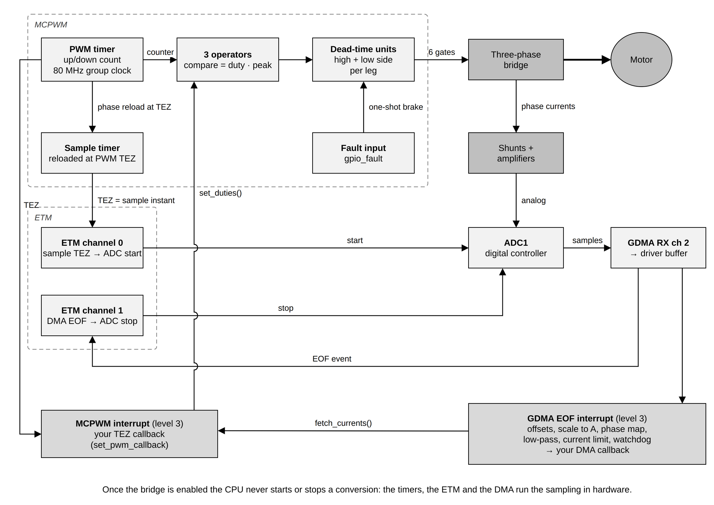
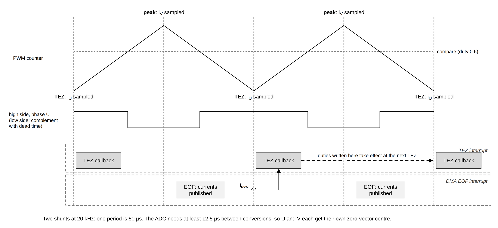

# 3. Inverter driver

The inverter driver is the part of espFoC that touches the power stage. It
produces the six PWM signals of a three-phase bridge, samples the phase
currents in step with that PWM, calls your control code once per PWM period,
and turns the bridge off when something goes wrong. It contains no control
policy: it applies the duty cycles it is given and reports the currents it
measures. You need it in every espFoC application, and you can also use it on
its own to bring up a new board before any controller is attached.

The public interface is generic
([`esp_foc_inverter.h`](../../include/espFoC/drivers/esp_foc_inverter.h)); the
implementation shipped with espFoC builds it from the ESP32 MCPWM, ETM, ADC and
GDMA peripherals
([`esp_foc_inverter_mcpwm.h`](../../include/espFoC/drivers/esp_foc_inverter_mcpwm.h)).

## What it does

### The three-phase bridge

A PMSM or BLDC motor has three windings, one per phase (U, V, W). A
**three-phase bridge** (also called an inverter) connects each winding to
either the positive supply rail or ground through electronic switches,
usually MOSFETs.

- A **half bridge** (or leg) is two switches in series between the rails. The
  point between them, the **phase node**, goes to one motor lead.
- The switch to the positive rail is the **high side**; the switch to ground
  is the **low side**. A three-phase bridge is three half bridges.
- The DC supply that feeds the bridge is the **DC link**, with voltage Vdc.

The high and low side of one leg must never conduct at the same time: that
short-circuits the supply through the leg ("shoot-through"). Switches do not
turn off instantly, so the driver inserts a **dead time**: after one side turns
off, both stay off for a short interval before the other side turns on.

**PWM** (pulse-width modulation) switches each leg on and off many thousand
times per second. The **duty cycle** is the fraction of each period during
which the high side is on. The average voltage at the phase node is
duty × Vdc, so three duty cycles set three average phase voltages. In espFoC a
duty cycle is a number in [0, 1], written in Q16.16 fixed point (`q16_t`,
where `Q16_ONE` is 1.0 and `Q16_HALF` is 0.5). A duty of 0.5 on all three
phases puts the same average voltage on every lead, so no current flows.

The driver uses **center-aligned PWM**: the timer counts up to a peak and back
down, and each phase's pulse is symmetric about the same instant. All three
legs switch away from the two moments where the counter is at zero (called
**TEZ**, timer equals zero) and at its peak (TEP). At TEZ every high side is
on (for any duty above zero); at the peak every low side is on. Both are "zero vectors" (no voltage
across the windings), and the switching ripple of the current crosses its mean
value there, so they are the cleanest moments to measure current.

### Current sensing with shunts

Field-oriented control regulates the winding currents, so it has to measure
them. A **shunt** is a small resistor (milliohms) in the current path; the
current produces a small voltage across it, which an **amplifier** with a known
gain lifts into the ADC range. The driver converts ADC counts to amperes with

```
amps = (counts - offset) * (3.3 V / 4096) / (amp_gain * shunt_ohm)
```

The **offset** is the ADC reading at zero current. Current-sense amplifiers
are usually biased to mid-scale so they can report both directions, and that
bias differs from part to part, so the driver measures it at run time
(`calibrate_currents`, below) instead of assuming it.

Two shunt placements exist:

- **Inline**: the shunt is in series with the motor lead, so it sees the
  winding current at any instant. This is the only topology the driver
  implements (`ESP_FOC_SENSE_INLINE`).
- **Low side**: the shunt sits under the low-side switch and only carries
  current while that switch conducts. The usable sample window then depends
  on the duty cycle and needs a per-sector choice of legs. This is not
  implemented, and `esp_foc_inverter_mcpwm_init()` refuses
  `ESP_FOC_SENSE_LOW_SIDE` with `ESP_ERR_NOT_SUPPORTED` rather than return
  wrong currents at high modulation.

With **three shunts** each phase is measured. With **two shunts** the third
current is computed from Kirchhoff's law, iw = −(iu + iv), because the three
currents of a star-connected motor sum to zero.

## How it works



The driver chains four peripherals so that, once the bridge is enabled, the CPU
never starts or stops a conversion:

1. **MCPWM** generates the PWM. One timer counts up and down at an 80 MHz
   group clock, so one period is `2 * peak` ticks with
   `peak = 80 MHz / (2 * pwm_hz)` (2000 ticks at 20 kHz). Three operators,
   one per leg, compare the counter with a value derived from the duty. Each
   operator's generator drives the high side; the dead-time unit derives the
   complementary low side and inserts the same delay on both edges. The six
   outputs are routed to the six GPIOs in the configuration.
2. A **second MCPWM timer** (the sample timer, index `(mcpwm_timer + 1) % 3`)
   is reloaded with a phase on every PWM TEZ. Its own TEZ therefore lands at a
   fixed, programmable delay inside the PWM period. That delay is chosen so
   the ADC sample instant falls on a zero-vector centre.
3. **ETM** (event task matrix) connects peripheral events to peripheral tasks
   in hardware. ETM channel 0 connects the sample-timer TEZ to the ADC start
   task. ETM channel 1 stops the ADC in hardware at the end of each block.
4. The **ADC digital controller** converts the shunt channels on ADC1 and
   streams the results through **GDMA** (RX channel 2) into a buffer owned by
   the driver. When the block is complete, the DMA end-of-frame (EOF)
   interrupt fires.

Two interrupt handlers run, both at level 3 and allocated with
`ESP_INTR_FLAG_IRAM`:

- The **MCPWM interrupt** fires at every PWM TEZ and calls the TEZ callback
  you registered with `set_pwm_callback`. This is where a control loop runs.
  The same interrupt handles the fault input.
- The **GDMA EOF interrupt** parses the block, removes the offsets, scales to
  amperes, applies the phase map and the current filter, runs the protection
  checks, and finally calls the callback registered with `set_dma_callback`.

Because both handlers share one interrupt level, a long TEZ callback delays
the EOF handler.

### One PWM period



With two shunts (the configuration used by all shipped examples), each PWM
period runs like this:

1. **TEZ.** The compare registers load the duties written during the
   previous period. The MCPWM interrupt runs your TEZ callback. The shunt on
   `gpio_iu` is sampled at this instant.
2. **Peak.** The shunt on `gpio_iv` is sampled. Its conversion completes a few
   microseconds later, the DMA EOF interrupt publishes the new currents and
   runs your DMA callback.
3. **Next TEZ.** Your TEZ callback reads the currents published in step 2,
   computes new duties and writes them; they take effect at the following TEZ.

So the duties computed in one period are applied one period later, and the
`gpio_iu` sample is half a period older than the `gpio_iv` sample. The ADC
needs at least 12.5 µs between two conversions, so two legs cannot share one
zero-vector centre: the driver issues two ADC starts per period, one
conversion each, one start per centre.

With three shunts the driver issues one start per period and converts U, V
and W back to back at the minimum interval, with V on the timer peak. The
driver source notes that this layout has not been validated on silicon.

`esp_foc_inverter_mcpwm_init()` checks that the conversions of each start fit
in the time available at the requested PWM rate and returns
`ESP_ERR_INVALID_ARG` with a log line if they do not.

### From ADC counts to phase currents

The EOF handler identifies each conversion by the channel tag in the sample,
not by its position in the buffer, and drops a block in which a configured
channel is missing (the previous currents stay published). For each frame it
then:

1. subtracts the per-shunt offset and scales to amperes;
2. reconstructs the third current when there are two shunts;
3. applies the **phase map** (below) to go from hardware legs to the logical
   phases U, V, W;
4. passes each current through a 2nd-order Butterworth low-pass filter running
   at the PWM rate (unless bypassed);
5. checks the current limit and the frozen-sense watchdog;
6. sets the "sample ready" flag and calls your DMA callback.

### Phase map

Motor leads can be connected to the bridge in any order, and the sign of each
current amplifier can be either way. The **phase map**
(`esp_foc_phase_map_t`) absorbs both, so the control code always works with
logical phases U, V, W:

- `pwm_to_hw[L]` is the hardware leg (0..2) that drives logical phase `L`
  (U = 0, V = 1, W = 2). It must be a permutation of {0, 1, 2}.
- `i_sign[L]` is +1 or −1, applied to the current of logical phase `L`.

The driver applies it in both directions: `set_duties(u, v, w)` writes the
duty of logical phase `L` to hardware leg `pwm_to_hw[L]`, and the published
current of logical phase `L` is `i_sign[L]` times the current of sense slot
`pwm_to_hw[L]`. Hardware leg *k* means the MCPWM operator wired to the k-th
gate pair (`gpio_uh`/`gpio_ul`, then V, then W) and the k-th sense input
(`gpio_iu`, `gpio_iv`, `gpio_iw`). The map moves drive and sense together;
it cannot fix a shunt wired to the wrong leg.

`esp_foc_phase_map_identity()` and `esp_foc_phase_map_valid()` are inline
helpers in the header. [Phase map discovery](05_phase_map_discovery.md)
measures the map at standstill and the stacks install it with `set_phase_map()` before they enable the bridge.

### Protection and faults

Any of four conditions **trips** the bridge:

| Reason | Source | Detected in |
|---|---|---|
| `ESP_FOC_FAULT_ILIMIT` | largest filtered phase current above `i_limit_amps` | DMA EOF interrupt, once per frame |
| `ESP_FOC_FAULT_GPIO` | external fault pin active (`gpio_fault`) | MCPWM fault input, hardware one-shot brake |
| `ESP_FOC_FAULT_SOFT_TRIP` | `soft_trip()` called | caller's context |
| `ESP_FOC_FAULT_SENSE_STALE` | 512 consecutive bit-identical raw frames while the watchdog is armed | DMA EOF interrupt |

A trip sets the duties to 50 %, triggers the MCPWM one-shot brake (the fault
pin does this in hardware, before any software runs), drives the enable pin to
its off level, stops the timers, the ADC and the ETM link, and then calls your
fault callback with the reason. While faulted, `set_duties` is ignored and
`enable` returns `ESP_ERR_INVALID_STATE`. `clear_fault` releases the brake
only if the fault pin is no longer active; after that you call `enable` again.

The current limit is armed only by `calibrate_currents()`. Until it has run,
`i_limit_amps` has no effect.

The frozen-sense watchdog exists because the current limit cannot see a dead
converter: a frozen reading is a constant, a constant never crosses a
threshold, and the current regulators wind up to full voltage while the
protection watches a still picture. It is off after init and after every
`enable()`; the caller arms it with `set_sense_watchdog(true)` once current is
expected to move (the shipped stacks arm it for the closed-loop run). A
standstill hold or a DC test legitimately reads one value for a long time, so
leave it off for bring-up and identification. 512 frames is 25.6 ms at 20 kHz.

### SoC requirements

The driver includes `esp_foc_driver_soc_gate.h`, which stops the build with
`#error "espFoC inverter requires MCPWM + ETM + ADC digi/DMA (SOC_CAPS)"`
unless `SOC_ETM_SUPPORTED`, `SOC_MCPWM_SUPPORTED`,
`SOC_ADC_DIG_CTRL_SUPPORTED`, `SOC_ADC_DMA_SUPPORTED` and
`SOC_MCPWM_SUPPORT_ETM` are all true. The ETM glue also requires
`SOC_GDMA_SUPPORT_ETM` (the hardware stop of the ADC block keys on a GDMA
event). Chips without ETM cannot run this driver.

## How to use it

### Acquire and initialise

Driver objects come from a static pool of `CONFIG_ESP_FOC_MAX_INVERTERS`
entries; there is no heap allocation.

```c
#include "espFoC/drivers/esp_foc_inverter_mcpwm.h"

esp_foc_inverter_t *inv = esp_foc_inverter_mcpwm_acquire(0);  /* NULL if taken */

const esp_foc_inverter_mcpwm_config_t cfg = {
    .gpio_uh = CONFIG_EXAMPLE_PWM_U_HIGH_GPIO,
    .gpio_ul = CONFIG_EXAMPLE_PWM_U_LOW_GPIO,
    .gpio_vh = CONFIG_EXAMPLE_PWM_V_HIGH_GPIO,
    .gpio_vl = CONFIG_EXAMPLE_PWM_V_LOW_GPIO,
    .gpio_wh = CONFIG_EXAMPLE_PWM_W_HIGH_GPIO,
    .gpio_wl = CONFIG_EXAMPLE_PWM_W_LOW_GPIO,
    .gpio_enable = -1,
    .pwm_hz = CONFIG_ESP_FOC_PWM_RATE_HZ,
    .deadtime_ns = 500,
    .dc_link_volts = 12.0f,
    .shunt_ohm = 0.010f,
    .amp_gain = 20.0f,
    .shunt_count = 2,
    .sense_topology = ESP_FOC_SENSE_INLINE,
    .gpio_iu = CONFIG_EXAMPLE_CURRENT_U_GPIO,
    .gpio_iv = CONFIG_EXAMPLE_CURRENT_V_GPIO,
    .gpio_iw = -1,
    .i_limit_amps = 4.0f,
    .gpio_fault = -1,
};
ESP_ERROR_CHECK(esp_foc_inverter_mcpwm_init(inv, &cfg));
```

`esp_foc_inverter_mcpwm_deinit()` disables the bridge and frees the
peripherals; `esp_foc_inverter_mcpwm_release()` deinitialises if needed and
returns the object to the pool. After `init` the timers are stopped and the
enable pin is at its off level.

| Field | Unit | If 0 / invalid | Meaning |
|---|---|---|---|
| `gpio_uh`, `gpio_ul`, `gpio_vh`, `gpio_vl`, `gpio_wh`, `gpio_wl` | GPIO | pin not routed if < 0 | High- and low-side gate inputs of the three legs |
| `gpio_enable` | GPIO, encoded | −1: no enable pin | Gate-driver enable; see the encoding below |
| `pwm_hz` | Hz | `CONFIG_ESP_FOC_PWM_RATE_HZ` | Carrier frequency, 5000..40000 |
| `deadtime_ns` | ns | 500 | Dead time on both edges, 12.5 ns resolution |
| `dc_link_volts` | V | 12 | Supply voltage; reported by `get_dc_link_voltage`, not measured |
| `shunt_ohm` | Ω | 0.01 | Shunt resistance |
| `amp_gain` | V/V | 20 | Current amplifier gain |
| `shunt_count` | — | must be 2 or 3 | Number of measured phases |
| `sense_topology` | enum | — | Only `ESP_FOC_SENSE_INLINE` is accepted |
| `gpio_iu`, `gpio_iv`, `gpio_iw` | GPIO | `gpio_iw` unused with 2 shunts | Amplifier outputs; must be ADC1 channel 0..6 pins |
| `mcpwm_group` | index | — | MCPWM group, usually 0 |
| `mcpwm_timer` | index | — | PWM timer, usually 0; the next timer becomes the sample timer |
| `i_limit_amps` | A | ≤ 0 disables | Software over-current trip on the filtered currents |
| `i_filt_fc_hz` | Hz | 0: 8000 Hz; < 0: bypass | Current low-pass cutoff, clamped to 0.49 × `pwm_hz` |
| `gpio_fault` | GPIO | < 0: unused | External fault input (hardware one-shot brake) |
| `fault_active_high` | bool | — | Active level of `gpio_fault` |
| `boot_charge_ms` | ms | 20 | Low-side window at each `enable()` |
| `phase_map` | struct | invalid or zeroed: identity | Initial phase map |

**Enable pin encoding.** `gpio_enable` packs the pin and its polarity into one
`int`: `-1` means no enable pin, a value `>= 0` is an active-high pin, and a
value `<= -2` means GPIO `|gpio_enable|`, active low (on = 0). The examples
build it like this:

```c
int enable_gpio = CONFIG_EXAMPLE_BRIDGE_ENABLE_GPIO;
if ((enable_gpio >= 0) && BRIDGE_ENABLE_ACTIVE_LOW) {
    enable_gpio = -enable_gpio;
}
```

### Register callbacks

Each callback has one slot; registering replaces the previous one and `NULL`
removes it.

```c
inv->set_pwm_callback(inv, my_tez, my_ctx);       /* every PWM TEZ */
inv->set_dma_callback(inv, my_dma, my_ctx);       /* every new current frame */
inv->set_fault_callback(inv, my_fault, my_ctx);   /* once per trip */
```

`esp_foc_inverter_cb_t` is `void (*)(void *arg)`;
`esp_foc_fault_cb_t` is `void (*)(void *arg, esp_foc_fault_reason_t reason)`.
Phase discovery, motor identification and the control stacks install their own
callbacks while they run and clear them when they finish.

### Enable, zero the shunts, drive, disable

`enable()` runs this sequence, from task context:

1. Refuse with `ESP_ERR_INVALID_STATE` if faulted; reset the filters and
   disarm the frozen-sense watchdog.
2. Set all duties to 0, start the timers, turn the enable pin on, and wait
   `boot_charge_ms`. With every low side on, the bootstrap capacitors of the
   high-side gate drivers charge (they can only charge while the low side
   pulls the phase node down), and any energy left in the windings drains
   through the switches instead of the body diodes.
3. Set all duties to 50 % and wait `boot_charge_ms` again, so the shunt zero
   is not taken on the tail of the low-side window.
4. Enable the ETM events and the ADC, and align the first ADC start.

It returns with the bridge at 50 % duty and current frames flowing, which is
the state in which to call `calibrate_currents(rounds)`. That call averages
`rounds` frames of raw ADC counts per shunt, installs them as offsets, logs
each zero, warns if a zero moved more than 16 counts since the previous
calibration, and arms the current limit. `rounds = 0` arms the limit without
taking a new zero. The control stacks use 32 rounds.

`disable()` sets all duties to 0 for 3 ms (skipped if faulted) so the
winding current leaves through the low sides, then stops the ADC, the timers
and the ETM link and turns the enable pin off.

### Standalone use

The driver works without any controller, which is how a new power stage
should be brought up. This snippet applies a small DC voltage across phase U
and reads the resulting currents:

```c
#include <stdio.h>
#include "espFoC/drivers/esp_foc_inverter_mcpwm.h"
#include "espFoC/osal/esp_foc_osal.h"

ESP_ERROR_CHECK(inv->enable(inv));          /* returns at 50 % duty */
inv->calibrate_currents(inv, 32);           /* zero the shunts, arm the trip */

inv->set_duties(inv, q16_from_float(0.53f), Q16_HALF, Q16_HALF);
esp_foc_sleep_ms(20);

q16_t iu, iv, iw;
inv->fetch_currents(inv, &iu, &iv, &iw);
printf("iu=%.3f iv=%.3f iw=%.3f A\n",
       (double)q16_to_float(iu), (double)q16_to_float(iv), (double)q16_to_float(iw));

inv->set_duties(inv, Q16_HALF, Q16_HALF, Q16_HALF);
inv->disable(inv);
```

For an open-loop rotating field, step an angle in the TEZ callback and turn it
into duties with the portable math helpers:

```c
#include "espFoC/utils/esp_foc_angle.h"
#include "espFoC/utils/esp_foc_svm.h"
#include "espFoC/utils/esp_foc_trig.h"

static esp_foc_inverter_t *inv;
static q16_t theta;     /* electrical angle [rad] */
static q16_t dtheta;    /* angle step per PWM period [rad] */
static q16_t v_pu;      /* vector amplitude, per unit of Vdc */

static void open_loop_tez(void *arg)
{
    q16_t s, c, du, dv, dw;
    (void)arg;
    theta = q16_wrap_pi(q16_add(theta, dtheta));
    esp_foc_sincos(theta, &s, &c);
    esp_foc_svm(q16_mul(v_pu, c), q16_mul(v_pu, s), &du, &dv, &dw);
    inv->set_duties(inv, du, dv, dw);
}
```

Register it with `inv->set_pwm_callback(inv, open_loop_tez, NULL)` before
`enable()`. The TEZ interrupt only runs while the bridge is enabled.

### Interface reference

| Operation | Context | Behaviour in the MCPWM driver |
|---|---|---|
| `set_pwm_callback(cb, arg)` | any | `cb` runs in the MCPWM interrupt at every PWM TEZ |
| `set_dma_callback(cb, arg)` | any | `cb` runs in the GDMA EOF interrupt after the currents are published |
| `set_fault_callback(cb, arg)` | any | `cb(arg, reason)` runs once per trip, where the trip happened |
| `enable()` | task | Sequence above; blocks about 2 × `boot_charge_ms` |
| `disable()` | task | 3 ms low-side window unless faulted, then everything off |
| `set_duties(u, v, w)` | any | Logical duties in [0, `Q16_ONE`], clamped; applied at the next TEZ; ignored while faulted |
| `get_dc_link_voltage()` | any | Configured Vdc in volts (Q16) |
| `get_pwm_rate_hz()` | any | Carrier frequency in Hz |
| `fetch_currents(&iu, &iv, &iw)` | any | Filtered logical currents in amperes (Q16); clears the ready flag |
| `fetch_currents_raw(&iu, &iv, &iw)` | any | Last currents before the filter, after the phase map |
| `sample_ready()` | any | True after a new frame, until `fetch_currents` |
| `calibrate_currents(rounds)` | task, enabled | Zero the shunts, arm the current limit |
| `set_sense_watchdog(on)` | any | Arm or disarm the frozen-sense trip |
| `soft_trip()` | any | Trip with `ESP_FOC_FAULT_SOFT_TRIP` |
| `clear_fault()` | any | `ESP_ERR_INVALID_STATE` if not faulted or the fault pin is still active |
| `is_faulted()`, `get_fault_reason()` | any | Current fault state |
| `set_phase_map(map)` | disabled | `ESP_ERR_INVALID_ARG` if invalid, `ESP_ERR_INVALID_STATE` if enabled |
| `get_phase_map(map)` | any | Copy of the active map |

Three extra functions in `esp_foc_inverter_mcpwm.h` serve sampling-point
characterisation: `esp_foc_inverter_mcpwm_set_sample_shift_ns()` moves the
sample instants away from the zero-vector centres (positive = later, from the
next period), `esp_foc_inverter_mcpwm_peek_conversions()` returns each
conversion of the last block in amperes with its sense slot (consistent only
from the DMA callback), and `esp_foc_inverter_mcpwm_conv_offset_ns()` gives
the nominal instant of each conversion relative to the timer peak.

## Configuration

| Symbol | Default | Meaning |
|---|---|---|
| `CONFIG_ESP_FOC_PWM_RATE_HZ` | 20000 | Carrier frequency used when `pwm_hz` is 0 (range 5000..40000). The examples pass it explicitly. |
| `CONFIG_ESP_FOC_MAX_INVERTERS` | 1 | Size of the static pools for inverter objects and their ADC sense blocks (range 1..2). |
| `CONFIG_ESP_FOC_ADC_DIGI_SW_TRIGGER` | n | Debug option described as letting the ADC digital timer start conversions for DMA bring-up. The current driver sources do not read it; the ETM start is the only path. |
| `CONFIG_ESP_FOC_TRACE_ENABLE` | y | The driver pushes fault steps and interrupt durations into the hot-path trace ring (`CONFIG_ESP_FOC_TRACE_DEPTH`, default 256); see [OSAL and trace](10_osal_and_trace.md). |

The number of calibration rounds is set by the caller; the related options are
`CONFIG_ESP_FOC_PHASE_DISCOVER_CAL_ROUNDS` (32) and
`CONFIG_ESP_FOC_SL_CAL_ROUNDS` (32).

## Use cases

**Bringing up a new power stage.** Initialise the driver alone, enable it and
call `calibrate_currents()`: the logged zeros should be near mid-scale and
should not move between calls. Then apply small duty imbalances as in the
standalone snippet and check that each phase reacts with the expected sign
and magnitude. A wrong shunt, gain or pin shows here, before any controller
can hide it.

**Open-loop spin.** A TEZ callback that rotates a voltage vector, as above,
turns the shaft without any rotor sensor. It exercises PWM, dead time, the
enable pin and the current trip together.

**Under a control stack.** The [sensored](07_sensored_stack.md) and
[sensorless](08_sensorless_stack.md) stacks take the
initialised inverter, install their callbacks and own enable, calibration,
the frozen-sense watchdog and fault recovery. See
[`foc_sensored_torque`](../../examples/foc_sensored_torque/README.md) and
[`foc_sensorless_torque`](../../examples/foc_sensorless_torque/README.md) for
the full setup, including the enable-pin encoding and the current filter
setting (`i_filt_fc_hz` is left at its default in the sensored examples and
set from `CONFIG_EXAMPLE_CURRENT_FILTER_HZ` in the sensorless ones).

## Limits and pitfalls

- **Callbacks run in interrupts.** The TEZ and DMA callbacks run at interrupt
  level 3 from handlers allocated with `ESP_INTR_FLAG_IRAM`: keep them short,
  never block, and keep the code and data they touch in internal RAM. The
  espFoC component itself is placed in IRAM by its linker fragment and is
  always compiled at `-O2`, because the TEZ path only fits its period at that
  level. A long TEZ callback also delays the DMA EOF handler, which shares the
  level.
- **The fault callback can run in an interrupt.** It runs where the trip was
  detected: the DMA interrupt for `ILIMIT` and `SENSE_STALE`, the MCPWM
  interrupt for `GPIO`, the caller for `SOFT_TRIP`.
- **`calibrate_currents()` needs frames.** It waits for each frame with 1 ms
  sleeps and has no timeout, so call it only while the bridge is enabled. It
  waits on the same ready flag that `fetch_currents()` clears, so remove a DMA
  callback that fetches currents before calibrating and restore it after, as
  the stacks do.
- **Calibrate at zero current.** Take the zero at 50 % duty with the shaft at
  rest. A spinning shaft produces back-EMF current, and a zero taken then is a
  false current the d-axis regulator will fight.
- **The current limit is software and filtered.** It is checked once per
  frame on the filtered currents, and only after `calibrate_currents()`. A
  short spike is attenuated by the low-pass filter. Use `gpio_fault` with a
  hardware comparator for fast over-current protection.
- **Duties are applied one period late,** and 100 % duty is not reachable: the
  compare value is clamped one tick below the peak.
- **`dc_link_volts` is not measured.** It is the number you configure; set it
  to the real supply voltage, because phase discovery and the stacks scale
  voltages with it.
- **Sense wiring follows drive wiring.** Sense input *k* must measure the leg
  driven by gate pair *k*. The phase map fixes motor lead order and amplifier
  sign, not a shunt on the wrong leg.
- **Active-low enable on GPIO 0 or 1 cannot be encoded.** −0 is 0 (active
  high) and −1 means "no enable pin".
- **Three shunts are unvalidated.** The driver source states that the
  three-shunt sampling layout has not been on silicon, and its outer
  conversions sit away from the zero-vector centre.
- **`set_phase_map()` only while disabled.**
- **Fixed resources.** The driver uses ADC1, GDMA RX channel 2, ETM channels 0
  and 1, two of the three MCPWM timers and all three operators of its group.
  Its ETM setup resets the whole ETM peripheral, which clears every channel:
  create the inverter before any other driver that uses ETM (the Hall sensor
  in [chapter 4](04_rotor_sensors.md) depends on this order).
- **Disable brakes a turning shaft.** The 3 ms low-side window at `disable()`
  shorts the three windings; a shaft still turning brakes into them for that
  time.
