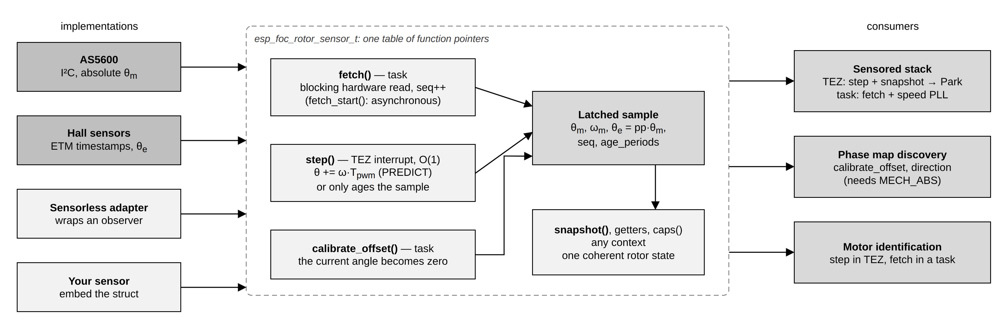

# 4. Rotor sensors

Field-oriented control needs to know where the rotor is. A rotor sensor
driver turns a physical measurement (a magnetic encoder, three Hall switches,
or a software observer) into one common description of the rotor: its angle,
its speed, and how fresh that information is. espFoC defines that description
once, in
[`esp_foc_rotor_sensor.h`](../../include/espFoC/drivers/esp_foc_rotor_sensor.h),
and ships three implementations: the AS5600 magnetic encoder over I2C, a Hall
sensor driver, and an adapter that exposes a sensorless observer through the
same interface. You need this chapter when you build a sensored application,
when you bring up a new sensor, or when you want to write a driver for a
sensor espFoC does not ship.

## What it does

### Why FoC needs the rotor angle

FoC controls the motor currents in a frame that turns with the rotor magnet:
the **d axis** points along the magnet, the **q axis** is 90° ahead of it.
Current on q produces torque; current on d does not. To move between the
three fixed phase currents and that rotating frame, the controller applies
the Park transform, and the Park transform needs the rotor angle at every PWM
period. With a wrong angle, the current meant for q partly lands on d: torque
drops, and with a large enough error the motor stalls or turns the wrong way.

### Mechanical and electrical angle

The **mechanical angle** θm is the shaft position: one full turn is 2π rad.
A motor has a number of magnet **pole pairs** (pp). Each time the shaft moves
by one pole pair, the magnetic field seen by the windings goes through one
full cycle. That cycle is the **electrical angle** θe:

```
θe = pp × θm   (wrapped to one turn)
```

A 7-pole-pair motor goes through 7 electrical turns per shaft turn. Park uses
θe. One consequence: any error in the mechanical reading is multiplied by pp
in the electrical angle.

The electrical angle also needs a zero: θe = 0 must mean "magnet aligned with
phase U". A shaft encoder does not know where that is, so the angle has to be
zeroed against the motor (phase map discovery does it, see below).

In espFoC all angles are in radians, in Q16.16 fixed point (`q16_t`), and
position getters wrap to (−π, +π]. Speeds are in rad/s.

### Absolute, quantised and estimated angles

Sensors differ in what they can know:

- A **magnetic encoder** such as the AS5600 reads the absolute mechanical
  angle over one shaft turn. From it and pp, the electrical angle follows.
- **Hall sensors** are three digital switches that change state every 60
  electrical degrees. They give the electrical angle to within one of six
  sectors, and only the timing of the edges tells what happens in between.
  They do not know which of the pp electrical turns the shaft is in, so they
  give no absolute mechanical angle.
- A **sensorless observer** estimates the electrical angle from the voltages
  and currents. Like Hall sensors it is electrical only.

The interface is "electrical first" for that reason, and every sensor declares
what it can deliver through **capability bits**.

## How it works



### Fetch in a task, step in the interrupt

Reading a sensor can be slow: an I2C transfer to the AS5600 takes far longer
than a PWM period. The interface therefore splits the work in two:

- **`fetch()`** takes a new hardware measurement. It may block and runs in
  task context, at a lower rate (for example 2500 Hz).
- **`step()`** runs once per PWM period in the TEZ interrupt. It is O(1), does
  not divide and does not read a clock. A sensor that can extrapolate (the
  `ESP_FOC_ROTOR_CAP_PREDICT` bit) advances its angle by speed × PWM period, so
  the Park angle does not freeze into a staircase between two reads. A sensor
  that cannot still binds `step()` and uses it to age its sample.

The getters and `snapshot()` only return the last latched values and are safe
to call from an interrupt.

The shipped consumers use the split like this:

- **[Sensored stack](07_sensored_stack.md)**: its TEZ callback calls `step()` and `snapshot()` every
  period and feeds `theta_e` to Park. Every `pwm_hz / fetch_hz` periods it
  wakes its supervisor task, which calls `fetch()`, then `snapshot()`, and runs
  a speed PLL on the result.
- **[Phase map discovery](05_phase_map_discovery.md)**: calls `step()` from its TEZ callback, `fetch()` and
  `get_position()` from its task to watch the shaft, and `calibrate_offset()`
  to zero the encoder while current holds the rotor on the d axis. It refuses
  a sensor without `ESP_FOC_ROTOR_CAP_MECH_ABS` (`ESP_ERR_NOT_SUPPORTED`).
- **[Motor identification](06_motor_identification.md)**: calls `step()` from its TEZ callback and `fetch()`
  from a rotor task it creates, at `CONFIG_ESP_FOC_MOTOR_ID_FETCH_HZ`.

### Capability bits

`caps()` returns a bitwise OR of `esp_foc_rotor_caps_t`. A getter for a
quantity the sensor cannot provide returns 0, so the bit is the only way to
tell "the angle is zero" from "this sensor cannot know".

| Bit | Meaning |
|---|---|
| `ESP_FOC_ROTOR_CAP_MECH_ABS` | θm is absolute over one mechanical turn |
| `ESP_FOC_ROTOR_CAP_ELEC_ABS` | θe is absolute over one electrical turn |
| `ESP_FOC_ROTOR_CAP_MECH_MULTITURN` | θm accumulates past 2π |
| `ESP_FOC_ROTOR_CAP_PREDICT` | `step()` extrapolates between measurements |
| `ESP_FOC_ROTOR_CAP_NEEDS_MAP` | unusable until a map is installed |

| Driver | Caps reported |
|---|---|
| AS5600 | `MECH_ABS`; `ELEC_ABS` if `pole_pairs` ≠ 0; `PREDICT` if `pwm_hz` ≠ 0 |
| Hall | `ELEC_ABS`, `PREDICT`; `NEEDS_MAP` until a sector map is installed |
| Sensorless adapter | `ELEC_ABS` |

### The coherent sample

A controller needs angle, speed and validity from the same instant. Five
separate getters could each return a value from a different update, so
`snapshot()` fills one `esp_foc_rotor_state_t`:

| Field | Meaning |
|---|---|
| `theta_e` | Electrical angle [rad], wrapped to (−π, +π] |
| `omega_e` | Electrical speed [rad/s] |
| `theta_m` | Mechanical angle [rad]; its meaning is declared by the caps |
| `omega_m` | Mechanical speed [rad/s] |
| `seq` | Increments once per raw measurement |
| `age_periods` | `step()` calls since the last raw measurement |
| `sector` | 0..5 for Hall, `ESP_FOC_ROTOR_SECTOR_UNKNOWN` otherwise |
| `valid` | The values come from a real measurement |
| `moving` | The sensor considers the rotor in motion |

`seq` lets a caller tell a new measurement from a repeated one; `age_periods`
tells a fresh angle from an extrapolated one without a timebase.

### Operations

`esp_foc_rotor_sensor_t` is a table of function pointers. No slot is ever
NULL: an implementation binds all of them and reports what it cannot do
(`ESP_ERR_NOT_SUPPORTED` from `esp_err_t` slots, 0 from getters, with the caps
bit absent). Inline wrappers such as `esp_foc_rotor_sensor_fetch()`,
`esp_foc_rotor_sensor_step()`, `esp_foc_rotor_sensor_snapshot()` and
`esp_foc_rotor_sensor_has_cap()` also tolerate a NULL sensor.

| Operation | Context | Contract |
|---|---|---|
| `fetch()` | task | Blocking measurement; on failure the last latch is kept |
| `fetch_start()` | task | Start one asynchronous measurement; `ESP_ERR_INVALID_STATE` if busy |
| `calibrate_offset(samples)` | task | Average `samples` reads (8..32 recommended), make the current angle zero |
| `caps()` | any | Capability bits |
| `step()` | TEZ interrupt | Advance by one PWM period; O(1) |
| `snapshot(out)` | any | Fill `esp_foc_rotor_state_t` |
| `get_position()` | any | θm [rad] |
| `get_velocity()` | any | ωm [rad/s] |
| `get_electrical_position()` | any | θe [rad] |

## How to use it

Each driver has its own static pool of `CONFIG_ESP_FOC_MAX_ROTOR_SENSORS`
objects, taken with `*_acquire(index)` (NULL if out of range or taken) and
returned with `*_release()`. `*_init()` configures the object and
`*_deinit()` frees the hardware.

### AS5600 magnetic encoder

The AS5600 is a 12-bit (4096 counts per turn) contactless magnetic angle
sensor on I2C (address 0x36). The driver talks to the I2C controller through
HAL/LL, not through the IDF I2C driver. From the sensored examples:

```c
#include "espFoC/drivers/esp_foc_rotor_as5600.h"

esp_foc_rotor_sensor_t *encoder = esp_foc_rotor_as5600_acquire(0);

const esp_foc_rotor_as5600_config_t encoder_config = {
    .sda = CONFIG_EXAMPLE_ENCODER_SDA_GPIO,
    .scl = CONFIG_EXAMPLE_ENCODER_SCL_GPIO,
    .i2c_port = 0,
    .i2c_hz = CONFIG_EXAMPLE_ENCODER_I2C_HZ,
    .dt_seconds = 1.0f / (float)CONFIG_ESP_FOC_SD_FETCH_HZ,
    .invert = false,              /* phase discovery measures the direction */
    .pole_pairs = CONFIG_EXAMPLE_MOTOR_POLE_PAIRS,
    .pwm_hz = CONFIG_ESP_FOC_PWM_RATE_HZ,   /* predict between reads */
};
ESP_ERROR_CHECK(esp_foc_rotor_as5600_init(encoder, &encoder_config));
```

| Field | Unit | If 0 | Meaning |
|---|---|---|---|
| `sda`, `scl` | GPIO | — | I2C pins |
| `i2c_port` | index | — | HP I2C controller, usually 0 |
| `i2c_hz` | Hz | 400000 | Bus frequency |
| `dt_seconds` | s | rejected | Period between two `fetch()` calls; used to compute speed |
| `invert` | bool | — | Reverse the counting direction |
| `pole_pairs` | — | no θe, `ELEC_ABS` off | Motor pole pairs |
| `pwm_hz` | Hz | no prediction | Rate at which `step()` is called; enables `PREDICT` |

What the driver does:

- **Init** reads the angle once (failure returns the error and logs the
  pins), programs the sensor's configuration register for normal power mode,
  no hysteresis and the fastest filter, then re-reads the angle register so
  later reads need no register address. A part left in a low-power mode
  refreshes its angle only at 10 Hz, which aliases any useful shaft speed; if
  the configuration write fails, init logs a warning and continues.
- **`fetch()`** works only in task context (`ESP_ERR_INVALID_STATE`
  otherwise). It reads two bytes and blocks on the I2C interrupt, for up to
  100 ms if the bus does not answer. On failure the last angle stays published
  and the next fetch re-addresses the angle register.
- **Speed** is the angle change between successive readings divided by
  `dt_seconds`, spread over the number of fetches since the reading last
  changed. After more than 16 fetches with an identical reading the speed
  reads 0.
- **`step()`** adds speed / `pwm_hz` to the angle when `pwm_hz` is set.
- **`fetch_start()`** starts the same read asynchronously; the I2C interrupt
  updates the latch when it completes.
- **`calibrate_offset(samples)`** averages `samples` reads (handling the wrap
  at 4096), installs the result as the offset so the current position reads
  0, and resets the speed. It returns `ESP_ERR_INVALID_ARG` for `samples < 1`
  and `ESP_ERR_INVALID_STATE` while a transfer is in flight.
- `get_electrical_position()` and `theta_e` are pp × θm, wrapped.

Runtime setters and diagnostics: `esp_foc_rotor_as5600_set_invert()`,
`esp_foc_rotor_as5600_set_pole_pairs()`, `esp_foc_rotor_as5600_busy()`,
`esp_foc_rotor_as5600_bus_recover()` (abort a stuck transfer, task context),
`esp_foc_rotor_as5600_xfer_fail_count()` and
`esp_foc_rotor_as5600_xfer_ok_count()`. The offset is applied before the
inversion, so changing `invert` after calibration keeps the zero.

The examples start with `invert = false`, let phase discovery measure the
direction, and then apply it:

```c
esp_foc_rotor_as5600_set_invert(encoder, phase_map->sensor_reversed);
```

### Hall sensors

The Hall driver is compiled only with `CONFIG_ESP_FOC_ROTOR_HALL` (default y).
It is a standalone driver: the shipped sensored stack and examples use the
AS5600, and no shipped example runs the sensored stack on Hall sensors.

Three lines (A, B, C) form a 3-bit code. The six legal codes in travel order
are 1, 3, 2, 6, 4, 5; neighbours differ by one bit. 000 and 111 mean an open
line or a dead sensor. At each one-bit transition the driver knows the
electrical angle of the boundary just crossed and the instant it was crossed.
A common-layer estimator uses those (angle, time) pairs to produce a
continuous θe and ωe, extrapolated at every `step()`.

The edge instant comes from one of two strategies (`ts_kind`):

- **`ESP_FOC_HALL_TS_ETM_TIMG`**: each line's any-edge GPIO event drives,
  through ETM, the capture task of a timer-group timer counting at 1 MHz.
  The time is latched in hardware, so interrupt latency does not reach it.
- **`ESP_FOC_HALL_TS_GPIO_IRQ`**: a GPIO interrupt reads a 1 MHz clock at
  handler entry. It is simpler to bring up but carries the interrupt's entry
  jitter, which the PWM interrupt can make a sizeable fraction of a sector at
  speed.

The pins are configured open-drain and released, with the internal pull-up to
3.3 V, for open-collector Hall outputs; the driver never drives them low.

| Field | Unit | Default | Meaning |
|---|---|---|---|
| `gpio[3]` | GPIO | required, distinct | Lines A, B, C; avoid strapping pins |
| `pole_pairs` | — | ≥ 1 required | Motor pole pairs |
| `pwm_hz` | Hz | > 0 required | Rate at which `step()` is called |
| `ts_kind` | enum | — | Timestamp strategy |
| `etm_channel[3]` | index | — | ETM_TIMG: three free, distinct ETM channels chosen by the application |
| `timer_group` | index | — | ETM_TIMG: timer group used for the capture |
| `require_etm_ready` | bool | — | ETM_TIMG: refuse init if nothing has enabled ETM yet |
| `irq_level` | 1..3 | 0 → 1 | GPIO_IRQ: interrupt level, below the PWM interrupt |
| `dir_sign` | ±1 | 0 → natural | −1 reverses the sequence |
| `theta_edge_rad[6]` | rad | — | Electrical angle of the boundary that opens each sector |
| `have_map` | bool | false → nominal k·60° ladder | Whether `theta_edge_rad` is valid |
| `lambda_theta` | — | 0 → 0.5 | Estimator angle correction gain |
| `lambda_omega` | — | 0 → 0.3 | Estimator speed correction gain |
| `standstill_ms` | ms | 0 → 150 | Time without edges before the rotor counts as stopped |

The sector map absorbs both the wiring order and the mounting offset. Without
one the angle is correct up to an unknown constant, which is enough to check
decoding, direction, timestamps and extrapolation, and the driver reports it
through `ESP_FOC_ROTOR_CAP_NEEDS_MAP`. `esp_foc_rotor_hall_set_map()`
installs a map and clears that bit.

The driver is event driven: everything happens in `step()`, which reads the
three levels and polls the capture. `fetch()`, `fetch_start()` and
`calibrate_offset()` return `ESP_ERR_NOT_SUPPORTED`. θm is published as
θe / pp and is only meaningful modulo 2π / pp, so `MECH_ABS` is never set.

**Init order with ETM.** Create the inverter before the Hall sensor. The
inverter resets the ETM peripheral during its init, which clears all
channels; the Hall driver only enables the ETM clock and never resets it. In
that order no coordination is needed. With `require_etm_ready` set, the Hall
init detects the reverse order (ETM clock still off) and returns
`ESP_ERR_INVALID_STATE`. An inverter created later clears the Hall channels;
`step()` then sees codes change without captures and counts `capture_lost`,
and `esp_foc_rotor_hall_rearm()` reprograms the channels.

Diagnostics: `esp_foc_rotor_hall_get_health()` fills
`esp_foc_rotor_hall_health_t` (`edges`, `illegal_code`, `multi_bit`,
`capture_lost`, `spurious`, `bounce`, `stale`, `clamped`, `worst_dticks`,
`etm_cold_start`, `ts_healthy`), and `esp_foc_rotor_hall_raw_code()` returns
the 3-bit code for bring-up logs.

```c
#include "espFoC/drivers/esp_foc_rotor_hall.h"

esp_foc_rotor_sensor_t *hall = esp_foc_rotor_hall_acquire(0);
const esp_foc_rotor_hall_config_t hall_config = {
    .gpio = {HALL_A_GPIO, HALL_B_GPIO, HALL_C_GPIO},
    .pole_pairs = POLE_PAIRS,
    .pwm_hz = CONFIG_ESP_FOC_PWM_RATE_HZ,
    .ts_kind = ESP_FOC_HALL_TS_ETM_TIMG,
    .etm_channel = {4, 5, 6},     /* the inverter uses channels 0 and 1 */
    .timer_group = 0,
    .require_etm_ready = true,    /* inverter already created */
};
ESP_ERROR_CHECK(esp_foc_rotor_hall_init(hall, &hall_config));

/* call esp_foc_rotor_sensor_step(hall) once per PWM period, then: */
esp_foc_rotor_hall_health_t health;
esp_foc_rotor_hall_get_health(hall, &health);
```

The driver includes `esp_foc_hall_soc_gate.h`, which stops the build with
`#error "espFoC hall rotor sensor requires ETM + timer-group capture (SOC_CAPS)"`
unless `SOC_ETM_SUPPORTED` and `SOC_TIMER_SUPPORT_ETM` are true.

### Sensorless adapter

[`esp_foc_rotor_sensorless.h`](../../include/espFoC/drivers/esp_foc_rotor_sensorless.h)
wraps an `esp_foc_observer_t` so that code written against the rotor-sensor
interface can read an observer's angle. It is always compiled.

```c
const esp_foc_rotor_sensorless_config_t cfg = {
    .pole_pairs = POLE_PAIRS,      /* >= 1 */
    .observer = &my_observer,      /* not owned; you keep it alive */
};
esp_foc_rotor_sensor_t *s = esp_foc_rotor_sensorless_acquire(0);
ESP_ERROR_CHECK(esp_foc_rotor_sensorless_init(s, &cfg));
```

- `esp_foc_rotor_sensorless_latch()` copies θe and ωe from the observer and
  derives θm = θe / pp and ωm = ωe / pp. Call it after each observer update,
  in the TEZ callback or a task. `fetch()` does the same.
- `fetch_start()` returns `ESP_ERR_NOT_SUPPORTED`; `step()` only ages the
  sample.
- `calibrate_offset()` sets the observer's angle and speed to 0.
- Only `ESP_FOC_ROTOR_CAP_ELEC_ABS` is reported: an electrical observer
  cannot tell which of the pp mechanical positions the shaft is in.

The shipped sensorless stack and the sensorless examples do not use this
adapter; they run the observer themselves. A sensorless application carries no
rotor sensor at all.

### Writing your own sensor

The interface is a plain struct of function pointers, so any sensor can be
added outside espFoC: embed `esp_foc_rotor_sensor_t` in your object, bind
every slot, and hand the pointer to the consumers. The unit tests use the same
technique for a simulated rotor.

```c
#include "esp_macros.h"
#include "espFoC/drivers/esp_foc_rotor_sensor.h"
#include "espFoC/utils/esp_foc_angle.h"

typedef struct {
    esp_foc_rotor_sensor_t iface;
    q16_t theta_m, omega_m;
    uint32_t seq, age;
    unsigned pp;
} my_enc_t;

static my_enc_t s_enc;

static my_enc_t *me(const esp_foc_rotor_sensor_t *s)
{
    return __containerof(s, my_enc_t, iface);
}

static esp_err_t my_fetch(esp_foc_rotor_sensor_t *s)
{
    my_enc_t *e = me(s);
    /* Task context: read the hardware, update theta_m and omega_m. */
    e->seq++;
    e->age = 0;
    return ESP_OK;
}

static esp_err_t my_unsupported(esp_foc_rotor_sensor_t *s) { (void)s; return ESP_ERR_NOT_SUPPORTED; }
static esp_err_t my_cal(esp_foc_rotor_sensor_t *s, int n) { (void)s; (void)n; return ESP_ERR_NOT_SUPPORTED; }
static uint32_t my_caps(const esp_foc_rotor_sensor_t *s) { (void)s; return ESP_FOC_ROTOR_CAP_MECH_ABS | ESP_FOC_ROTOR_CAP_ELEC_ABS; }
static void my_step(esp_foc_rotor_sensor_t *s) { me(s)->age++; }
static q16_t my_pos(esp_foc_rotor_sensor_t *s) { return me(s)->theta_m; }
static q16_t my_vel(esp_foc_rotor_sensor_t *s) { return me(s)->omega_m; }
static q16_t my_elec(esp_foc_rotor_sensor_t *s)
{
    return q16_wrap_pi((q16_t)((int64_t)me(s)->theta_m * me(s)->pp));
}

static void my_snapshot(const esp_foc_rotor_sensor_t *s, esp_foc_rotor_state_t *out)
{
    const my_enc_t *e = me(s);
    out->theta_m = e->theta_m;
    out->omega_m = e->omega_m;
    out->theta_e = q16_wrap_pi((q16_t)((int64_t)e->theta_m * e->pp));
    out->omega_e = (q16_t)((int64_t)e->omega_m * e->pp);
    out->seq = e->seq;
    out->age_periods = e->age;
    out->sector = ESP_FOC_ROTOR_SECTOR_UNKNOWN;
    out->valid = e->seq != 0u;
    out->moving = e->omega_m != 0;
}

esp_foc_rotor_sensor_t *my_enc_init(unsigned pole_pairs)
{
    s_enc.pp = pole_pairs;
    s_enc.iface.fetch = my_fetch;
    s_enc.iface.fetch_start = my_unsupported;
    s_enc.iface.calibrate_offset = my_cal;
    s_enc.iface.caps = my_caps;
    s_enc.iface.step = my_step;
    s_enc.iface.snapshot = my_snapshot;
    s_enc.iface.get_position = my_pos;
    s_enc.iface.get_velocity = my_vel;
    s_enc.iface.get_electrical_position = my_elec;
    return &s_enc.iface;
}
```

Check the consumers' expectations against your sensor: phase map discovery
needs `MECH_ABS` and a working `calibrate_offset()` to zero the angle, and
the sensored stack and motor identification call `fetch()` from their tasks.

## Configuration

| Symbol | Default | Meaning |
|---|---|---|
| `CONFIG_ESP_FOC_MAX_ROTOR_SENSORS` | 1 | Size of each driver's static pool (range 1..2). The AS5600, Hall and sensorless pools are separate. |
| `CONFIG_ESP_FOC_ROTOR_HALL` | y | Build the Hall driver and its timestamp strategies. |
| `CONFIG_ESP_FOC_SD_FETCH_HZ` | 2500 | Encoder fetch rate of the sensored stack (range 100..20000). Must divide the PWM rate; the speed PI, the position P and the PLL run at this rate. |
| `CONFIG_ESP_FOC_MOTOR_ID_FETCH_HZ` | 2500 | Rotor fetch rate of motor identification. Must divide the PWM rate and match the rate the sensor was configured for. |
| `CONFIG_ESP_FOC_PHASE_DISCOVER_ZERO_SAMPLES` | 16 | Sensor reads averaged into the zero by phase map discovery. |

## Use cases

**AS5600 under the sensored stack.** Create the inverter, then the AS5600
with `dt_seconds = 1 / CONFIG_ESP_FOC_SD_FETCH_HZ` and `pwm_hz` set to the
PWM rate. Phase discovery zeros the encoder and measures its direction,
motor identification fits the remaining angle offset and delay, and the
stack runs with prediction at the PWM rate. See
[`foc_sensored_torque`](../../examples/foc_sensored_torque/README.md),
[`foc_sensored_velocity`](../../examples/foc_sensored_velocity/README.md) and
[`foc_sensored_servo`](../../examples/foc_sensored_servo/README.md).

**Hall bring-up.** Create the inverter first, then the Hall sensor without a
map. Call `step()` at the configured rate, turn the shaft by hand and log
`esp_foc_rotor_hall_raw_code()` and the health counters: the code should walk
1, 3, 2, 6, 4, 5 (or the reverse), `illegal_code` and `capture_lost` should
stay at 0, and `edges` should rise by 6 × pp per turn.

**A sensor espFoC does not ship.** Implement the interface as shown above,
declare honest caps, and pass the object wherever an
`esp_foc_rotor_sensor_t *` is expected.

## Limits and pitfalls

- **Rates must match.** `dt_seconds` must equal the real interval between
  `fetch()` calls, and `pwm_hz` must equal the rate of `step()` calls; the
  drivers compute speed and prediction from these numbers, not from a clock.
  Call `step()` exactly once per PWM period.
- **`fetch()` blocks.** The AS5600 fetch waits on I2C, up to 100 ms on a dead
  bus, and refuses to run outside task context. Never call it from the TEZ
  callback.
- **Do not fetch during calibration.** `calibrate_offset()` takes its own
  reads; the header asks the caller not to fetch beforehand.
- **Mechanical errors are multiplied by pp.** The AS5600 resolves
  2π / 4096 mechanical; the electrical resolution is pp times coarser, and so
  is any mounting or eccentricity error.
- **The Hall driver does not fit every consumer.** Phase map discovery refuses
  it (no `MECH_ABS`), and it answers `fetch()` with `ESP_ERR_NOT_SUPPORTED`,
  which the sensored stack counts as read errors. Hall support in the stacks
  is not part of the shipped, validated paths.
- **ETM init order.** Create the inverter before a Hall sensor using
  `ESP_FOC_HALL_TS_ETM_TIMG`, or call `esp_foc_rotor_hall_rearm()` afterwards.
  The cold-start check is exact after a power-on reset and only advisory after
  a software or JTAG reset.
- **GPIO_IRQ timestamps.** The GPIO interrupt level must stay below the PWM
  interrupt's (level 3), and its timestamps carry entry jitter. The interrupt
  strategy only handles Hall pins numbered below 32.
- **Sensorless means no sensor.** The sensorless adapter publishes an
  estimate; it is not a reason to wire an encoder into a sensorless
  application.
