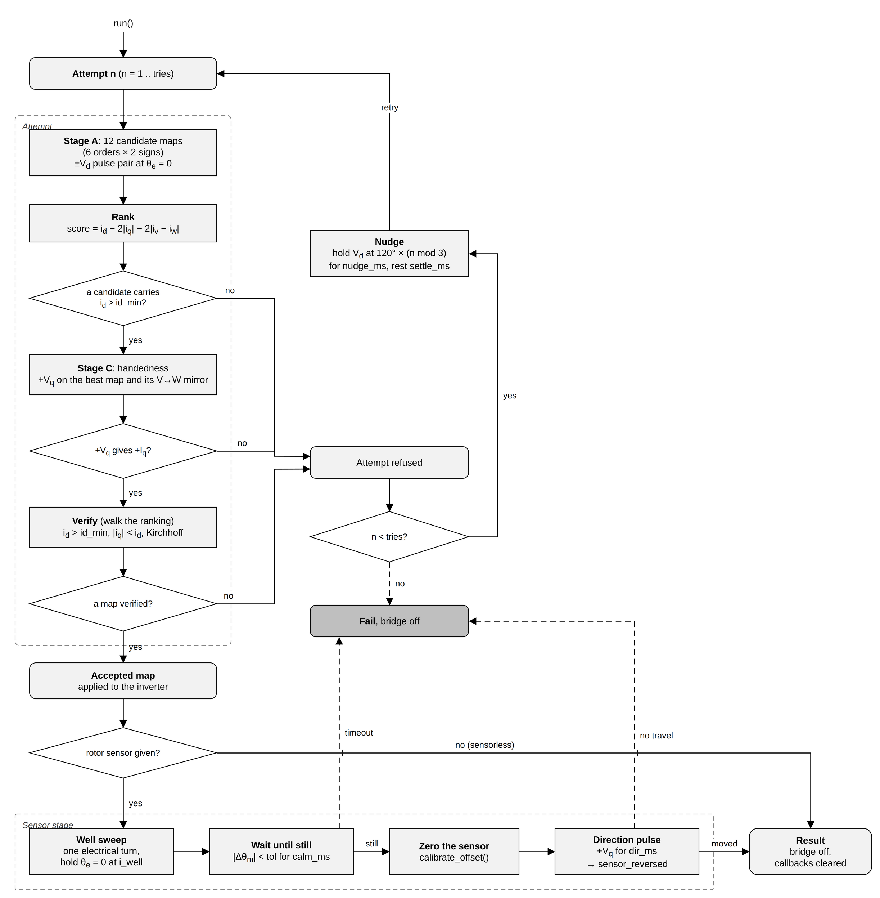

# 5. Phase map discovery

Phase map discovery finds out, at standstill and before anything else drives
the motor, how the motor is wired to the inverter: which bridge output drives
which motor phase, which sign each current-sense channel reports, and, when a
rotor sensor is fitted, where the sensor's zero is and which way it counts.
You need it on the first power-up of any new wiring, and the examples run it
on every boot so that the motor leads can be connected in any order. The block
lives in
[`esp_foc_phase_discover.h`](../../include/espFoC/motor_control/esp_foc_phase_discover.h).

## What it does

A three-phase motor has three leads, and the inverter (the three half-bridges
that switch the supply onto those leads) has three outputs. Nothing in the
hardware says which lead goes where, so there are six possible orders. On top
of that:

- Each current-sense channel (a shunt resistor plus an amplifier) may report
  the current flowing into the motor as positive or as negative, depending on
  how the amplifier is wired.
- A rotor sensor such as a magnetic encoder reads an angle whose zero is
  wherever the magnet happened to be glued, and it may count up in either
  direction of rotation.

Field-oriented control (FoC) does all its work in a frame that turns with the
rotor: the **d axis** points along the rotor magnet, the **q axis** sits 90
electrical degrees ahead of it, and only current on the q axis makes torque.
The software decides where these axes are from the phase order, the current
signs and the rotor angle. If any of them is wrong, a voltage the code puts on
"d" lands somewhere else, and the current it reads back as "q" is not the
torque current.

The consequence is not always an obvious failure. Every later measurement is
taken in the frame the map defines, so with a wrong map the motor
identification ([chapter 6](06_motor_identification.md)) still returns numbers,
they just describe the wrong thing: a wrong map can make a 2.2 ohm winding read
as 8.3 ohm. A sign error on the q axis is worse: the current regulator then
pushes the current further away instead of correcting it (positive feedback),
and no gain setting can fix that.

The result of discovery is an `esp_foc_phase_map_t`, defined in
[`esp_foc_inverter.h`](../../include/espFoC/drivers/esp_foc_inverter.h):

| Field | Meaning |
|---|---|
| `pwm_to_hw[L]` | Hardware output (0..2) that drives logical phase `L` (U = 0, V = 1, W = 2). Must be a permutation of {0, 1, 2}. |
| `i_sign[L]` | +1 or -1, the sign applied to the current read for phase `L`. |

Once the map is applied to the inverter, the rest of espFoC sees an ideal
motor with phases U, V, W in order and currents positive into the motor.


## How it works

Discovery runs a series of short voltage pulses with the rotor at rest,
measures the current each pulse produces, and keeps the map under which the
motor answers the way an ideal motor would. With a sensor, it then pulls the
rotor onto a known electrical angle and zeroes the sensor there.



### Why the rotor does not matter: the pulse pair

Each test applies a voltage vector for `pulse_ms` (6 ms by default) and
averages the phase currents over that window. The window is chosen between two
time scales:

- it is longer than the **electrical time constant** (how long the winding
  current takes to settle after a voltage step, around 100 µs on small motors),
  so the current has reached its final value;
- it is shorter than the **mechanical time constant** (how long the rotor takes
  to start moving, tens of milliseconds), so the shaft has not answered yet.

Every test is a **pulse pair**: the vector, a pause, then the same vector with
the opposite sign. At standstill the winding answers both with equal and
opposite currents, whatever the rotor position. Things that do not reverse,
such as a small offset in the current sense or the voltage from a shaft that
is still drifting, are removed by taking half the difference of the two
readings. The pair also cancels its own torque, so the rotor does not walk
away during the test.

Before each candidate map is tested the bridge is re-armed with that map, the
current-sense offsets are re-measured (`cal_rounds` rounds) and the bridge sits
at 50 % duty for 50 ms. After the pulse pair the bridge is disabled again.

### Stage A: rank twelve candidates

Six phase orders times two signs (all three `i_sign` values +1, or all -1) give
twelve candidate maps. For each one, discovery puts a d-axis voltage `Vd` at
electrical angle 0 (along phase U) and measures the d and q currents and the
three phase currents. The candidate is scored as

```
score = id - 2·|iq| - 2·|iv - iw|
```

In words: a correct map puts the current on +d, leaks almost nothing into q,
and splits the return current evenly between phases V and W (a vector along U
returns through V and W in equal parts). A candidate is admitted only if `id`
exceeds `id_min_a`; the admitted ones are sorted by score. Discovery ranks
instead of applying fixed thresholds because absolute limits on leakage and
balance turned out to sit inside the spread of healthy motors and refused
good runs.

If no candidate carries current, the attempt fails with `ESP_FAIL`.

### Stage C: handedness check

Stage A only looks at the d axis. Stage C applies a q-axis voltage `+Vq` with
the best map and with its mirror (V and W outputs swapped) and checks that
`+Vq` produces `+Iq`.

This catches a case no map can fix. Reordering the outputs moves the drive and
the sense together, so it cannot change the sign of the q answer. If `+Vq`
still gives `-Iq`, the current channels are mirrored with respect to the
outputs (which leg each shunt reads), and the q regulator would run with
positive feedback. Discovery reports this as a failure
(`ESP_ERR_INVALID_RESPONSE`) instead of ranking it away. It also fails if the
two maps disagree on the sign, because then the measurement does not follow
the motor model at all.

### Verify

Verify walks the ranking from the top and accepts the first map that passes
three checks on a fresh d-axis pulse pair:

- `id` above `id_min_a` (real current on +d);
- `|iq| < id` (the current is mostly on d);
- **Kirchhoff's current law**: the three phase currents of a motor with no
  neutral wire sum to zero. Discovery requires the sum to be at most one fifth
  of the sum of their magnitudes, with that magnitude at least three times
  `id_min_a`.

On an inverter with two shunts the third current is computed as the negative
of the other two, so the Kirchhoff sum is zero by construction and only the
magnitude part can refuse.

The accepted map is applied to the inverter. Its d current per volt of probe
(`admittance`) is kept and used later to size the sensor-stage hold voltage.

### Retries with a 120° nudge

If an attempt is refused (no candidate in stage A, a failed handedness check,
or no map passing verify) and attempts remain, discovery holds a d-axis vector
at an electrical angle of 120° × (attempt mod 3) for `nudge_ms`, disables the
bridge, waits `settle_ms` and starts over. The rotor is moved on purpose
because many motors have a different inductance along and across the magnet
(written Ld ≠ Lq). On such a motor the stage A currents depend on where the
rotor happens to rest, and since the pulse pairs cancel their own torque, a
retry without a nudge would see exactly the same rotor position again. The
number of attempts is `tries` (3 by default).

### Sensor stage (only with a rotor sensor)

After a map is accepted, and only if a sensor was given to `init`:

1. **Well sweep.** The field is turned through one full electrical revolution
   in `sweep_ms` and then held at electrical angle 0. The rotor magnet lines
   up with the field, as a compass needle does, and comes to rest in this
   "well". The hold is applied as a voltage, sized from the measured admittance
   to give about `i_well_a` of current (capped at 25 % of the supply), so no
   current loop is needed yet.
2. **Wait until still.** Discovery reads the sensor every 5 ms and waits until
   the mechanical angle has stayed within `still_tol_rad` for `calm_ms`. If
   that does not happen within `timeout_ms`, the run fails with
   `ESP_ERR_TIMEOUT`.
3. **Zero the sensor.** `esp_foc_rotor_sensor_calibrate_offset()` averages
   `zero_samples` reads and takes that angle as zero. From now on, sensor
   angle zero means "rotor magnet aligned with phase U".
4. **Direction pulse.** A `+Vq` pulse of `dir_v` volts for `dir_ms` pushes the
   rotor forward. If the sensor angle goes down, the sensor counts backwards
   and `sensor_reversed` is set. If the shaft moved less than `dir_min_rad`,
   the run fails with `ESP_ERR_INVALID_RESPONSE`.

The sweep matters because of **cogging**: the magnets are attracted to the
stator teeth, which gives the rotor preferred rest positions independent of
the field. Cogging holds the rotor anywhere within `asin(cog / i_well)` of the
well, where `cog` is the cogging torque expressed as an equivalent current.
A rotor that starts near the unstable point (facing away from the field) may
also stay there unless the field sweeps it in. As an illustration, with
cogging equivalent to 0.11 A, a 0.25 A hold leaves up to ±26 electrical
degrees of error in the zero, while a 0.60 A hold after a sweep leaves about
11 degrees.

## How to use it

The sequence an application follows is: create the inverter (and the sensor),
fill a config, `init`, `run`, `cleanup`, then hand the result to the stack.
This is the shape the sensored examples use:

```c
#include "espFoC/motor_control/esp_foc_phase_discover.h"
#include "espFoC/drivers/esp_foc_rotor_as5600.h"

static esp_err_t discover_phases(esp_foc_inverter_t *inverter,
                                 esp_foc_rotor_sensor_t *encoder,
                                 esp_foc_phase_discover_result_t *result)
{
    esp_foc_phase_discover_t discovery = {0};
    esp_foc_phase_discover_config_t cfg;

    esp_foc_phase_discover_default_config(&cfg);
    esp_err_t err = esp_foc_phase_discover_init(&discovery, inverter, encoder, &cfg);
    if (err == ESP_OK) {
        err = esp_foc_phase_discover_run(&discovery, result);
    }
    esp_foc_phase_discover_cleanup(&discovery);
    if (err != ESP_OK) {
        return err;
    }
    /* Discovery only reports the direction; the sensor driver applies it. */
    esp_foc_rotor_as5600_set_invert(encoder, result->sensor_reversed);
    return ESP_OK;
}
```

### Step by step

1. **`esp_foc_phase_discover_default_config(&cfg)`** fills the config from the
   Kconfig values (see [Configuration](#configuration)). Change fields after
   this call if needed. Passing `NULL` as the config to `init` has the same
   effect.
2. **`esp_foc_phase_discover_init(&pd, inv, rotor, &cfg)`** binds the block to
   an initialised inverter and an optional sensor. It does not touch the
   inverter. Pass `rotor = NULL` for a sensorless setup. A sensor must report
   `ESP_FOC_ROTOR_CAP_MECH_ABS` (an absolute mechanical angle); the AS5600
   driver does, the hall-sensor driver does not. `init` checks the config and
   returns `ESP_ERR_NOT_SUPPORTED` for a sensor without that capability or for
   an RTOS tick slower than 1 kHz.
3. **`esp_foc_phase_discover_run(&pd, &result)`** blocks until discovery ends.
   On `ESP_OK` the map is already applied to the inverter. On every return the
   bridge is disabled and the inverter callbacks are cleared.
4. **`esp_foc_phase_discover_cleanup(&pd)`** removes anything the block left
   installed. It is idempotent and safe after a failed run, after a successful
   run (where it does nothing) and without any run.

The `esp_foc_phase_discover_t` object is owned by the caller and needs no heap.
It can live on the stack of the calling task, as in the snippet; zero it before
use so that `cleanup` is safe even if `init` failed early.

### The result

| Field | Meaning |
|---|---|
| `map` | The accepted map: `map.pwm_to_hw[3]` and `map.i_sign[3]`. |
| `attempts` | Attempts used (1 when the first one succeeded). |
| `rank_idx` | Stage A index (0..11) of the accepted map; -1 if none. |
| `id_verify`, `iq_verify` | d and q current of the verify pulse, amps (Q16.16). |
| `admittance` | `id_verify` divided by the probe voltage, amps per unit of supply voltage (Q16.16). |
| `sensor_zeroed` | The sensor offset was taken in the well. |
| `sensor_reversed` | The sensor counts against the motor's forward direction. Reported only. |

`sensor_reversed` is not applied by discovery, because the portable sensor
interface has no call to flip a sensor. The application does it through the
sensor driver, for example `esp_foc_rotor_as5600_set_invert()`. The zero taken
by discovery stays valid after the flip on sensors that subtract the offset
before applying the direction, which the AS5600 driver does.

### Return codes of `run`

| Code | Meaning |
|---|---|
| `ESP_OK` | Map found and applied (and, with a sensor, zero and direction taken). |
| `ESP_ERR_INVALID_ARG` | `NULL` arguments. |
| `ESP_ERR_INVALID_STATE` | Called from an interrupt, not initialised, or called again while running. |
| `ESP_FAIL` | No candidate carried current, or the bridge tripped in the sensor stage. |
| `ESP_ERR_INVALID_RESPONSE` | Current sense mirrored (stage C), no map verified, or the shaft did not answer the direction pulse. |
| `ESP_ERR_TIMEOUT` | The rotor never came to rest in the well. |
| other | An error returned by the sensor. |

### Applying the result to a stack

The stacks take the map through their config and apply it to the inverter at
`init` (the bridge must be disabled, which it is after `run`):

```c
esp_foc_sensored_config_t controller_config;
esp_foc_sensored_default_config(&controller_config);
/* ... motor parameters, see chapter 6 ... */
esp_foc_sensored_config_from_phase_map(&controller_config, &result);
```

`esp_foc_sensored_config_from_phase_map()` and
`esp_foc_sensorless_config_from_phase_map()` copy `result.map` into the
config's `map` field and set `map_valid`, but only if the map is a valid
permutation with ±1 signs. See the [Sensored stack](07_sensored_stack.md)
chapter for the rest of the config.

If you already know the map you can skip discovery and set `map` and
`map_valid` by hand, or seed the inverter at creation through the `phase_map`
field of `esp_foc_inverter_mcpwm_config_t` (an invalid or all-zero map there
means identity). With a sensor this does not replace discovery: the portable
sensor interface sets the zero only through `calibrate_offset`, and has no call
to load a stored one.

### Optional event callback

Set `cfg.on_event` (and `cfg.ctx`) to watch every step. The callback runs on
the task that called `run`, between pulses. Currents in the event are Q16.16
amps, already as the half difference of the pulse pair.

```c
static void on_discovery_event(void *ctx, const esp_foc_phase_discover_event_t *e)
{
    (void)ctx;
    switch (e->ev) {
    case ESP_FOC_PHASE_DISCOVER_EV_CANDIDATE:
        printf("candidate %2d id %+.3f A iq %+.3f A %s\n", e->idx,
               (double)q16_to_float(e->id), (double)q16_to_float(e->iq),
               e->good ? "admitted" : "rejected");
        break;
    case ESP_FOC_PHASE_DISCOVER_EV_REFUSED:
        printf("attempt %u refused: %s\n", (unsigned)e->attempt, esp_err_to_name(e->err));
        break;
    default:
        break;
    }
}
```

| Event | When | Useful fields |
|---|---|---|
| `ESP_FOC_PHASE_DISCOVER_EV_ATTEMPT` | An attempt starts | `idx` = attempt, `value` = probe Vd (per unit of supply) |
| `ESP_FOC_PHASE_DISCOVER_EV_CANDIDATE` | Stage A, each candidate | `idx` = 0..11, currents, `score`, `good`, `tripped` |
| `ESP_FOC_PHASE_DISCOVER_EV_RANKED` | Stage A done | `idx` = admitted count, `map` = best |
| `ESP_FOC_PHASE_DISCOVER_EV_HANDED` | Stage C | `idx` 0 = best, 1 = its V↔W mirror |
| `ESP_FOC_PHASE_DISCOVER_EV_VERIFY` | Each verified map | `idx` = rank position, `value` = Kirchhoff residual |
| `ESP_FOC_PHASE_DISCOVER_EV_REFUSED` | Attempt failed | `err` |
| `ESP_FOC_PHASE_DISCOVER_EV_NUDGE` | Between attempts | `idx` = 120° step, `ms` = hold |
| `ESP_FOC_PHASE_DISCOVER_EV_MAP` | Map accepted and applied | `map`, `id`, `iq`, `value` = admittance |
| `ESP_FOC_PHASE_DISCOVER_EV_WELL` | Sweep done | `value` = hold Vd (per unit) |
| `ESP_FOC_PHASE_DISCOVER_EV_STILL` | Rest reached or not | `ms` = time to rest, `good` |
| `ESP_FOC_PHASE_DISCOVER_EV_ZERO` | Sensor zeroed | `err` = `calibrate_offset` result |
| `ESP_FOC_PHASE_DISCOVER_EV_DIR` | Direction pulse | `value` = shaft travel (rad), `reversed` |

### How long it takes

Every candidate test costs about 70 ms of arming and settling plus three
`pulse_ms` windows (pulse, pause, opposite pulse). An attempt is 16 candidate
tests when the top-ranked map verifies, about 1.4 s with the defaults, and 27
when verify has to walk the whole ranking, about 2.4 s. The worst case with the
defaults is about 14 s: three attempts, two nudges of `nudge_ms + settle_ms`,
and the sensor stage, bounded by `sweep_ms + timeout_ms + dir_ms`.

## Configuration

All options are in `idf.py menuconfig` under **espFoC Settings → Phase map
discovery**. Apart from `CONFIG_ESP_FOC_PHASE_DISCOVER`, which builds the block,
they are only the defaults `esp_foc_phase_discover_default_config()` copies
into the config; every one has a matching config field.

| Symbol | Default | Meaning |
|---|---|---|
| `CONFIG_ESP_FOC_PHASE_DISCOVER` | y | Build phase map discovery. |
| `CONFIG_ESP_FOC_PHASE_DISCOVER_VD_MV` | 1200 | Probe voltage, mV (`vd_v`). Clamped to 5..25 % of the supply at `init`. |
| `CONFIG_ESP_FOC_PHASE_DISCOVER_ID_MIN_MA` | 80 | Minimum d current to admit a candidate, mA (`id_min_a`). |
| `CONFIG_ESP_FOC_PHASE_DISCOVER_PULSE_MS` | 6 | Pulse window, ms (`pulse_ms`). |
| `CONFIG_ESP_FOC_PHASE_DISCOVER_CAL_ROUNDS` | 32 | Current-sense zero rounds per candidate (`cal_rounds`). |
| `CONFIG_ESP_FOC_PHASE_DISCOVER_TRIES` | 3 | Attempts before giving up (`tries`). |
| `CONFIG_ESP_FOC_PHASE_DISCOVER_NUDGE_MS` | 300 | Nudge hold between attempts, ms (`nudge_ms`). |
| `CONFIG_ESP_FOC_PHASE_DISCOVER_SETTLE_MS` | 800 | Rest after a nudge, ms (`settle_ms`). |
| `CONFIG_ESP_FOC_PHASE_DISCOVER_WELL_MA` | 600 | Well hold current, mA (`sensor.i_well_a`). |
| `CONFIG_ESP_FOC_PHASE_DISCOVER_WELL_SWEEP_MS` | 500 | Duration of the one-revolution sweep, ms (`sensor.sweep_ms`). |
| `CONFIG_ESP_FOC_PHASE_DISCOVER_STILL_TIMEOUT_MS` | 4000 | Give up waiting for rest after, ms (`sensor.timeout_ms`). |
| `CONFIG_ESP_FOC_PHASE_DISCOVER_DIR_MV` | 1000 | Direction pulse q voltage, mV (`sensor.dir_v`). |

The **Rotor sensor stage** submenu also holds the rest tolerance (12 mrad), the
calm time (400 ms), the number of zero samples (16), the direction pulse length
(25 ms) and the minimum travel over that pulse (5 mrad).

The probe height is a voltage, not a fraction of the supply, on purpose: the
bridge dead time and the transistor drops eat a roughly fixed 0.7 V, so a
fraction that works at 24 V can sit inside that dead zone at 12 V.

Discovery also needs `CONFIG_FREERTOS_HZ=1000`; every example sets it in its
`sdkconfig.defaults`.

## Use cases

- **First power-up with unknown wiring.** Connect the motor leads in any order,
  run discovery, and print the map (the examples print a table of motor phase,
  bridge output and current sign). From then on the rest of the software sees
  phases in order.
- **Every boot.** All examples run discovery, then identification, on every
  boot before starting the controller; see
  [sensored torque](../../examples/foc_sensored_torque/README.md),
  [sensored velocity](../../examples/foc_sensored_velocity/README.md) and
  [sensored servo](../../examples/foc_sensored_servo/README.md). With a sensor
  this is also how the sensor zero is set on each boot.
- **Motor re-plugged.** Run discovery again whenever the motor is unplugged and
  reconnected, and before identifying the motor again: the old map may no
  longer match the leads.
- **Sensorless.** Pass `rotor = NULL`. Only the map is found; there is no sensor
  stage, `sensor_zeroed` and `sensor_reversed` stay false. See
  [sensorless torque](../../examples/foc_sensorless_torque/README.md) and
  [sensorless velocity](../../examples/foc_sensorless_velocity/README.md).

## Limits and pitfalls

- **1 kHz RTOS tick.** Pulses are timed with 1 ms sleeps. With a slower tick a
  6 ms probe stretches into a torque pulse the shaft answers, so `init` refuses
  with `ESP_ERR_NOT_SUPPORTED`. Set `CONFIG_FREERTOS_HZ=1000`.
- **Task context, blocking.** `run` must be called from a task; from an
  interrupt it returns `ESP_ERR_INVALID_STATE`. It blocks for seconds.
- **It owns the inverter callbacks while it runs.** `run` installs its own PWM
  (TEZ), DMA and fault callbacks and clears all three on every return path.
  Run discovery before initialising a stack, and register your own callbacks
  after it.
- **It owns the sensor while it runs.** Nothing else may fetch the rotor sensor
  during `run`.
- **The bridge is off afterwards.** On every return, success or failure, the
  bridge is disabled.
- **The shaft moves.** The pulse pairs barely move it, but the nudges and the
  sensor stage turn it on purpose. Keep the shaft free and hands off.
- **Weak current.** A high-resistance winding at a low probe voltage may not
  reach `id_min_a`; the run then fails with `ESP_FAIL`. Raise `vd_v` (it is
  clamped to 25 % of the supply).
- **Mirrored current sense.** A stage C failure means the current channels are
  mirrored with respect to the outputs. No phase map can correct it; check
  which current-sense input is wired to which phase.
- **Uniform signs only.** Candidates use the same `i_sign` on all three
  phases.
- **Hold current versus cogging.** On a motor with strong cogging, a
  `sensor.i_well_a` close to the cogging level leaves a large error in the
  sensor zero. Keep it well above the cogging torque.
- **The direction is reported, not applied.** Call the sensor driver's invert
  function with `sensor_reversed` before using the sensor.
