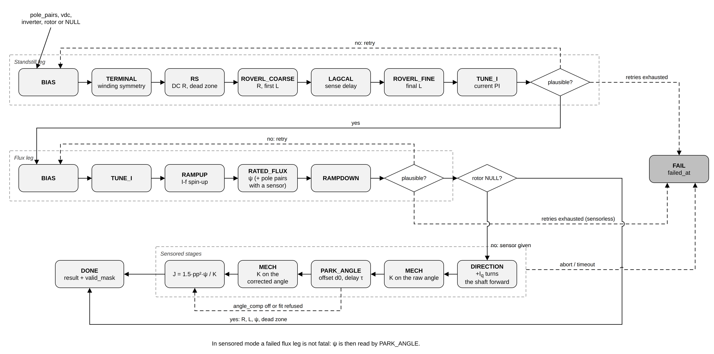

# 6. Motor identification

Motor identification measures the electrical and mechanical numbers that
describe a motor (its resistance, inductance, magnet strength and, with a rotor
sensor, how fast it accelerates per amp and how the sensor angle relates to the
real rotor angle). The controllers design their gains and their observer from
these numbers, so identification lets an application start from nothing but
the pole pairs and the supply voltage. You need it whenever the motor's
parameters are not already known, and it has to run after
[phase map discovery](05_phase_map_discovery.md). The entry point is
`esp_foc_motor_id_run()` in
[`esp_foc_motor_id.h`](../../include/espFoC/motor_control/esp_foc_motor_id.h).

## What it does

### The motor parameters in plain words

A controller is designed against a model of the motor. espFoC uses the usual
model of a permanent-magnet motor, and its parameters are:

| Parameter | Result field | What it is | Who needs it |
|---|---|---|---|
| Phase resistance R | `rs_ohm`, `r_loop_ohm` | Resistance of one phase winding, in ohm. Sets how much voltage a given current needs at rest. | Current-loop gains, observer |
| Inductance L | `ls_h` | How strongly the winding resists a change of current, in henry. Sets how fast the current can follow a voltage step. | Current-loop gains, observer |
| Flux linkage ψ | `psi_f_wb` | Strength of the rotor magnets as seen by the winding, in weber. The voltage the spinning motor generates (back-EMF) is ω_e·ψ, so ψ is also the back-EMF constant in volts per electrical rad/s. | Sensorless observer, speed design |
| Pole pairs | `pole_pairs` | Number of north/south magnet pairs on the rotor. The electrical angle turns this many times faster than the shaft. Supplied by you, not measured. | Everything that converts shaft angle to electrical angle |
| Acceleration per amp K | `k_rad_s2_per_a` | How fast the electrical speed rises per amp of torque current, in rad/s² per A. Folds torque constant, inertia and load into one number. | Speed and position loop gains (sensored) |
| Inertia J | `j_kgm2` | Rotational mass of the rotor and whatever is attached, in kg·m². Computed from K, ψ and the pole pairs. | Informative |
| Sensor angle offset | `park_offset_rad` | Constant error between the sensor's electrical angle and the real magnet axis, in rad. | Park transform (sensored) |
| Sensor delay | `park_lead_s` | How far behind the sensor angle lags, in seconds; the angle error grows with speed as ω_e·delay. | Park transform (sensored) |
| Bridge dead zone | `v_deadzone_v` | Voltage the bridge loses to dead time and transistor drops before the winding sees anything. | Sensorless start-up |

The **Park transform** is the step that turns the three phase currents into the
d and q currents using the rotor angle. With a sensor, the angle the
controller uses is

```
θ_park = θe + park_offset_rad + ω_e · park_lead_s
```

where θe is the sensor's electrical angle and ω_e the electrical speed. An
angle error shifts current from q (torque) to d (no torque), so a motor with
an uncorrected offset makes less torque per amp than it should.

### Why the controllers need them

- The **current loop** is a PI regulator (proportional + integral) on the d and
  q currents. Its gains are designed from R and L: the stacks compute them
  themselves when `kp_i` is left at 0.
- The **sensorless observer** estimates the rotor angle from the voltages and
  currents. It subtracts the voltage R and L explain and reads what is left as
  back-EMF, which only works if R, L and ψ are right.
- The **speed loop** (sensored) needs K to know how much current a given speed
  error is worth.
- The **Park offset and delay** let the sensored stack place the current on the
  q axis at every speed.

## How it works

`esp_foc_motor_id_run()` takes the inverter, an optional rotor sensor and the
two numbers no measurement can supply: the pole pairs and the supply voltage
(`vdc`). It runs the sequence on its own task and returns the result. The mode
is picked by the sensor argument:

- **Sensorless** (`rotor` is `NULL`): standstill impedance probes (R, L, sense
  delay, dead zone, current-loop gains), then a flux leg that spins the motor
  open loop to measure ψ. This is everything a sensorless observer needs.
- **Sensored**: the same electrical stages, then, on the sensor angle, a
  direction check, the mechanical plant (K, J), a probe that fits the sensor
  offset and delay, and the mechanical plant again on the corrected angle.



### Stages

The sequence reports its progress as an `esp_foc_motor_id_phase_t`.
`esp_foc_motor_id_phase_name()` returns the short name shown in the second
column.

| Stage | Name | What happens |
|---|---|---|
| `ESP_FOC_MOTOR_ID_IDLE` | `idle` | Not started. |
| `ESP_FOC_MOTOR_ID_BIAS` | `bias` | Outputs parked at zero; checks that the bridge has not tripped. |
| `ESP_FOC_MOTOR_ID_TERMINAL` | `terminal` | DC current into each of the three terminals in turn; refuses an asymmetric winding. |
| `ESP_FOC_MOTOR_ID_RS` | `rs` | DC resistance from two operating points; the bridge dead zone from the same line. |
| `ESP_FOC_MOTOR_ID_ROVERL_COARSE` | `roverl_coarse` | First AC impedance probe at a low frequency: R and a first L. |
| `ESP_FOC_MOTOR_ID_LAGCAL` | `lagcal` | Times the delay from voltage command to current measurement off a voltage step. |
| `ESP_FOC_MOTOR_ID_ROVERL_FINE` | `roverl_fine` | AC probe re-aimed near the frequency where ωL = R: the final L. |
| `ESP_FOC_MOTOR_ID_TUNE_I` | `tune_i` | Current-loop gains designed from R and L and applied. |
| `ESP_FOC_MOTOR_ID_RAMPUP` | `rampup` | I-f spin-up of the flux leg. |
| `ESP_FOC_MOTOR_ID_RATED_FLUX` | `rated_flux` | Steady I-f spin; ψ from the q-axis voltage balance. |
| `ESP_FOC_MOTOR_ID_RAMPDOWN` | `rampdown` | I-f ramp back to rest. |
| `ESP_FOC_MOTOR_ID_DIRECTION` | `direction` | Sensored: +Iq must turn the shaft forward on the sensor. |
| `ESP_FOC_MOTOR_ID_MECH` | `mech` | Sensored: K from a two-level torque step. |
| `ESP_FOC_MOTOR_ID_PARK_ANGLE` | `park_angle` | Sensored: sensor offset and delay from a speed sweep. |
| `ESP_FOC_MOTOR_ID_DONE` | `done` | Finished. |
| `ESP_FOC_MOTOR_ID_FAIL` | `fail` | Ended with an error. |

### Standstill leg

The motor is not meant to turn here. The probes work like this:

- **Two-point DC resistance (`rs`).** A single voltage/current reading would
  count the bridge's fixed voltage loss as resistance. Two operating points
  and the slope between them cancel that loss, and where the line crosses zero
  current is the dead zone, reported as `v_deadzone_v`.
- **AC impedance probes (`roverl_coarse`, `roverl_fine`).** A sine voltage is
  applied on top of a DC bias and the current answer is correlated with the
  excitation over a whole number of periods (`probe_periods`). The in-phase
  part gives R and the out-of-phase part gives L. The DC bias keeps the current
  from changing sign, because near zero current the bridge's dead time leaves
  the phase floating and the probe would measure a clipped waveform instead of
  the winding. The amplitude is searched toward a target current
  (`i_probe_target_a`) so the same sequence covers both low- and high-inductance
  windings.
- **Sense delay (`lagcal`).** The current measurement lags the command by a few
  PWM periods (trigger, conversion and transfer each take time). At the probe
  frequency even one period of delay rotates the measured answer by several
  degrees, which spoils L. The delay is timed off a voltage step: the winding
  cannot answer before it is driven, so the first sample that moves marks the
  delay.
- **Current-loop design (`tune_i`).** The PI gains are designed from R and L for
  a bandwidth of `i_bw_hz`, scaled by `tune_backoff`, and applied so that the
  flux leg can run a current loop.

### Flux leg

The flux leg reuses the standstill R and L and skips the DC and AC probes. It
drives the motor **I-f** (current-forced open loop): a current of fixed size
(`i_flux_a`) whose angle is turned at a set frequency, ramped up to `flux_hz`.
The rotor magnets lock to the turning current and follow it, like a compass
needle following a rotating magnet. At steady speed the q-axis voltage must
balance

```
vq = R·iq + ω·L·id + ω·ψ
```

so ψ is what is left after the resistive and inductive terms are subtracted,
divided by the speed. With a sensor, the leg also measures the shaft speed and
counts the pole pairs from the ratio of electrical to mechanical speed; an
attempt whose count differs from `pole_pairs` is refused, because a rotor that
slipped behind the field reads a wrong ψ.

### Retries and plausibility checks

Each of the two electrical legs (standstill and flux) is tried up to `tries`
times. Before each standstill attempt the motor rests `settle_ms` (a swinging
rotor generates voltage that spoils the AC probes). After every attempt the
bridge is off for `coast_ms`, and after a failed one the sequence rests a
further `retry_ms`, because the probe bias heats the winding. Current-sense
offsets are re-measured on every attempt so retries are independent.

An attempt that finishes is still refused if its numbers are implausible:

| Check | Default window |
|---|---|
| Loop resistance `r_loop_ohm` | `r_min_ohm` 0.20 .. `r_max_ohm` 40 ohm |
| Inductance `ls_h` | `l_min_h` 20 µH .. `l_max_h` 50 mH |
| Flux linkage `psi_f_wb` | `psi_min_wb` 200 µWb .. `psi_max_wb` 50 mWb |
| Winding symmetry (`terminal`) | spread under `sym_limit_permil` 600 ‰ |

The windows are loose on purpose: the measured plant includes the bridge and
the wiring, not only the motor.

### Sensored stages

With a sensor, after the electrical legs:

1. **Direction (`direction`).** +Iq is ramped to `iq_dir_a` and the shaft must
   reach at least `fm_min_hz` forward on the sensor. This proves that the phase
   map and the sensor direction agree.
2. **Mechanical plant (`mech`, first pass).** The shaft is brought into an
   electrical speed band (`band_lo_hz` .. `band_hi_hz`), then the torque
   current is stepped between two levels. The acceleration at each level is a
   least-squares slope over many speed reads, and K is the change of
   acceleration over the change of current. A refused fit is not fatal; the
   next stage then uses `k_fallback`.
3. **Park angle (`park_angle`).** Only when `angle_comp` is set. The sequence
   measures the speed noise at rest, designs an internal speed hold from K,
   and holds eight speeds: ±1, 2, 3 and 4 times `probe_base_hz`. At each speed
   it finds the angle that would put the back-EMF exactly on +q, which is the
   Park error at that speed. A straight-line fit `e = d0 + τ·ω` gives the
   offset `d0` and the delay `τ`. Two passes run: the second measures what is
   left on the corrected angle and adds it. A fit outside `d0_max_rad` (60°) or
   `tau_max_s` (2 ms) is not applied.
4. **Mechanical plant again (`mech`, second pass).** Torque per amp scales with
   the cosine of the Park error, so K measured on the uncorrected angle is too
   low. It is measured again on the corrected angle.

J is then computed as `1.5 · pp² · ψ / K`. In sensored mode a failed flux leg
is not fatal: ψ is then taken from the back-EMF the Park-angle probe reads.

### Lower-level kernels

The measurement maths lives in
[`esp_foc_ident.h`](../../include/espFoC/motor_control/esp_foc_ident.h): pure
functions with no driver and no RTOS, so they can be unit-tested without an
inverter. It provides the sine impedance probe (`esp_foc_ident_zprobe_*`), a DC
current average (`esp_foc_ident_dcprobe_*`), the two-point resistance
(`esp_foc_ident_r_slope_mohm`), the step delay (`esp_foc_ident_step_lag`), the
winding symmetry check (`esp_foc_ident_symmetry`), the flux from the q-axis
balance (`esp_foc_ident_psi_uwb`), and helpers to pick the probe frequency and
get L from the impedance magnitude. The per-sample calls are O(1) and meant for
the PWM interrupt; the solve calls run once per probe window. Results are
integers in milliohm, microhenry and microweber. An application only needs
these to build its own identification sequence; `esp_foc_motor_id_run()` uses
them internally.

## How to use it

### With a sensor

Run phase discovery first (it also zeroes the sensor and fixes its direction),
then identification. From the sensored torque example:

```c
esp_foc_motor_id_config_t id_config;
esp_foc_motor_id_result_t plant;

memset(&plant, 0, sizeof(plant));
esp_foc_motor_id_default_config(&id_config);
id_config.pole_pairs = POLE_PAIRS;
id_config.vdc = DC_LINK_VOLTS;
esp_err_t err = esp_foc_motor_id_run(inverter, encoder, &id_config, &plant);
if (err != ESP_OK) {
    printf("Motor identification failed at '%s': %s\n",
           esp_foc_motor_id_phase_name(plant.failed_at), esp_err_to_name(err));
}
```

`esp_foc_motor_id_default_config()` fills everything from Kconfig and fixed
defaults; the caller must still set `pole_pairs` and `vdc`. With a sensor,
`pole_pairs` is also the count the sensor reports its electrical angle for, and
`sensored.fetch_hz` (the rate the sequence reads the sensor at) must divide the
PWM rate and match the rate the sensor driver was configured for.

### Without a sensor

Pass `NULL` as the rotor. Only the electrical legs run:

```c
esp_err_t err = esp_foc_motor_id_run(inverter, NULL, &id_config, &plant);
```

The `sensored` sub-config is not read in this mode, and the sensored result
fields stay zero.

### The result

`esp_foc_motor_id_run()` fills the result as far as the run got, even on
failure. Always check `valid_mask` before using a field.

| `valid_mask` bit | Set when |
|---|---|
| `ESP_FOC_MOTOR_ID_VALID_SYMMETRY` | The terminal symmetry check passed. |
| `ESP_FOC_MOTOR_ID_VALID_R_LOOP` | `r_loop_ohm` (resistance at the probe frequency) is valid. |
| `ESP_FOC_MOTOR_ID_VALID_LS` | `ls_h` is valid. |
| `ESP_FOC_MOTOR_ID_VALID_RS` | `rs_ohm` (DC resistance) and `v_deadzone_v` are valid. |
| `ESP_FOC_MOTOR_ID_VALID_GAINS` | `kp`, `ki` were designed. |
| `ESP_FOC_MOTOR_ID_VALID_PSI_F` | `psi_f_wb` is valid. |
| `ESP_FOC_MOTOR_ID_VALID_PP` | The pole pairs were counted on the sensor. |
| `ESP_FOC_MOTOR_ID_VALID_DIR` | The direction check passed. |
| `ESP_FOC_MOTOR_ID_VALID_K` | `k_rad_s2_per_a` is valid. |
| `ESP_FOC_MOTOR_ID_VALID_J` | `j_kgm2` is valid. |
| `ESP_FOC_MOTOR_ID_VALID_PARK` | `park_offset_rad`, `park_lead_s` are valid. |

Besides the parameters in the table at the top of this chapter, the result
carries diagnostic fields: the probe frequency, current and voltage
(`probe_hz`, `probe_i_ma`, `probe_v_mv`), the coarse probe (`coarse`), the
delay used (`lag_samples`), the terminal currents (`terminal_ma`), the K
measured before angle correction (`k_raw_rad_s2_per_a`), the current that
held the probe speed (`drag_a`) and the residual of the angle fit
(`park_fit_rms_rad`).

On error, `failed_at` names the stage that failed; print it with
`esp_foc_motor_id_phase_name()`. A plausibility refusal is reported at
`tune_i` (standstill leg) or `rated_flux` (flux leg).

### Event callback

Set `on_event` (and `ctx`) to follow the run. The callback runs on the
identification task, whose stack is `CONFIG_ESP_FOC_MOTOR_ID_TASK_STACK`, not
on the caller's.

```c
static void on_id_event(void *ctx, const esp_foc_motor_id_event_t *e)
{
    (void)ctx;
    if (e->ev == ESP_FOC_MOTOR_ID_EV_PHASE) {
        printf("  id: %s\n", esp_foc_motor_id_phase_name(e->phase));
    } else if (e->ev == ESP_FOC_MOTOR_ID_EV_ATTEMPT) {
        printf("  id: %s leg, attempt %u: %s\n", e->pass ? "flux" : "standstill",
               (unsigned)e->attempt, esp_err_to_name(e->err));
    }
}
```

| Event | Meaning |
|---|---|
| `ESP_FOC_MOTOR_ID_EV_PHASE` | A stage was entered (`phase`). |
| `ESP_FOC_MOTOR_ID_EV_ATTEMPT` | An electrical leg ended: `pass` 0 standstill / 1 flux, `attempt`, `err`, `result`. |
| `ESP_FOC_MOTOR_ID_EV_DIRECTION` | `v[0]` mechanical Hz reached, `v[1]` the iq used. |
| `ESP_FOC_MOTOR_ID_EV_MECH` | `pass` 0 raw / 1 corrected, `err`; `v[0]` K, `v[1]` drag A, `v[2]` electrical Hz at entry, `v[3]` J. |
| `ESP_FOC_MOTOR_ID_EV_HOLD` | Speed hold designed: `v[0]` speed noise, `v[1]` bandwidth Hz, `v[2]` Kp, `v[3]` Ki. |
| `ESP_FOC_MOTOR_ID_EV_ANGLE_POINT` | One speed point: `v[0]` electrical Hz, `v[1]` Park error rad, `v[2]` ψ, `v[3]` iq. |
| `ESP_FOC_MOTOR_ID_EV_ANGLE_FIT` | One fit pass: `err`, `v[0]` d0 rad, `v[1]` τ s, `v[2]` fit RMS rad, `v[3]` ψ. |

### Feeding the result into a stack

Two helpers copy the fields that `valid_mask` marks valid into a stack config.
They exist only when `CONFIG_ESP_FOC_ENABLE_MOTOR_ID` is set.

```c
esp_foc_sensored_default_config(&controller_config);
controller_config.pole_pairs = POLE_PAIRS;
esp_foc_sensored_config_from_motor_id(&controller_config, &plant);
esp_foc_sensored_config_from_phase_map(&controller_config, &phase_map);
```

- `esp_foc_sensored_config_from_motor_id()` copies R (the loop value
  `r_loop_ohm` first, `rs_ohm` otherwise) into `rs_ohm`, L into `ls_h`, ψ into
  `psi_wb`, the counted pole pairs, K into `k_rads2_a`, J into `j_kgm2`, and
  the Park offset and delay into `park_offset_rad` and `park_lead_s`.
- `esp_foc_sensorless_config_from_motor_id()` copies R, L, ψ, the pole pairs
  and the dead zone `v_deadzone_v`.

The identified current-loop gains (`kp`, `ki`) are not copied: the stacks
design their own from R and L. See the [Sensored stack](07_sensored_stack.md)
chapter for the rest of the config.

### Skipping identification

If the parameters are known (from a datasheet or an earlier run), fill the
stack config by hand and do not call `esp_foc_motor_id_run()`. For the
sensored stack the fields are `rs_ohm`, `ls_h`, `psi_wb`, `pole_pairs`,
`k_rads2_a` (required for every control mode above torque), `j_kgm2`
(informative), `park_offset_rad` and `park_lead_s`:

```c
esp_foc_sensored_default_config(&controller_config);
controller_config.control = ESP_FOC_SD_CONTROL_TORQUE;
controller_config.pole_pairs = 13;
controller_config.rs_ohm = 2.84f;
controller_config.ls_h = 409e-6f;
controller_config.psi_wb = 1.519e-3f;
controller_config.k_rads2_a = 83422.0f;
controller_config.park_offset_rad = -0.066f;
controller_config.park_lead_s = 201e-6f;
esp_foc_sensored_config_from_phase_map(&controller_config, &phase_map);
```

(The values are from the sensored torque example's output.) For the
sensorless stack the fields are `rs_ohm`, `ls_h`, `psi_wb`, `pole_pairs` and,
optionally, `v_deadzone_v`. With all parameters filled by hand,
`CONFIG_ESP_FOC_ENABLE_MOTOR_ID` can stay off and the identification code is
not built.

espFoC has no function to store or load identification results. The result
and the stack configs are plain C structs of numbers, so an application can
keep the values in its own storage and fill the config by hand on later boots.
With a sensor, phase discovery still has to run on each boot to zero it (see
[chapter 5](05_phase_map_discovery.md)).

## Configuration

`CONFIG_ESP_FOC_ENABLE_MOTOR_ID` builds identification; the **Motor
identification** menu under **espFoC Settings** appears when it is on. Most
options are defaults that `esp_foc_motor_id_default_config()` copies into the
config.

| Symbol | Default | Meaning |
|---|---|---|
| `CONFIG_ESP_FOC_ENABLE_MOTOR_ID` | n | Build identification. The FoC core does not depend on it. |
| `CONFIG_ESP_FOC_MOTOR_ID_TASK_STACK` | 6144 | Stack of the identification task, bytes. `on_event` runs here. |
| `CONFIG_ESP_FOC_MOTOR_ID_TASK_PRIO` | 5 | Priority of the identification task. |
| `CONFIG_ESP_FOC_MOTOR_ID_PROBE_PERIODS` | 128 | Whole excitation periods per impedance probe. More is slower and less noisy. |
| `CONFIG_ESP_FOC_MOTOR_ID_I_TARGET_MA` | 450 | AC probe response target, mA. |
| `CONFIG_ESP_FOC_MOTOR_ID_I_PROBE_MAX_MA` | 900 | AC probe response ceiling, mA. |
| `CONFIG_ESP_FOC_MOTOR_ID_I_ABORT_MA` | 1200 | A probe window averaging this much is discarded. Keep under the bridge trip. |
| `CONFIG_ESP_FOC_MOTOR_ID_V_DEADZONE_MV` | 700 | Bridge dead zone the AC probes are biased past, mV. |
| `CONFIG_ESP_FOC_MOTOR_ID_I_BW_HZ` | 300 | Current-loop bandwidth of the flux leg, Hz. |
| `CONFIG_ESP_FOC_MOTOR_ID_I_FLUX_MA` | 450 | I-f current of the flux leg, mA. |
| `CONFIG_ESP_FOC_MOTOR_ID_FLUX_HZ` | 100 | I-f electrical frequency of the flux leg, Hz. |
| `CONFIG_ESP_FOC_MOTOR_ID_TRIES` | 3 | Attempts per electrical leg. |
| `CONFIG_ESP_FOC_MOTOR_ID_FETCH_HZ` | 2500 | Sensored: sensor read rate, Hz. Must divide the PWM rate. |
| `CONFIG_ESP_FOC_MOTOR_ID_SPIN_I_BW_HZ` | 200 | Sensored: current-loop bandwidth while spinning on the sensor, Hz. |
| `CONFIG_ESP_FOC_MOTOR_ID_IQ_DIR_MA` | 700 | Sensored: +Iq of the direction check, mA. |
| `CONFIG_ESP_FOC_MOTOR_ID_I_MAX_MA` | 700 | Sensored: iq ceiling of the mechanical stage and the speed hold, mA. |
| `CONFIG_ESP_FOC_MOTOR_ID_K_FALLBACK` | 6500 | Sensored: K the speed hold is designed on if the first mechanical stage fails, rad/s²/A. |
| `CONFIG_ESP_FOC_MOTOR_ID_ANGLE_COMP` | y | Sensored: run the Park-angle stage. |
| `CONFIG_ESP_FOC_MOTOR_ID_OVERSPEED_HZ` | 625 | Sensored: abort above this electrical speed, Hz. |

`K_FALLBACK` is low on purpose: an underestimated K gives a sluggish speed
hold, an overestimated one an unstable hold.

Fields without a Kconfig option are set by `esp_foc_motor_id_default_config()`
and can be changed in code, for example the plausibility windows above,
`settle_ms` (1500 ms), `coast_ms` (2000 ms), `retry_ms` (4000 ms),
`skip_terminal` (false) and, in `sensored`, `probe_base_hz` (80 Hz).

## Use cases

- **Sensored commissioning on every boot.** Phase discovery, then
  identification with the encoder, then the stack built from both. Shown in
  [sensored torque](../../examples/foc_sensored_torque/README.md),
  [sensored velocity](../../examples/foc_sensored_velocity/README.md) and
  [sensored servo](../../examples/foc_sensored_servo/README.md). The examples
  print a table of every parameter with "identified" or "not fitted" from
  `valid_mask`.
- **Sensorless commissioning.** Same order with `rotor = NULL`; the stack
  needs R, L and ψ. Shown in
  [sensorless torque](../../examples/foc_sensorless_torque/README.md) and
  [sensorless velocity](../../examples/foc_sensorless_velocity/README.md).
- **Known motor.** Identify once, note the values, then fill the stack config
  by hand and leave `CONFIG_ESP_FOC_ENABLE_MOTOR_ID` off in the product build.
- **Diagnosing a failure.** Set `on_event` and log the stage events and the
  attempt results; `failed_at` names where the run stopped.

## Limits and pitfalls

- **Run phase discovery first.** Every measurement is taken in the frame the
  phase map defines. With a wrong map the excitation lands on a different axis
  than the one it names and the impedance comes back plausible and wrong. Run
  discovery again every time the motor is unplugged and reconnected.
- **Identify from cold.** Winding resistance rises with temperature, and the DC
  bias the probes ride on is what heats the winding. Back-to-back runs can
  raise the measured resistance by about 30 % within a couple of minutes.
- **The shaft must be free.** The flux leg spins the motor open loop, and the
  sensored stages spin it up to several times `probe_base_hz` in both
  directions. Keep hands off. The header describes the terminal symmetry stage
  as needing a restrained shaft; the examples run it with the shaft free.
  `skip_terminal` skips it.
- **Duration.** The sensored examples announce about 90 s for identification.
- **Blocking, task context, one at a time.** `esp_foc_motor_id_run()` returns
  `ESP_ERR_INVALID_STATE` from an interrupt or while another identification is
  running. The caller sleeps until the sequence ends.
- **It owns the inverter and the sensor while it runs.** It installs its own
  PWM, DMA and fault callbacks, runs the sequence on its own task and, with a
  sensor, spawns one more task at the top priority that reads it. All are
  removed and the bridge is disabled on every return. Initialise the stack
  after identification, not before.
- **Correct inputs.** `vdc` must be the real supply voltage and `pole_pairs`
  the real count; neither can be measured from scratch. With a sensor, a wrong
  `pole_pairs` makes the flux leg refuse its attempts.
- **Stay under the trip.** Keep `i_abort_a` (`CONFIG_ESP_FOC_MOTOR_ID_I_ABORT_MA`)
  below the inverter's over-current trip, so that the identification names the
  stage that drew too much current before the bridge trips.
- **Callback stack.** `on_event` runs on the identification task; a formatted
  log line with floats is the usual peak, so size
  `CONFIG_ESP_FOC_MOTOR_ID_TASK_STACK` for what the callback does.
