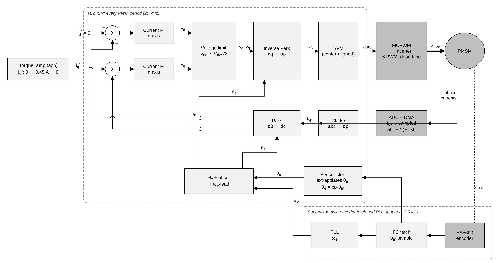
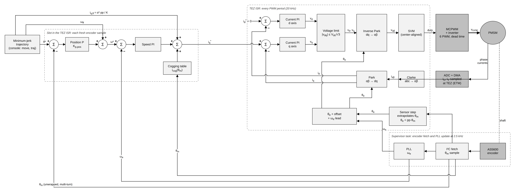
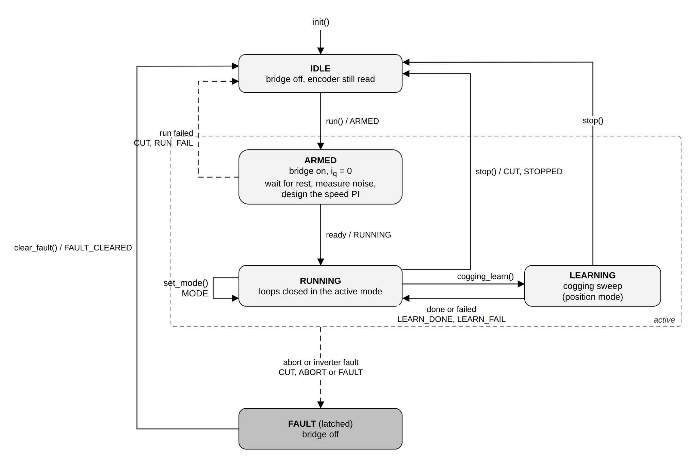

# 7. Sensored stack

The sensored stack is the closed-loop motor controller for a motor with a
rotor position sensor (an encoder) on the shaft. You give it the motor
parameters measured during commissioning, an inverter and a rotor sensor; it
runs field-oriented control (FoC) on every PWM period and lets you command the
motor at one of three levels: torque, speed or position. Use it when your
hardware has an encoder and you want the motor to follow a current, a speed or
an angle. The API is in
[`esp_foc_sensored.h`](../../include/espFoC/motor_control/esp_foc_sensored.h).

## What it does

A permanent-magnet motor makes torque in proportion to the current that flows
at 90 electrical degrees from its magnets. FoC is the method that keeps the
current at that angle: it measures the phase currents, rotates them into a
frame that turns with the rotor, regulates them there, and rotates the
resulting voltages back to the three phases. The rotation needs the rotor
angle on every PWM period, and that is what the encoder provides.

On top of that current loop the stack offers three nested **control levels**:

- **Torque** (`ESP_FOC_SD_CONTROL_TORQUE`): you set the torque-producing
  current `iq` in amps; the speed is whatever the load allows.
- **Velocity** (`ESP_FOC_SD_CONTROL_VELOCITY`): you set a speed; a speed loop
  computes the `iq` that holds it.
- **Position** (`ESP_FOC_SD_CONTROL_POSITION`): you set a shaft angle or a
  stream of trajectory samples; a position loop computes the speed reference.

It also provides **cogging compensation** (cogging is the torque the magnets
exert on the stator iron by themselves, which makes the shaft "click" into
preferred angles; the stack learns it per shaft angle and cancels it with a
current feedforward), **guards** that stop the motor on overspeed, encoder
trouble or an inverter fault, and **gain design** from the identified motor
parameters, with every gain still settable by hand.

## How it works

### Execution contexts

The work is split over three contexts, each running only what fits its rate:

| Context | Rate | What runs there |
|---|---|---|
| TEZ interrupt | every PWM period | sensor angle step, Park angle, Clarke, Park, current PI d/q plus the voltage feedforward, voltage limit, inverse Park, SVM, duty update |
| Slot | inside the TEZ, once per fresh encoder sample | position P, speed PI, cogging feedforward, overspeed and stale-sensor guards |
| Supervisor task | woken every `PWM rate / fetch_hz` periods | encoder read, PLL update, unwrapped position, in-position flag, state machine, run/stop/learn requests, every event callback |

TEZ is the interrupt raised when the PWM counter is at zero; the ADC samples
the phase currents at the same instant, triggered by hardware. The slot is not
a separate interrupt: it is a branch inside the TEZ that runs when the
supervisor has delivered a new encoder sample, so the speed and position loops
use the same angle and speed the current loop has just used.

### The loop by level

In **torque** mode the slot copies the user's `iq` into the current loop
reference. Everything else is the current loop.



In **velocity** mode the slot slews the speed reference toward the target at
`wref_slew_hz_s`, runs the speed PI on the error between that reference and the
PLL speed, and adds the user `iq` (and the cogging current, if enabled) as
feedforward. The PI output is clamped to `±i_max_a`; the integrator stops
integrating while the output is pushed into the clamp, so it does not wind up.


In **position** mode the slot computes the position error in mechanical
radians, multiplies it by the position gain `kp_pos` (in 1/s, so the result is
a speed), clamps that correction to `±corr_max_hz`, adds the joint speed
feedforward and clamps the sum to `±wm_max_hz`. Multiplied by the pole pairs,
it becomes the electrical speed reference of the speed PI.



The speed loop reads the PLL speed directly; there is no separate speed
filter, and `pll_bw_hz` sets how much encoder noise reaches the speed PI.

### The angle path

1. **Fetch.** The supervisor reads the encoder at `fetch_hz` (default
   2500 Hz). The read is a blocking bus transaction, so it runs in a task.
2. **Step.** Between reads, the sensor driver advances its angle estimate once
   per PWM period, so Park never uses an angle one fetch period old.
3. **PLL.** A phase-locked loop (a tracking filter that follows the measured
   angle and outputs a smooth speed) runs at `fetch_hz` on the electrical
   angle, with bandwidth `pll_bw_hz` and damping `pll_zeta`. Its speed `ω_e`
   feeds the speed loop, the guards and the lead.
4. **Offset and lead.** `θ_park = θ_e + park_offset_rad + ω_e · park_lead_s`.
   The offset corrects the encoder zero; the lead compensates the encoder's
   delay. Motor identification measures both.
5. **PWM delay.** A new duty takes effect one period later, so inverse Park
   uses an angle advanced by a further `ω_e · pwm_delay_ts` PWM periods
   (default 1.5). This rotation uses a cubic approximation, accurate while the
   lead stays under about 0.3 rad.

The supervisor also unwraps the mechanical angle into a multi-turn position.
With the bridge off it keeps reading the encoder every 20 ms, so a shaft
turned by hand is not lost.

### Gain design

All designs use the motor parameters in the config and the DC-link voltage
reported by the inverter.

**Current loop** (at `init()`, unless `kp_i` or `ki_i` is non-zero). The
winding is a resistor and an inductor in series: a first-order plant with
gain `Vdc/R` and time constant `L/R`. The stack uses an internal-model (IMC)
design for that plant sampled at the PWM rate: the PI cancels the winding's
time constant and leaves a first-order closed loop with bandwidth `i_bw_hz`
(default 200 Hz). Both gains are then scaled by `i_tune_backoff` (default
0.5) for margin. The d and q PIs share the same gains, in per-unit of `Vdc`
per amp.

**Speed loop** (during `run()`, above torque). The plant from `iq` to
electrical speed is an integrator with gain `k_rads2_a`: one amp accelerates
the rotor by that many electrical rad/s². The bandwidth is the smallest of
three values:

- **Wanted:** `speed_bw_hz` if set; otherwise `speed_bw_frac · f_base`,
  clamped to `[speed_bw_min_hz, speed_bw_max_hz]`. `f_base = Vdc/√3 / (2π·ψ)`
  is the electrical frequency at which the back-EMF uses up the whole bridge
  voltage.
- **Noise ceiling:** at rest the stack measures the standard deviation `σ` of
  the speed feedback over `ripple_ms`. The proportional gain may turn one `σ`
  into at most `fb_iq_budget_a` of current. When this ceiling binds,
  `Kp = fb_iq_budget_a / σ` whatever `K` is, so an error in `K` moves only
  the integral gain and the damping.
- **Phase ceiling:** the PLL delays the speed by roughly a pole at
  `pll_bw_hz/2`; the speed crossover is kept `pll_sep_min` times below it.

Both ceilings bound the crossover `fc = 2·speed_zeta·bw`. The PI is then
designed for the integrator plant at `fetch_hz` with that bandwidth and
`speed_zeta`, unless `kp_w` or `ki_w` is set. With the default Kconfig values
the phase ceiling is `0.5·180/5/2.3 ≈ 7.8 Hz`, the bandwidth the velocity and
servo examples print.

**Position loop.** `kp_pos = 2π·fc / pos_sep` unless `kp_pos` is set in the
config: the position loop crosses over `pos_sep` (default 4) times below the
speed loop.

`esp_foc_sensored_get_tuning()` returns every intermediate value, from
`f_base_hz` and `ripple_rads` to the three bandwidth candidates and the final
gains.

### State machine



| State | Meaning |
|---|---|
| `ESP_FOC_SD_STATE_IDLE` | bridge off, encoder still read |
| `ESP_FOC_SD_STATE_ARMED` | inside `run()`: bridge on, current loop at zero, speed PI being designed |
| `ESP_FOC_SD_STATE_RUNNING` | loops closed in the active mode |
| `ESP_FOC_SD_STATE_LEARNING` | cogging sweep in progress (position mode) |
| `ESP_FOC_SD_STATE_FAULT` | an abort or fault latched; bridge off until `clear_fault()` |

`run()` walks IDLE → ARMED → RUNNING:

1. Emit `ESP_FOC_SD_EV_ARMED`, enable the bridge at 50 % duties, calibrate
   the current-sense offsets, wait 50 ms.
2. Seed the PLL, close the current loop at zero current, turn the guards and
   the current-sense watchdog on.
3. Above torque only: wait until `|ω_e|` stays under `still_hz` for 300 ms
   (at most `still_timeout_ms`), measure the speed noise for `ripple_ms`
   (residual around a straight-line fit, so a slow coast-down is not counted),
   design the speed PI.
4. Enter the mode of `cfg.control` and emit `ESP_FOC_SD_EV_RUNNING`.

If a step fails, the bridge is cut, `ESP_FOC_SD_EV_RUN_FAIL` names the reason
and the axis returns to IDLE. An abort or fault during ARMED, RUNNING or
LEARNING latches FAULT instead. A "cut" in this chapter means: duties to
50 %, bridge disabled, shaft left to coast.

## How to use it

Enable the stack in menuconfig: **espFoC Settings → FoC stack → Sensored**
(`CONFIG_ESP_FOC_STACK_SENSORED`). `config_from_motor_id()` also needs
`CONFIG_ESP_FOC_ENABLE_MOTOR_ID`.

### 1. Build the config

Start from defaults, copy what commissioning measured
([phase map discovery](05_phase_map_discovery.md) and
[motor identification](06_motor_identification.md)), then adjust. The
`inverter` and `encoder` objects come from the
[inverter driver](03_inverter_driver.md) and the
[rotor sensor](04_rotor_sensors.md) chapters.

```c
esp_foc_sensored_config_t cfg;

esp_foc_sensored_default_config(&cfg);
cfg.axis = 0;
cfg.control = ESP_FOC_SD_CONTROL_VELOCITY;
cfg.pole_pairs = 13;
esp_foc_sensored_config_from_motor_id(&cfg, &plant);      /* R, L, psi, pp, K, J, Park offset/lead */
esp_foc_sensored_config_from_phase_map(&cfg, &phase_map); /* bridge output and current sign per phase */
cfg.guard.overspeed_hz = 2900.0f / 60.0f * 13;            /* electrical Hz */
cfg.on_event = on_event;
cfg.ctx = NULL;
```

- `default_config()` fills every field from Kconfig and leaves the "0 =
  derive" gains at 0. Its default `control` is `ESP_FOC_SD_CONTROL_POSITION`.
- `config_from_motor_id()` copies only what the result's `valid_mask` marks
  valid: the loop resistance first (the plain phase resistance otherwise),
  inductance, flux linkage, pole pairs, `K`, inertia, Park offset and lead.
- `config_from_phase_map()` copies the map and sets `map_valid` only if the
  discovered map is valid.
- `i_max_a` (default 0.7 A) is the `|iq|` ceiling of the speed loop and of
  every current setter. The bridge's own over-current trip is set separately,
  in the inverter config.

### 2. Init and run

```c
ESP_ERROR_CHECK(esp_foc_sensored_init(inverter, encoder, &cfg));

if (esp_foc_sensored_run(0) != ESP_OK) {
    /* the ESP_FOC_SD_EV_RUN_FAIL event carries the reason */
}
```

`init()` must be called from a task with the bridge disabled. It validates
the config, designs the current PI and the PLL, applies the phase map,
installs the inverter's TEZ, DMA and fault callbacks and starts the
supervisor task (`foc_sd0`..`foc_sd3`). It returns `ESP_ERR_INVALID_ARG` for
a NULL rotor, an axis out of range, a bad config or a `fetch_hz` that does not
divide the PWM rate; `ESP_ERR_INVALID_STATE` if the axis is already
initialised; `ESP_ERR_NO_MEM` if the task cannot be created.

`run()` blocks until RUNNING or failure (`ESP_FAIL`). Above torque it can take
up to `still_timeout_ms + ripple_ms` plus a few seconds.

### 3. Command the axis

Write references after `run()` returns: entering a mode resets the speed
reference to the measured speed and the position reference to the measured
position.

**Torque:**

```c
esp_foc_sensored_set_iq(0, 0.30f);         /* amps, |a| <= i_max_a */
esp_foc_sensored_set_id(0, 0.0f);          /* d-axis current, normally 0 */
esp_foc_sensored_set_vdq_ff(0, 0.0f, 0.0f); /* volts added to the PI outputs */
```

**Velocity** (signed electrical Hz; shaft rpm = Hz · 60 / pole pairs):

```c
esp_foc_sensored_set_speed_slew(0, 1000.0f);  /* Hz per second */
esp_foc_sensored_set_speed_ref_hz(0, 433.0f); /* 2000 rpm on 13 pole pairs */
```

The reference moves toward the target at the slew rate, so a ramp is one call
of each. A target above `guard.overspeed_hz` returns `ESP_ERR_INVALID_ARG`.
In velocity and position mode, `set_iq()` adds a current feedforward to the
speed PI output.

**Position** (mechanical radians from the origin):

```c
esp_foc_sensored_set_origin(0);                 /* here is 0 rad */
esp_foc_sensored_set_position_ref_rad(0, 1.57f);
```

`set_position_ref_rad()` steps the reference and zeroes the joint speed
feedforward. For smooth moves, stream joint samples instead:
`set_joint(axis, theta_rad, w_ff_rads, iq_ff_a)` sets the position, the
mechanical speed feedforward and the current feedforward together, applied on
the next encoder sample. The servo example samples a minimum-jerk profile
(position `10s³ − 15s⁴ + 6s⁵` of normalised time `s`, so speed and
acceleration are zero at both ends) every 20 ms:

```c
min_jerk_sample(distance, duration_s, t_s, &pos, &speed, &accel);
esp_foc_sensored_set_joint(0, start_rad + pos, speed,
                           accel * (float)POLE_PAIRS / cfg.k_rads2_a);
```

The current feedforward is the profile's shaft acceleration times pole pairs
over `K`, because `K` is in electrical rad/s² per amp. The position loop then
only corrects what the profile did not predict.

The **in-position flag** (`status.inpos`) goes true when the position error is
within `inpos_rad` and `|ω_e|` is under `inpos_w_hz`, both held for
`inpos_ms`. It drops when the error leaves the band. `inpos_toggles` counts
its transitions.

### 4. Switch modes

`esp_foc_sensored_set_mode(axis, mode)` switches at or under `cfg.control`,
bumplessly: the speed integrator takes over the current in flight, the speed
reference starts at the measured speed and the position reference at the
measured position. It emits `ESP_FOC_SD_EV_MODE`. It returns
`ESP_ERR_INVALID_STATE` for a mode above `cfg.control` or while ARMED or
LEARNING. `set_speed_ref_hz()` works only in velocity mode,
`set_position_ref_rad()` and `set_joint()` only in position mode; elsewhere
they return `ESP_ERR_INVALID_STATE`. `set_iq()` is accepted in every mode
except during a cogging learn.

### 5. Read status and tuning

```c
esp_foc_sensored_status_t st;
esp_foc_sensored_get_status(0, &st);
float rpm = st.we_rads / (2.0f * (float)M_PI) / 13 * 60.0f;
```

The status holds state and mode, Park angle, PLL speed and speed reference
(electrical), position and reference (mechanical, from the origin), currents,
voltages, the in-position and cogging flags, counters (`tez`, `fetch_n`,
`fetch_fail`) and the last `fail`/`abort`/`fault` reasons.
`esp_foc_sensored_get_window()` returns speed-error statistics (mean, sums,
min, max, mean crossings, `iq` means) gathered per encoder sample since the
previous call, and resets them: use one reader only.

### 6. Manual tuning

| Call | Effect | Allowed when |
|---|---|---|
| `set_current_pi(axis, kp, ki)` | both current PIs, per-unit of Vdc per A | any level |
| `set_speed_pi(axis, kp, ki)` | speed PI, A per electrical rad/s | `cfg.control` ≥ velocity |
| `set_speed_bw(axis, hz)` | redesigns the speed PI on `K` at `hz`, ceilings not applied, `hz < fetch_hz/4` | `cfg.control` ≥ velocity |
| `set_position_kp(axis, kp)` | position gain, 1/s | `cfg.control` = position |

The config fields `kp_i`/`ki_i`, `kp_w`/`ki_w` and `kp_pos` do the same at
init/run time: any non-zero value skips the corresponding design.

### 7. Cogging compensation

```c
esp_foc_sensored_cogging_info_t info;

esp_foc_sensored_set_origin(0);
if (esp_foc_sensored_cogging_learn(0, 150000, &info) == ESP_OK && info.converged) {
    /* table active: info.p2p_a is the cogging current peak to peak */
}
```

`cogging_learn()` needs RUNNING in position mode and blocks up to
`timeout_ms`. Each pass sweeps the shaft at `+sweep_hz` then `−sweep_hz`
(mechanical) for `revs` revolutions, skipping the first `skip_ms` of each leg
and resting `rest_ms` after it. It records the current the speed loop needs
in each of `CONFIG_ESP_FOC_SD_COG_BINS` mechanical-angle bins. Averaging the
two directions cancels friction and loop lag; what remains is the
position-locked cogging torque. Empty bins are interpolated, the mean is
removed and the table is smoothed over `smooth` bins. Each pass learns on top
of the table, until the RMS change falls under `conv_a` (from pass 2 on) or
`passes_max` is reached. With the defaults one leg maps for 8 s
(2 revolutions at 0.25 Hz).

It returns `ESP_OK` (check `info->converged`), `ESP_ERR_INVALID_STATE` (wrong
state or mode, called from the event callback, or a `stop()` during the
sweep), `ESP_ERR_TIMEOUT` (the axis stays RUNNING) or `ESP_FAIL` (fewer than
half the bins mapped, or an abort/fault during the sweep). The axis ends
RUNNING, holding where the sweep ended.

`cogging_enable(axis, on)` turns the feedforward on or off; turning it on
without a learned table returns `ESP_ERR_INVALID_STATE`. The feedforward is
applied in velocity and position mode. `get_cogging_info()` returns the last
learn result.

### 8. Stop, recover, deinit

- `esp_foc_sensored_stop(axis)`: cuts the bridge and ends in IDLE
  (`ESP_FOC_SD_EV_CUT`, then `ESP_FOC_SD_EV_STOPPED`). In FAULT the bridge is
  already off and the latch stays: use `clear_fault()`.
- `esp_foc_sensored_clear_fault(axis)`: clears the stack latch and the
  inverter's fault, FAULT → IDLE (`ESP_FOC_SD_EV_FAULT_CLEARED`). Then call
  `run()` again.
- `esp_foc_sensored_deinit(axis)`: cuts the bridge, stops the supervisor and
  removes the inverter callbacks. Task context only.

## Events and error handling

Set `cfg.on_event` to receive `esp_foc_sensored_event_t` (`ev`, `axis`,
`state`, `mode`, and the fields listed below). The callback runs on the
supervisor task.

| Event | When | Fields |
|---|---|---|
| `ESP_FOC_SD_EV_ARMED` | `run()` started | |
| `ESP_FOC_SD_EV_RUNNING` | `run()` reached RUNNING | `mode` |
| `ESP_FOC_SD_EV_MODE` | `set_mode()` switched | `mode` |
| `ESP_FOC_SD_EV_CUT` | the bridge was turned off | |
| `ESP_FOC_SD_EV_STOPPED` | `stop()` brought the axis to IDLE | |
| `ESP_FOC_SD_EV_RUN_FAIL` | `run()` failed, axis back in IDLE | `fail` |
| `ESP_FOC_SD_EV_LEARN_PASS` | one cogging pass done | `pass`, `change_rms_a` |
| `ESP_FOC_SD_EV_LEARN_DONE` | cogging learn finished | `pass`, `change_rms_a` |
| `ESP_FOC_SD_EV_LEARN_FAIL` | cogging learn failed or timed out | `pass` |
| `ESP_FOC_SD_EV_ABORT` | a guard tripped, FAULT latched | `abort` |
| `ESP_FOC_SD_EV_FAULT` | the inverter faulted, FAULT latched | `fault` |
| `ESP_FOC_SD_EV_FAULT_CLEARED` | `clear_fault()` done | |

**Run failures** (`esp_foc_sensored_fail_t`, not latched; fix and call `run()`
again):

| Reason | Meaning | What to do |
|---|---|---|
| `ESP_FOC_SD_FAIL_ENABLE` | the inverter refused `enable()` | check the inverter state and fault latch |
| `ESP_FOC_SD_FAIL_NOT_STILL` | the speed never stayed under `still_hz` | keep the shaft still and unloaded during `run()`, or raise `still_hz`/`still_timeout_ms` |
| `ESP_FOC_SD_FAIL_DESIGN` | the speed PI design refused the plant | check `k_rads2_a` and the speed bandwidth fields, or set `kp_w`/`ki_w` |

**Aborts** (`esp_foc_sensored_abort_t`, latched; the stack sets 50 % duties
at once, then the supervisor cuts the bridge):

| Reason | Trigger | What to do |
|---|---|---|
| `ESP_FOC_SD_ABORT_OVERSPEED` | speed magnitude above `guard.overspeed_hz` for `guard.overspeed_hold_ms` | check the reference and the load; in torque mode a light load keeps accelerating |
| `ESP_FOC_SD_ABORT_SENSOR_STALE` | no new encoder sample for `guard.sensor_stale_slots` samples (50 ms with the defaults) | check the encoder wiring and bus; keep event callbacks short |
| `ESP_FOC_SD_ABORT_SENSOR_FAIL` | `guard.sensor_fail_max` failed reads in a row | check the encoder wiring, supply and bus speed |

**Faults** (`esp_foc_fault_reason_t` from the inverter, latched):
`ESP_FOC_FAULT_ILIMIT` (bridge over-current trip), `ESP_FOC_FAULT_GPIO`
(external fault pin), `ESP_FOC_FAULT_SOFT_TRIP` (software trip),
`ESP_FOC_FAULT_SENSE_STALE` (the current-sense samples stopped changing).

Both aborts and faults leave the axis in FAULT. Call
`esp_foc_sensored_clear_fault()` and then `run()`. `status.abort` and
`status.fault` keep the last reason until the clear.

## Configuration

All options are under **espFoC Settings → Sensored stack**. They are the
defaults that `esp_foc_sensored_default_config()` writes into the config;
change them per axis in the struct.

| Symbol | Default | Meaning |
|---|---|---|
| `CONFIG_ESP_FOC_SD_MAX_AXES` | 1 | static axis instances (1..4) |
| `CONFIG_ESP_FOC_SD_TASK_PRIO_BELOW_MAX` / `_TASK_STACK` | 0 / 4096 | supervisor priority (levels below the highest) and stack bytes |
| `CONFIG_ESP_FOC_SD_FETCH_HZ` | 2500 | encoder rate; speed PI, position P and PLL run at it; must divide the PWM rate |
| `CONFIG_ESP_FOC_SD_PLL_BW_HZ` / `_PLL_ZETA_PERMIL` | 180 / 1000 | PLL bandwidth (Hz) and damping (1.0) |
| `CONFIG_ESP_FOC_SD_PWM_DELAY_PERMIL` | 1500 | inverse-Park lead, 1.5 PWM periods |
| `CONFIG_ESP_FOC_SD_I_MAX_MA` | 700 | `i_max_a`, 0.7 A |
| `CONFIG_ESP_FOC_SD_I_BW_HZ` / `_I_BACKOFF_PERMIL` | 200 / 500 | current loop bandwidth (Hz), gains × 0.5 |
| `CONFIG_ESP_FOC_SD_SPEED_BW_E4` | 154 | wanted speed bandwidth, 0.0154 · `f_base` |
| `CONFIG_ESP_FOC_SD_SPEED_BW_MIN_HZ` / `_MAX_HZ` | 4 / 8 | clamp of the wanted bandwidth |
| `CONFIG_ESP_FOC_SD_SPEED_ZETA_PERMIL` | 1150 | speed loop damping |
| `CONFIG_ESP_FOC_SD_FB_IQ_BUDGET_MA` | 100 | current one noise sigma may command |
| `CONFIG_ESP_FOC_SD_PLL_SEP_PERMIL` | 5000 | PLL pole over speed crossover (5×) |
| `CONFIG_ESP_FOC_SD_RIPPLE_MS` | 400 | noise measurement window |
| `CONFIG_ESP_FOC_SD_STILL_HZ` / `_STILL_TIMEOUT_MS` | 3 / 8000 | rest threshold (electrical Hz) and wait |
| `CONFIG_ESP_FOC_SD_WREF_SLEW_HZ_S` | 2000 | speed reference slew, electrical Hz/s |
| `CONFIG_ESP_FOC_SD_POS_SEP_PERMIL` | 4000 | speed over position crossover (4×) |
| `CONFIG_ESP_FOC_SD_CORR_MAX_MHZ` | 800 | position correction ceiling, 0.8 Hz mechanical |
| `CONFIG_ESP_FOC_SD_WM_MAX_HZ` | 18 | speed reference ceiling, Hz mechanical |
| `CONFIG_ESP_FOC_SD_INPOS_MDEG` / `_INPOS_W_HZ` / `_INPOS_MS` | 1000 / 6 / 100 | in-position band (1°), speed (electrical Hz), hold |
| `CONFIG_ESP_FOC_SD_OVERSPEED_HZ` / `_HOLD_MS` | 600 / 2 | overspeed trip (electrical Hz) and hold |
| `CONFIG_ESP_FOC_SD_STALE_SLOTS` / `_FAIL_MAX` | 125 / 50 | encoder stale and read-error limits |
| `CONFIG_ESP_FOC_SD_COG_BINS` | 1440 | cogging bins per revolution |
| `CONFIG_ESP_FOC_SD_COG_SWEEP_MHZ` / `_REVS_PERMIL` | 250 / 2000 | sweep 0.25 Hz mechanical, 2 revolutions per leg |
| `CONFIG_ESP_FOC_SD_COG_PASSES_MAX` / `_CONV_UA` | 6 / 10000 | passes at most, convergence 10 mA RMS |
| `CONFIG_ESP_FOC_SD_COG_SMOOTH` / `_SKIP_MS` / `_REST_MS` | 9 / 500 / 1000 | smoothing width, leg start skipped, rest per leg |

## Use cases

- **Torque drive.** A propeller, a fan or a winder where you care about the
  push (thrust, tension) more than the exact speed. Torque mode also serves as
  the inner loop of your own controller, running in your task and writing
  `set_iq()`.
  [foc_sensored_torque](../../examples/foc_sensored_torque/README.md) ramps
  `iq` up, holds it and ramps it down.
- **Constant-speed drive.** A pump, a conveyor or a spindle. Because `iq` is
  clamped to `i_max_a`, a load the motor cannot carry shows up as a speed
  error, not an over-current trip.
  [foc_sensored_velocity](../../examples/foc_sensored_velocity/README.md)
  ramps to 2000 rpm and back with `set_speed_slew()`/`set_speed_ref_hz()`.
- **Position servo with trajectories.** A gimbal, a valve or a robot joint.
  [foc_sensored_servo](../../examples/foc_sensored_servo/README.md) sets the
  origin, learns the cogging table, turns console commands (`move`, `traj`)
  into minimum-jerk `set_joint()` streams and waits for `inpos`. Its
  `servo.py` script sends the commands and generates sine and step
  trajectories.

## Limits and pitfalls

- **Speeds are electrical.** Speed references, `we_rads`, `still_hz`,
  `inpos_w_hz` and the overspeed guard are electrical (shaft speed × pole
  pairs). Positions, `w_ff_rads`, `corr_max_hz`, `wm_max_hz` and
  `cogging.sweep_hz` are mechanical.
- **`i_max_a` is a hard ceiling.** `set_iq()`, `set_id()` and the `iq_ff_a` of
  `set_joint()` return `ESP_ERR_INVALID_ARG` above it, and the speed PI output
  is clamped to it including feedforward and cogging current: a large
  feedforward leaves less room for the PI.
- **`run()` waits for rest** above torque, and measures noise right after. A
  load that turns the shaft (gravity, airflow) makes it fail with
  `ESP_FOC_SD_FAIL_NOT_STILL`; a vibrating shaft raises the measured noise and
  lowers the speed bandwidth.
- **The default level is position.** `default_config()` sets
  `ESP_FOC_SD_CONTROL_POSITION`, which requires `k_rads2_a > 0`; without it
  `init()` returns `ESP_ERR_INVALID_ARG`. `rs_ohm`, `ls_h`, `psi_wb` and
  `pole_pairs` are required at every level.
- **Encoder errors abort.** A stale encoder or a run of failed reads stops the
  motor and latches FAULT. There is no fallback to an estimated angle.
- **Callbacks share the encoder thread.** The event callback runs on the task
  that fetches the encoder: keep it short (set a flag, copy a value). A long
  callback shows up as a stale sensor. `run()`, `stop()`, `clear_fault()`
  and `cogging_learn()` normally block until the supervisor answers; called
  from the callback, the first three only queue the request and return
  `ESP_OK` without waiting, and `cogging_learn()` refuses with
  `ESP_ERR_INVALID_STATE`.
- **Position steps are rate-limited, not shaped.** A step through
  `set_position_ref_rad()` moves at up to `corr_max_hz` (0.8 rev/s with the
  defaults). Use `set_joint()` with a profile for smooth moves.
- **Bandwidth limits.** The PLL refuses a bandwidth near or above
  `fetch_hz/12` at damping 1, which makes `init()` fail. `set_speed_bw()`
  accepts only `hz < fetch_hz/4`. Raising `fetch_hz` raises both limits but
  needs an encoder bus fast enough to keep up.
- **Range checks at init.** Among others: `|park_lead_s|` under 10 ms,
  `speed_zeta` between 0.4 and 3, `cogging.sweep_hz` not above `wm_max_hz`,
  `cogging.smooth` odd.
- **Cogging table lifetime.** The table lives in RAM and `init()` clears it:
  learn it after every init. Each axis reserves 16 bytes per bin statically
  (about 23 KB at 1440 bins).
