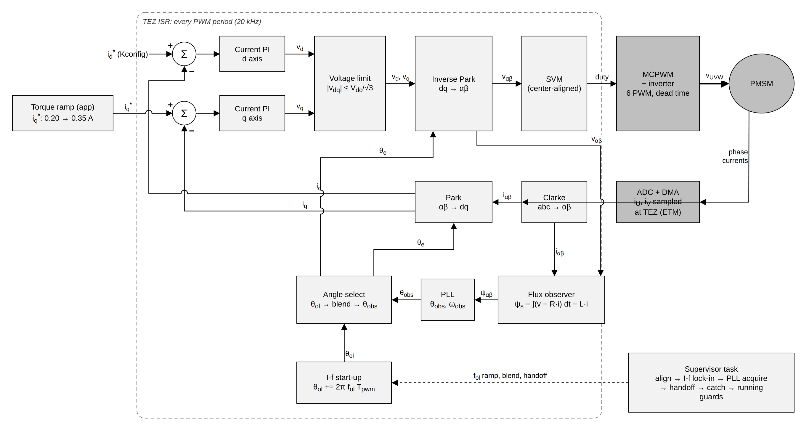
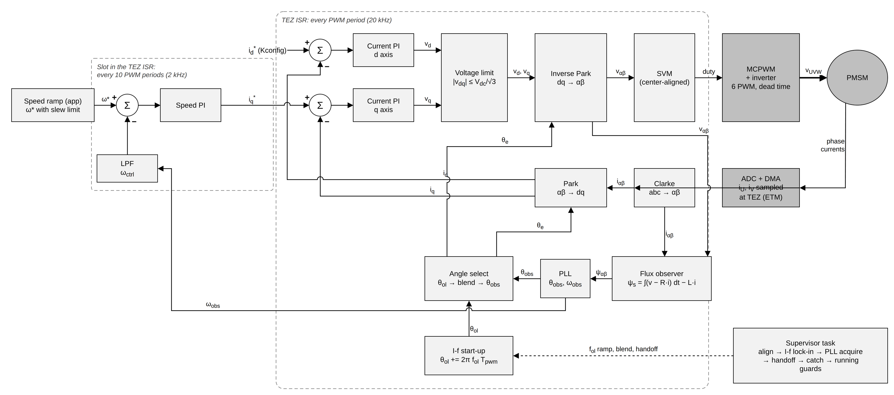
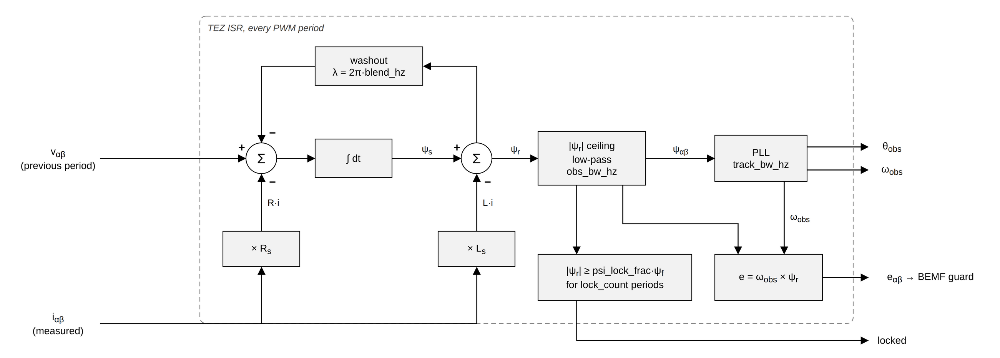
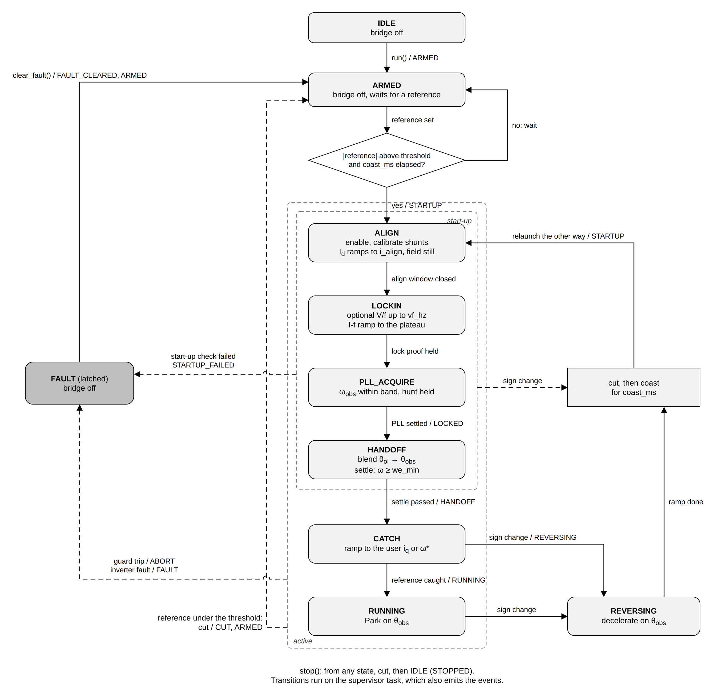

# 8. Sensorless stack

The sensorless stack runs field-oriented control (FoC) on a PMSM/BLDC motor that
has no rotor sensor. It estimates the rotor angle from the phase currents and the
voltages it applies, starts the motor from rest on its own, and then regulates
either torque (the q-axis current) or speed. Use it when the motor has no encoder
or hall sensors, or when there is no room or cable for one, and the load can live
with a motor that only runs above a minimum speed. The public API is in
[`esp_foc_sensorless.h`](../../include/espFoC/motor_control/esp_foc_sensorless.h).

## What it does

FoC needs the electrical rotor angle every PWM period: Park uses it to turn the
measured phase currents into `i_d` (current along the magnet) and `i_q` (the
current that makes torque). The [sensored stack](07_sensored_stack.md) reads that
angle from a sensor. The sensorless stack computes it from **back EMF**: the
voltage the spinning magnet induces in the winding. Back EMF grows with speed and
is zero at standstill, and that one fact shapes the whole stack:

- **No angle at rest.** With the rotor still there is nothing to observe, so the
  stack never runs at zero speed or zero torque. There is no position control.
- **Every start is a new start-up from rest.** The stack first drives the motor
  open loop (without knowing the angle) until it spins fast enough for the
  estimate, then hands control over to the estimate.
- **Every stop is a cut.** A reference under the start threshold turns the bridge
  off and lets the shaft coast. Nothing measures the shaft while the bridge is
  off, so the stack waits a fixed coast time before it starts again.
- **The estimate is checked all the time.** Guards watch for a rotor the estimate
  no longer describes (stalled, lost, collapsed current, overspeed) and cut the
  bridge when they see one.

The stack owns the inverter's PWM (TEZ), DMA and fault callbacks from `init()` to
`deinit()`. It supports up to `CONFIG_ESP_FOC_SL_MAX_AXES` axes, each on its own
inverter with its own supervisor task; axes share only code.

## How it works

### The control loop





The work is split over two contexts:

- **TEZ interrupt, every PWM period** (20 kHz with the default
  `CONFIG_ESP_FOC_PWM_RATE_HZ`): Clarke on the sampled currents, observer update,
  angle select, Park, current PI on d and q (plus the optional user voltage
  feedforward), voltage limit, inverse Park and SVM. All in Q16.16 fixed point.
- **Slot inside the same interrupt, every `CONFIG_ESP_FOC_SL_SLOW_DIV` periods**
  (10 by default, so 2 kHz): speed PI in speed mode (the user `iq` is added to
  its output), reference ramps and the guards. A guard trip sets mid duty at once
  and wakes the supervisor.
- **Supervisor task**: the state machine, the start-up, the handoff, the catch,
  the reversal ramps and every event callback.

In torque mode the application sets `i_q*` directly. In speed mode an outer speed
PI compares the speed reference `ω*` with a low-pass filtered observer speed
`ω_ctrl` and outputs `i_q*`, clamped to `i_max_a`. `i_d*` is set by the stack: after
the handoff it is `id_run_a` (`CONFIG_ESP_FOC_SL_ID_RUN_MA`, 450 mA) until you call
`esp_foc_sensorless_set_id()`.

### Flux observer and PLL



The **flux observer** estimates where the magnet points. Flux linkage is the
magnetic flux the winding sees; its rate of change is the voltage across the
winding minus the resistive drop. So the observer:

1. takes the applied voltage `v_αβ` (the command of the previous period) and the
   measured current `i_αβ`;
2. subtracts the resistive drop `R·i` and integrates, which gives the stator flux
   `ψ_s = ∫(v − R·i) dt`;
3. subtracts the part the current itself makes, `L·i`, which leaves the magnet
   (rotor) flux `ψ_r = ψ_s − L·i`. That vector points along the rotor.

A pure integrator drifts, so a slow washout (corner `blend_hz`) removes DC from the
estimate, and a low-pass filter (`obs_bw_hz`) smooths it. The magnitude of `ψ_r` is
also capped, because a magnet cannot grow and a larger estimate is drift.

A **PLL** (phase-locked loop) then follows the angle of `ψ_r`. It keeps its own
angle and speed and corrects them every period so that its angle stays on the
flux vector; the outputs are a smooth angle `θ_obs` and speed `ω_obs`, both
electrical. The observer reports "locked" once `|ψ_r|` stays above
`psi_lock_frac·ψf` (50 % of the identified flux linkage by default) for
`lock_count` PWM periods. The back EMF `e = ω_obs × ψ_r` is what the BEMF guard
checks.

The observer is designed from `rs_ohm`, `ls_h` and `psi_wb`. Wrong values give a
wrong angle, which is why the identified motor parameters matter so much here.

### Start-up sequence



`esp_foc_sensorless_run()` only arms the axis (`IDLE` → `ARMED`); the bridge stays
off. The **reference** starts the motor:

- speed mode: `|ω*|` from `set_speed_ref_hz()` above `w_min_hz`
  (`CONFIG_ESP_FOC_SL_W_MIN_HZ`, 40 Hz electrical);
- torque mode: `|iq|` from `set_iq()` above `iq_min_a`
  (`CONFIG_ESP_FOC_SL_IQ_MIN_MA`, 50 mA).

The sign of the reference gives the direction. If the bridge was turned off less
than `coast_ms` ago, the start waits until that time has passed. Then the
supervisor walks these states:

| State | What happens | Leaves when |
|---|---|---|
| `ALIGN` | Mid duty, bridge enabled, shunt zero calibrated (`cal_rounds`), `arm_ms` dwell. Then `Id` ramps to `i_align_a` over `align_ms` with the field standing still and is held `align_settle_ms`, so the rotor parks on a known angle. | The align window closes (settle time or `align_timeout_ms`). |
| `LOCKIN` | Optional **V/f** break-away up to `startup.vf_hz`: a voltage on q that grows with frequency, current loop out of the path. Then **I-f** lock-in: the current vector (`Id = i_align_a`) rotates open loop on angle `θ_ol` while its frequency ramps at `accel_rads2` to the plateau. At the plateau the observer starts, seeded with `θ_ol` and the ramp speed. | The lock proof holds (below). |
| `PLL_ACQUIRE` | Waits until `ω_obs` stays within `handoff.band_hz` of the ramp speed and moves less than `handoff.hunt_hz` per 20 ms poll, for `handoff.hold_ms`. Emits `LOCKED`. | PLL settled, or `handoff.timeout_ms`. |
| `HANDOFF` | Re-projects the current reference into the observer frame, with at least `handoff.iq_start_a` on q in the run direction. Blends Park from `θ_ol` to `θ_obs` over `handoff.blend_ms`, then Park is on `θ_obs` only. Checks speed for `handoff.settle_ms`. Turns the guards and the inverter's sense watchdog on. Emits `HANDOFF`. | Settle passed. |
| `CATCH` | Torque mode: `iq` ramps to the user value at `catch_up.slew_a_s`. Speed mode: holds `ω*` at the current speed for `catch_up.hold_ms`, ramps it to the user reference at the user slew, then waits until `ω_ctrl` is close to `ω*`. `Id` ramps to `id_run_a`. | Reference caught. Emits `RUNNING`. |
| `RUNNING` | Normal closed-loop operation on `θ_obs`. | Cut, stop, sign change, guard or fault. |

Some terms from the table:

- **I-f** (current-frequency) start-up drags the rotor like a magnet following a
  rotating field: a fixed current at a rising frequency, without any angle
  feedback.
- **V/f** (voltage-frequency) applies a voltage that grows with the frequency
  instead of a current. Below `vf_hz` the current loop has almost nothing to
  work with (no back EMF, noisy samples, the bridge dead zone), so an open voltage
  command breaks a cogging rotor loose more cleanly. The boost is sized from
  `v_deadzone_v`, `rs_ohm·i_align_a` and `vf_margin_v`.
- **Plateau**: the I-f end frequency. With `startup.plateau_hz = 0` it is derived
  from `f_base = (Vdc/√3) / (2π·ψf)`, the speed where back EMF alone fills the
  linear modulation range: `f_base · plateau_fbase_frac`, clamped to
  `[plateau_min_hz, plateau_max_hz]` and never below `guard.bemf_fmin_hz`.
- **Lock proof**: the only check the observer cannot fake. At the plateau the
  stack compares `|v − Rs·i|`, the voltage the current loop needed, with the back
  EMF a following rotor would make, `ψ·|ω|`. Only a turning magnet forces that
  voltage. It must stay above `follow_frac` of the expected value for
  `follow_hold_ms`.

After the blend and during the settle the stack checks that `|ω_obs|` stays at or
above `we_min`, which is `handoff.we_min_frac` (55.6 %) of the plateau. A rotor
that slowed down after the handoff was not really caught.

### Stopping, cuts and reversing

- **Cut**: a reference under the start threshold, in any active state, is a dry
  cut: mid duty, bridge disabled, back to `ARMED` (events `CUT`, then `ARMED`). The
  shaft coasts. The next start waits at least `coast_ms`
  (`CONFIG_ESP_FOC_SL_COAST_MS`, 5000 ms) from the cut.
- **Reversing**: a sign change while in `CATCH` or `RUNNING` decelerates on the
  observer angle (speed mode: `ω*` down to the plateau at `rev_decel_hz_s`; torque
  mode: `iq` down to 0 at `rev_decel_a_s`), cuts, coasts `coast_ms` and relaunches
  the other way. A sign change during the start-up cuts at once, coasts and
  relaunches.
- **Stop**: `esp_foc_sensorless_stop()` cuts from any state and ends in `IDLE`.

### Guards

The guards run in the slot. Each counts consecutive slot ticks and trips only
after its hold time.

| Guard | Active | Trips when | Abort reason |
|---|---|---|---|
| Back EMF | From the plateau on, above `guard.bemf_fmin_hz` | `\|e\|` under `bemf_frac·ψ·\|ω\|` for `bemf_hold_ms`: the speed says there should be back EMF and there is none, as with a stalled rotor | `ESP_FOC_SL_ABORT_BEMF` |
| Lock loss | After the handoff | Observer not locked for `lock_loss_ms`; aborts only if `guard.lock_loss_abort` is set (off by default, the lock flag can drop on healthy runs) | `ESP_FOC_SL_ABORT_LOCK_LOSS` |
| Collapse | After the handoff | More than 0.10 A asked on q, but `\|id\|` and `\|iq\|` both under `collapse_a` for `collapse_hold_ms` | `ESP_FOC_SL_ABORT_COLLAPSE` |
| Overspeed | After the handoff | `\|ω_obs\|` above `overspeed_frac·fe_rated_hz` for `overspeed_hold_ms` | `ESP_FOC_SL_ABORT_OVERSPEED` |

The inverter's own faults (over-current trip, fault pin, software trip, frozen
current samples) reach the stack through the fault callback and end the run with
a `FAULT` event.

## How to use it

Select the stack in menuconfig: **FoC stack** → **Sensorless**
(`CONFIG_ESP_FOC_STACK_SENSORLESS`). Copying identified parameters needs
`CONFIG_ESP_FOC_ENABLE_MOTOR_ID`. You need an initialised
[inverter](03_inverter_driver.md); the examples run
[phase map discovery](05_phase_map_discovery.md) and
[motor identification](06_motor_identification.md) on every boot, both without a
rotor sensor (`NULL` sensor argument).

### 1. Build the configuration

```c
esp_foc_sensorless_config_t cfg;

esp_foc_sensorless_default_config(&cfg);
cfg.axis = 0;
cfg.pole_pairs = POLE_PAIRS;
/* Electrical Hz: shaft rev/s times pole pairs. */
cfg.fe_rated_hz = (float)RATED_RPM / 60.0f * (float)POLE_PAIRS;
esp_foc_sensorless_config_from_motor_id(&cfg, &plant);      /* R, L, psi, dead zone */
esp_foc_sensorless_config_from_phase_map(&cfg, &phase_map); /* outputs and signs */
cfg.on_event = on_event;
cfg.ctx = NULL;
```

- `esp_foc_sensorless_default_config()` fills every field from Kconfig and leaves
  the "0 = derive" fields at 0 (current PI gains, speed bandwidth and gains, PLL
  bandwidth, washout, plateau). `init()` designs them from the motor and
  `fe_rated_hz`.
- `esp_foc_sensorless_config_from_motor_id()` copies only the fields the result
  marks valid. For resistance it prefers the loop value (`r_loop_ohm`), the series
  resistance the current PI and `v − R·i` act against. It also copies
  `v_deadzone_v` when the identification measured it.
- `esp_foc_sensorless_config_from_phase_map()` copies the map and sets
  `map_valid` only if the map is valid.

`rs_ohm`, `ls_h`, `psi_wb`, `pole_pairs` and `fe_rated_hz` (below 3000 Hz) must be
set, by identification or by hand. Other fields you are likely to touch:

| Field | Meaning |
|---|---|
| `speed_loop` | `true` (default) speed mode, `false` torque only |
| `fe_rated_hz` | Rated electrical speed; scales the derived bandwidths, the overspeed trip and the `set_speed_ref_hz()` limit |
| `i_max_a` | `\|iq\|` ceiling of the speed loop, and the limit of `set_iq()` / `set_id()` |
| `i_align_a` | Align and I-f current |
| `id_run_a` | `Id` after the handoff |
| `w_min_hz`, `iq_min_a` | Start / cut thresholds |
| `coast_ms` | Bridge-off time before a relaunch |
| `startup.vf_hz` | V/f break-away up to this frequency, 0 = off; must be below the plateau |
| `startup.accel_rads2`, `startup.plateau_hz` | I-f ramp rate and end frequency |
| `on_event`, `ctx` | Event callback and its context |

### 2. Init and arm

```c
ESP_ERROR_CHECK(esp_foc_sensorless_init(inverter, &cfg));
ESP_ERROR_CHECK(esp_foc_sensorless_run(0));
```

`init()` must be called from a task. It validates the config, designs the loops,
applies the phase map (the bridge must be disabled), installs the inverter
callbacks and starts the supervisor; it ends in `IDLE` with the bridge untouched.
It returns `ESP_ERR_INVALID_ARG` for a bad config or an axis out of range,
`ESP_ERR_INVALID_STATE` if the axis is already initialised, `ESP_ERR_NO_MEM` if the
task cannot start, or the loop design's error. A design is refused, for example,
when the speed bandwidth is not below the PLL bandwidth or when `vf_hz` is not below
the plateau. `run()` arms the axis; the bridge stays off.

### 3. Torque mode

```c
cfg.speed_loop = false;
/* ... init(), run() ... */

esp_foc_sensorless_set_iq(0, 0.20f);   /* above iq_min_a: starts the motor */
/* wait for ESP_FOC_SL_EV_RUNNING, then ramp */
esp_foc_sensorless_set_iq(0, 0.35f);
```

`set_iq()` refuses values above `i_max_a` with `ESP_ERR_INVALID_ARG`. In torque
mode the stack regulates current, not speed: with a free shaft the motor keeps
speeding up while a current is held, until the overspeed guard trips.

### 4. Speed mode

```c
cfg.speed_loop = true;
cfg.startup.vf_hz = 10.0f;             /* V/f break-away up to 10 Hz */
/* ... init(), run() ... */

esp_foc_sensorless_set_speed_slew(0, cfg.wref_slew_hz_s);
esp_foc_sensorless_set_speed_ref_hz(0, min_hz);   /* above w_min_hz: starts */
/* wait for RUNNING, then ramp to cruise in 1 s */
esp_foc_sensorless_set_speed_slew(0, fabsf(cruise_hz - min_hz));
esp_foc_sensorless_set_speed_ref_hz(0, cruise_hz);
```

Speeds are signed electrical Hz. `set_speed_ref_hz()` works only in speed mode
(`ESP_ERR_INVALID_STATE` otherwise) and refuses `|fe_hz|` above
`fe_rated_hz·guard.overspeed_frac`. The stack slews `ω*` toward the target at the
`set_speed_slew()` rate. After the handoff the reference ramps from the handoff
speed at that rate too, so a slow default slew (`CONFIG_ESP_FOC_SL_WREF_SLEW_HZ_S`,
7 Hz/s) makes `RUNNING` take a while. `set_iq()` in speed mode adds to the speed PI
output.

### 5. Watch events and state

The callback runs on the supervisor task, never in an interrupt. Keep it short
and hand results to the application through flags, as the examples do:

```c
static volatile bool running;
static volatile bool tripped;

static void on_event(void *ctx, const esp_foc_sensorless_event_t *e)
{
    switch (e->ev) {
    case ESP_FOC_SL_EV_RUNNING:
        running = true;
        break;
    case ESP_FOC_SL_EV_CUT:
        running = false;
        break;
    case ESP_FOC_SL_EV_STARTUP_FAILED:
    case ESP_FOC_SL_EV_ABORT:
    case ESP_FOC_SL_EV_FAULT:
        tripped = true;   /* e->fail, e->abort, e->fault say why */
        break;
    default:
        break;
    }
}
```

`esp_foc_sensorless_get_state()` returns the state.
`esp_foc_sensorless_get_status()` fills a snapshot: state and direction, whether
Park is on the observer and whether it is locked, angle, `we_rads` (observer
speed), `w_ctrl_rads`, `w_ref_rads`, the I-f frequency `fe_ol_hz`, measured and
reference `id`/`iq`, `vd`/`vq`, `vdc_v`, the derived `f_base_hz`, `plateau_hz` and
`we_min_hz`, a TEZ counter and the last fail / abort / fault reasons.
`esp_foc_sensorless_get_tuning()` returns the gains and bandwidths `init()` designed.

### 6. Stop, clear, deinit

```c
/* Normal stop: a zero reference cuts the bridge and returns to ARMED. */
esp_foc_sensorless_set_iq(0, 0.0f);   /* or set_speed_ref_hz(0, 0.0f) */
while (esp_foc_sensorless_get_state(0) != ESP_FOC_SL_STATE_ARMED) {
    esp_foc_sleep_ms(10);
}

/* Shutdown */
esp_foc_sensorless_stop(0);
esp_foc_sensorless_deinit(0);
inverter->disable(inverter);
```

- `stop()` cuts from any state and ends in `IDLE`. It blocks until the bridge is
  off, unless called from the event callback. Call `run()` again to re-arm.
- `deinit()` cuts, stops the supervisor and removes the callbacks. Task context.
- `clear_fault()` clears the stack latch and the inverter's, then moves `FAULT` →
  `ARMED`. It returns `ESP_ERR_INVALID_STATE` if nothing is latched, or an error if
  the inverter refuses to clear its own fault.
- `run()`, `stop()` and `clear_fault()` return `ESP_ERR_TIMEOUT` if the supervisor
  does not answer within 5 s.

### 7. Manual tuning

These setters act on a running axis. Coefficients are redesigned on a copy and
swapped under a critical section, so the interrupt never sees a half-written set.

| Setter | Effect |
|---|---|
| `esp_foc_sensorless_set_current_pi(axis, kp, ki)` | Gains of both current PIs |
| `esp_foc_sensorless_set_speed_pi(axis, kp, ki)` | Speed PI gains |
| `esp_foc_sensorless_set_speed_bw(axis, hz)` | Redesigns the speed PI and its feedback filter; must stay below the PLL bandwidth, and the filter below a quarter of the slot rate |
| `esp_foc_sensorless_set_id(axis, a)` | `Id` reference from the catch on |
| `esp_foc_sensorless_set_vdq_ff(axis, vd_v, vq_v)` | Voltage feedforward added to the current PI outputs, from `CATCH` on; each limited to `Vdc/√3` |

## Events and error handling

Every event carries `ev`, `axis`, `state`, `dir` and `speed_mode`. The fields that
matter per event:

| Event | When | Payload |
|---|---|---|
| `ESP_FOC_SL_EV_ARMED` | After `run()`, after a cut, after `clear_fault()` | — |
| `ESP_FOC_SL_EV_STARTUP` | A launch begins | `dir` |
| `ESP_FOC_SL_EV_LOCKED` | PLL acquired | `we_rads`, `dang_rad` (`θ_obs − θ_ol`) |
| `ESP_FOC_SL_EV_HANDOFF` | Park on the observer, settle passed | `we_rads`, `dang_rad` |
| `ESP_FOC_SL_EV_RUNNING` | Reference caught | `speed_mode`, `dir` |
| `ESP_FOC_SL_EV_REVERSING` | Sign change seen | `dir` = the new direction |
| `ESP_FOC_SL_EV_CUT` | Reference under the threshold, bridge off | — |
| `ESP_FOC_SL_EV_STOPPED` | `stop()` done | — |
| `ESP_FOC_SL_EV_STARTUP_FAILED` | A start-up check failed | `fail`, `state` (where it failed) |
| `ESP_FOC_SL_EV_ABORT` | A guard tripped | `abort` |
| `ESP_FOC_SL_EV_FAULT` | Inverter fault | `fault` |
| `ESP_FOC_SL_EV_FAULT_CLEARED` | `clear_fault()` done | — |

`STARTUP_FAILED`, `ABORT` and `FAULT` cut the bridge, move to `FAULT` and
**latch**: nothing starts, and `run()` is refused, until `clear_fault()`.

Start-up failures (`esp_foc_sensorless_fail_t`):

| Reason | Meaning |
|---|---|
| `ESP_FOC_SL_FAIL_ENABLE` | The inverter refused `enable()` |
| `ESP_FOC_SL_FAIL_SEQUENCE` | The I-f sequence refused its config or failed without a more specific reason |
| `ESP_FOC_SL_FAIL_NO_CURRENT` | On the I-f ramp, `\|Id* − Id\|` stayed above `ramp_id_err_a` (200 mA) for `ramp_id_err_ms` (400 ms): the current loop cannot put the lock-in current into the winding, so the field is sweeping over a motor it is not driving |
| `ESP_FOC_SL_FAIL_NO_FOLLOW` | The lock proof never held within `follow_timeout_ms` (2500 ms): the shaft did not make the back EMF the ramp implies, it did not follow |
| `ESP_FOC_SL_FAIL_PLL_TIMEOUT` | The PLL never held the band and hunt limits within `handoff.timeout_ms` |
| `ESP_FOC_SL_FAIL_WE_LOW` | `\|ω_obs\|` under `we_min` right after the Park blend |
| `ESP_FOC_SL_FAIL_WE_DROP` | `\|ω_obs\|` fell under `we_min` for 60 ms during the settle |

Abort reasons are the guards in the table above. Fault reasons
(`esp_foc_fault_reason_t`) come from the inverter: `ESP_FOC_FAULT_ILIMIT` (current
trip), `ESP_FOC_FAULT_GPIO` (fault pin), `ESP_FOC_FAULT_SOFT_TRIP` and
`ESP_FOC_FAULT_SENSE_STALE` (the current samples stopped changing; the watchdog is
on from the handoff).

What the application should do:

1. Treat the event as the end of the run: the bridge is already off. Log
   `fail` / `abort` / `fault` (the examples print them by name).
2. Find the cause before retrying. A start-up failure usually points at the
   start-up settings, the load or the motor parameters; an abort points at what
   happened while running.
3. Set the reference to 0 **before** `clear_fault()`. `clear_fault()` returns to
   `ARMED`, and a reference still above the threshold starts the motor again (after
   the coast time).

## Configuration

Under **espFoC Settings** → **Sensorless stack** (visible with
`CONFIG_ESP_FOC_STACK_SENSORLESS`). Kconfig values are integers; "permil" options
are fractions × 1000 and "E4" options fractions × 10000. They become the defaults
of `esp_foc_sensorless_default_config()`; the config fields override them per axis.

| Symbol | Default | Meaning |
|---|---|---|
| `CONFIG_ESP_FOC_SL_MAX_AXES` | 1 | Static axis instances (1..4) |
| `CONFIG_ESP_FOC_SL_SLOW_DIV` | 10 | PWM periods per speed/guard slot |
| `CONFIG_ESP_FOC_SL_I_BW_HZ` | 1000 | Current loop bandwidth [Hz] |
| `CONFIG_ESP_FOC_SL_I_MAX_MA` | 500 | `i_max_a` [mA] |
| `CONFIG_ESP_FOC_SL_ID_RUN_MA` | 450 | `id_run_a` [mA] |
| `CONFIG_ESP_FOC_SL_W_MIN_HZ` | 40 | Speed-mode start/cut on `\|ω*\|` [Hz electrical] |
| `CONFIG_ESP_FOC_SL_IQ_MIN_MA` | 50 | Torque-mode start/cut on `\|iq\|` [mA] |
| `CONFIG_ESP_FOC_SL_REV_DECEL_HZ_S` | 7 | Speed-mode reversal deceleration [Hz/s] |
| `CONFIG_ESP_FOC_SL_REV_DECEL_MA_S` | 500 | Torque-mode reversal ramp [mA/s] |
| `CONFIG_ESP_FOC_SL_COAST_MS` | 5000 | Bridge-off time before a relaunch [ms] |
| `CONFIG_ESP_FOC_SL_ALIGN_MA` | 450 | Align and I-f current [mA] |
| `CONFIG_ESP_FOC_SL_ALIGN_MS` | 400 | Align current slew [ms] |
| `CONFIG_ESP_FOC_SL_ACCEL_RADS2` | 200 | I-f acceleration [rad/s² electrical] |
| `CONFIG_ESP_FOC_SL_PLATEAU_FBASE_PERMIL` | 185 | Plateau as a fraction of `f_base` |
| `CONFIG_ESP_FOC_SL_PLATEAU_MIN_HZ` / `_MAX_HZ` | 20 / 50 | Plateau clamp [Hz] |
| `CONFIG_ESP_FOC_SL_VF_HZ` | 0 | V/f break-away up to [Hz], 0 = off |
| `CONFIG_ESP_FOC_SL_VF_RAMP_MS` | 800 | V/f ramp [ms] |
| `CONFIG_ESP_FOC_SL_FOLLOW_PERMIL` | 500 | Lock proof threshold, 0 disables it |
| `CONFIG_ESP_FOC_SL_ACQ_TIMEOUT_MS` | 4000 | PLL acquire deadline [ms] |
| `CONFIG_ESP_FOC_SL_BLEND_MS` | 10 | Park blend `θ_ol` → `θ_obs` [ms] |
| `CONFIG_ESP_FOC_SL_SPEED_BW_E4` | 154 | Speed bandwidth, of `fe_rated_hz` |
| `CONFIG_ESP_FOC_SL_WREF_SLEW_HZ_S` | 7 | Default `ω*` slew [Hz/s] |
| `CONFIG_ESP_FOC_SL_TRACK_BW_E4` | 385 | PLL bandwidth, of `fe_rated_hz` |
| `CONFIG_ESP_FOC_SL_OBS_BW_HZ` | 800 | Flux low-pass bandwidth [Hz] |
| `CONFIG_ESP_FOC_SL_BEMF_PERMIL` | 150 | BEMF guard threshold |
| `CONFIG_ESP_FOC_SL_OVERSPEED_PERMIL` | 1250 | Overspeed trip, of `fe_rated_hz` |
| `CONFIG_ESP_FOC_SL_LOCK_LOSS_ABORT` | n | Abort on observer lock loss |

`CONFIG_ESP_FOC_SL_I_MAX_MA` and `CONFIG_ESP_FOC_SL_SPEED_ERR_SAT_PERMIL` (22) set the
derived speed Kp together (Kp = ceiling / error that saturates it); scale both to
move the ceiling without moving the gains.

## Use cases

- **Constant-speed drives: fans, pumps, propellers.** The load sets the torque,
  the application sets a speed and rarely stops. Speed mode, a start reference
  above `w_min_hz`, then ramps with `set_speed_slew()`. See
  [foc_sensorless_velocity](../../examples/foc_sensorless_velocity/README.md),
  which also turns on V/f break-away (`startup.vf_hz = 10`) for a cogging rotor.
- **Set thrust or set torque.** When the application controls force rather than
  speed, use torque mode and drive `set_iq()`; the speed follows the load. Keep
  the overspeed guard in mind on light loads. See
  [foc_sensorless_torque](../../examples/foc_sensorless_torque/README.md).
- **No room for a sensor.** Sealed, small or high-speed motors where an encoder
  cannot be mounted or wired. The stack needs only the inverter with current
  shunts; phase discovery and identification also run without a sensor.

## Limits and pitfalls

- **Minimum speed.** The stack never runs at zero speed or holds a position. Any
  reference under `w_min_hz` / `iq_min_a` is a cut. Applications that need slow
  motion, holding torque at rest or positioning need the
  [sensored stack](07_sensored_stack.md).
- **Start-up needs a load it can drag.** The I-f ramp pulls the rotor with the
  align current alone, open loop. A heavy, stuck or very inertial load fails with
  `NO_FOLLOW` or `NO_CURRENT`. Raise `i_align_a`, lower `accel_rads2`, or enable
  V/f; keep `vf_hz` low, because a rotor that refuses to move draws the boost
  voltage over the winding resistance with no current loop to limit it.
- **Relaunch into a turning shaft.** Nothing measures the shaft with the bridge
  off, so `coast_ms` is the only wait for it to stop. A launch into a shaft that
  still turns aligns and calibrates the current zero against its back EMF.
  Increase `coast_ms` for loads that spin down slowly.
- **Identified parameters matter.** The current PI, the observer, the plateau, the
  lock proof and the guards all come from `rs_ohm`, `ls_h` and `psi_wb`. An
  under-identified `psi_wb` raises the derived plateau, which is backwards from
  what the motor can do. Run motor identification on the real motor and wiring.
- **No rotor sensor.** The observer is the only angle source. Do not build,
  initialise or read an encoder or Hall sensor alongside the sensorless stack; it
  takes no sensor and gains nothing from one. If the motor has a sensor and you
  want to use it, use the [sensored stack](07_sensored_stack.md).
- **Torque mode on a free shaft accelerates.** Holding a current with little load
  speeds the motor up until the overspeed guard trips at 125 % of `fe_rated_hz`
  (after 2 s by default).
- **Speed bandwidth below the PLL.** The speed loop runs on the observer speed;
  in speed mode `init()`, and `set_speed_bw()`, refuse a speed bandwidth at or
  above the PLL bandwidth.
- **Slow default ramps.** `CONFIG_ESP_FOC_SL_WREF_SLEW_HZ_S` and
  `CONFIG_ESP_FOC_SL_REV_DECEL_HZ_S` default to 7 Hz/s, and `catch_up.hold_ms` is
  1500 ms. Allow tens of seconds for `RUNNING` in speed mode (the velocity example
  waits up to 60 s) or set a faster slew.
- **Callback context.** Events run on the supervisor task. Do not block in the
  callback; `stop()` from the callback does not wait for the bridge.
