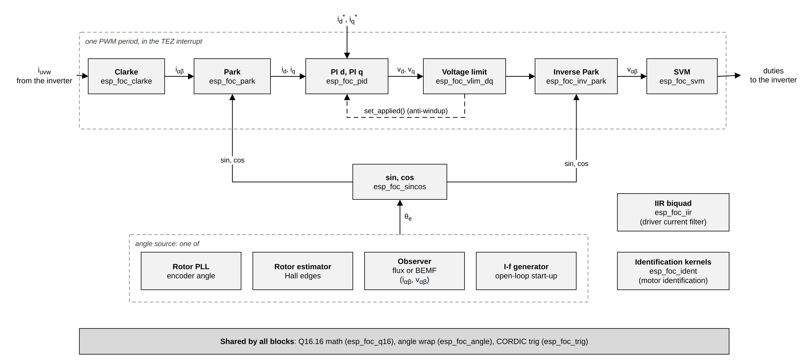

# 9. Building blocks

The sensored and sensorless stacks are assembled from small, portable modules:
fixed-point math, trigonometry, the Clarke and Park transforms, a PI
controller, a voltage limiter, space-vector modulation, a biquad filter, rotor
angle estimators, sensorless observers, an open-loop start-up generator and
identification kernels. Each one is a plain C unit with no driver and no RTOS
inside, so you can call it from your own code. You need this chapter when you
write your own control loop on top of the drivers, when you want one piece of a
stack (for example the encoder PLL) elsewhere, or when you read the stack
sources and want to know what each call does.

## What they are

A building block is a pure function or a small object with an `init` (or
`config_default` + `init`) and an `update`/`step` call. The same rules hold for
all of them:

- **Fixed point at run time.** Every value that moves through a loop is a
  `q16_t` (see [How espFoC runs](02_execution_model.md#fixed-point)). `float`
  appears only in design and configuration calls (`*_init`, `*_design_*`,
  `*_config_default`, `esp_foc_pid_set_kp`, ...). Call those from a task.
- **Angles** are Q16 radians wrapped to (−π, +π].
- **Units.** Currents are amps. The PI, the voltage limiter and SVM work in
  *per unit of Vdc*: `Q16_ONE` means the full DC-link voltage. The observers
  take volts.
- **No allocation, no locks, no blocking** (except the I-f sequencer, which is
  meant for a task). You own the state structs.
- **Placement.** The component's linker fragment (`linker.lf`) places all
  espFoC code in IRAM, and the component is compiled at `-O2` whatever the
  project's optimisation level.

All blocks are built in every configuration. `CONFIG_ESP_FOC_STACK_NONE`
("None (building blocks only)", the default of the `ESP_FOC_STACK` choice)
leaves out both stacks and keeps everything in this chapter. The exception is
the identification kernels, compiled only with `CONFIG_ESP_FOC_ENABLE_MOTOR_ID`.

## How they fit together

One PWM period of a current loop runs the blocks in a fixed order: the measured
phase currents go through Clarke and Park into the rotor frame, two PI
controllers turn the current error into voltages, the limiter keeps the voltage
vector inside what the inverter can produce, and inverse Park plus SVM turn it
into three duties. The rotor angle that both Park transforms need comes from one
of the estimators.



| Angle source | Input | Header |
|---|---|---|
| Rotor PLL | absolute angle read at a fixed rate (encoder) | `esp_foc_rotor_pll.h` |
| Rotor estimator | sparse, timestamped absolute angles (Hall edges) | `esp_foc_rotor_est.h` |
| Observer (flux or BEMF) | measured iαβ and applied vαβ, no sensor | `esp_foc_observer.h` |
| I-f generator | none: commands a frequency, the caller integrates θ | `esp_foc_if.h` |

## Math and transforms

### Q16.16 fixed point

A `q16_t` is an `int32_t` read as "value × 65536": 16 integer and 16 fraction
bits, range about −32768 to +32767, step 1/65536. The helpers in
[`esp_foc_q16.h`](../../include/espFoC/utils/esp_foc_q16.h) are `static inline`
and saturate instead of wrapping around:

- `Q16_ONE`, `Q16_HALF`, `Q16_MINUS_ONE`
- `q16_from_float(x)` (round to nearest, saturate), `q16_to_float(x)`
- `q16_add`, `q16_sub`, `q16_mul` (64-bit product shifted right by 16),
  `q16_neg`, `q16_clamp(x, lo, hi)`, `q16_min`, `q16_max`
- `q16_div(a, b)`: 64-bit `(a << 16) / b`; `b == 0` gives `INT32_MAX` for
  `a > 0`, `INT32_MIN` for `a < 0` and 0 for `0/0`

```c
q16_t v = q16_mul(q16_from_float(1.9f), q16_from_float(0.5f)); /* 0.95 */
```

`q16_mul` truncates (arithmetic shift), it does not round. `q16_div` is a 64-bit
integer division, a library call on a 32-bit core: precompute reciprocals at
init and multiply in the loop.

### Angles

[`esp_foc_angle.h`](../../include/espFoC/utils/esp_foc_angle.h) fixes one
convention, the interval (−π, +π] (`+π` is in, `−π` is not), and provides:

- `Q16_PI`, `Q16_PI_2`, `Q16_TWO_PI`, `Q16_MINUS_PI`, `Q16_MINUS_PI_2`,
  `Q16_SQRT3_2` (√3/2), `Q16_INV_SQRT3` (1/√3)
- `q16_t q16_wrap_pi(q16_t x)`: wrap into (−π, +π]
- `q16_t q16_angle_delta(q16_t prev, q16_t now)`: shortest signed `now − prev`

```c
theta = q16_wrap_pi(q16_add(theta, dtheta));        /* integrate */
q16_t err = q16_angle_delta(theta_hat, theta_meas); /* error across ±π */
```

`q16_wrap_pi` adds or subtracts 2π in a loop: cheap for inputs within a turn or
two, slower for far ones. Never use `q16_sub` of two angles as an error: across
the ±π seam it is almost 2π.

### Trigonometry

Sine, cosine, arctangent and square root without tables, computed with CORDIC,
an iterative method that rotates a vector by the fixed angles `atan(2^-i)` using
only shifts and adds
([`esp_foc_trig.h`](../../include/espFoC/utils/esp_foc_trig.h),
`source/utils/esp_foc_trig_cordic.c`).

```c
void  esp_foc_sincos(q16_t angle, q16_t *s_out, q16_t *c_out);
q16_t esp_foc_sin(q16_t angle);
q16_t esp_foc_cos(q16_t angle);
q16_t esp_foc_atan2(q16_t y, q16_t x);   /* (−π, +π]; atan2(0, 0) = 0 */
q16_t esp_foc_sqrt(q16_t x);             /* x <= 0 gives 0 */

q16_t s, c;
esp_foc_sincos(theta_e, &s, &c);         /* once per period, shared by both Parks */
```

- `esp_foc_sincos` wraps the angle, folds it into [0, π/2], runs 16 CORDIC
  iterations in 32-bit integers and restores the signs. Either output pointer
  may be `NULL`. `esp_foc_sin` and `esp_foc_cos` each run a full `sincos`.
- `esp_foc_atan2` uses the same 16 iterations in vectoring mode.
  `esp_foc_sqrt` normalises by powers of 4, runs a hyperbolic CORDIC and ends
  with one 64-bit division.
- The unit tests hold sin and cos within 0.002 of `float` over the circle,
  atan2 within 0.003 rad, and sqrt within 2 %.

### Clarke and Park

Clarke turns the three phase quantities u, v, w into two orthogonal components
α, β of the fixed stator frame. espFoC uses the amplitude-invariant form, so a
current vector keeps its peak value: `α = (2u − v − w)/3`, `β = (v − w)/√3`.
Park then rotates αβ by the electrical rotor angle θ into the rotor frame, d
along the magnet and q at 90° to it, where a steady current is a constant a PI
can regulate: `d = α·cos θ + β·sin θ`, `q = β·cos θ − α·sin θ`. The inverses
go back.

```c
/* esp_foc_clarke.h */
void esp_foc_clarke(q16_t u, q16_t v, q16_t w, q16_t *alpha, q16_t *beta);
void esp_foc_inv_clarke(q16_t alpha, q16_t beta, q16_t *u, q16_t *v, q16_t *w);
/* esp_foc_park.h */
void esp_foc_park(q16_t s, q16_t c, q16_t alpha, q16_t beta, q16_t *d, q16_t *q);
void esp_foc_inv_park(q16_t s, q16_t c, q16_t d, q16_t q, q16_t *alpha, q16_t *beta);

esp_foc_clarke(iu, iv, q16_neg(q16_add(iu, iv)), &ia, &ib);  /* two shunts */
esp_foc_park(s, c, ia, ib, &id, &iq);
```

- With two current shunts, reconstruct `w = −u − v` before Clarke.
- Inverse Clarke is `u = α`, `v = −α/2 + β·√3/2`, `w = −α/2 − β·√3/2`; SVM
  calls it internally.
- Park takes the sine and cosine, not the angle, so one `esp_foc_sincos` serves
  the current Park and the voltage inverse Park. Four multiplies each.
  Forward Clarke has one `q16_div` by 3.

## Control and modulation

### PI controller

A discrete controller in "2p2z" form (two poles, two zeros), one recursive
equation that covers P, PI and PID. For a PI it is
`u[k] = u[k−1] + b0·e[k] + b1·e[k−1]` with `e = setpoint − measurement`,
`b0 = kp + ki·Ts/2`, `b1 = ki·Ts/2 − kp` (Tustin discretisation of
`kp + ki/s`). With `kd != 0` the derivative is filtered by a pole at
`N = 2π·n_hz` (`10/ts` when `n_hz <= 0`).
API in [`esp_foc_pid.h`](../../include/espFoC/utils/esp_foc_pid.h):

```c
esp_err_t esp_foc_pid_init(esp_foc_pid_t *p, float kp, float ki, float kd,
                           float n_hz, float ts);
q16_t     esp_foc_pid_update(esp_foc_pid_t *p, q16_t sp, q16_t meas);
void      esp_foc_pid_set_applied(esp_foc_pid_t *p, q16_t u_applied);
void      esp_foc_pid_reset(esp_foc_pid_t *p);
void      esp_foc_pid_set_ff(esp_foc_pid_t *p, q16_t ff);
void      esp_foc_pid_set_bypass(esp_foc_pid_t *p, bool on);
void      esp_foc_pid_set_pmsm_ff(esp_foc_pid_t *pd, esp_foc_pid_t *pq, q16_t we,
                                  q16_t id, q16_t iq, q16_t ls, q16_t psi_f,
                                  q16_t inv_vdc);
esp_err_t esp_foc_pid_set_kp(esp_foc_pid_t *p, float kp);  /* also _ki, _kd */
esp_err_t esp_foc_pid_design_imc_zoh(float k_plant, float tau_s, float fs_hz,
                                     float bw_hz, float *kp, float *ki);
esp_err_t esp_foc_pid_design_integrator(float k_plant, float fs_hz, float bw_hz,
                                        float zeta, float *kp, float *ki);
```

```c
float kp, ki;   /* current loop: plant gain Vdc/Rs [A per unit], tau Ls/Rs */
ESP_ERROR_CHECK(esp_foc_pid_design_imc_zoh(vdc / rs, ls / rs, 20000.0f, 200.0f,
                                           &kp, &ki));
ESP_ERROR_CHECK(esp_foc_pid_init(&pi_q, kp, ki, 0.0f, 0.0f, 1.0f / 20000.0f));

q16_t vq = esp_foc_pid_update(&pi_q, iq_ref, iq);  /* every period */
vq = q16_clamp(vq, q16_neg(vmax), vmax);
esp_foc_pid_set_applied(&pi_q, vq);                /* anti-windup */
```

- **Anti-windup is yours.** `update` does not limit its output. Clamp it, then
  pass the value really applied to `set_applied`, which overwrites the stored
  previous output, so the integrator cannot run away while the output is
  limited. Without `set_applied` there is no anti-windup.
- `esp_foc_pid_design_imc_zoh` places the closed loop of a sampled first-order
  plant (gain `k_plant`, time constant `tau_s`) at `bw_hz < fs_hz/2`. The
  stacks use it for the current loops with `k_plant = Vdc/Rs`, `tau_s = Ls/Rs`;
  the sensored stack then scales the gains by
  `CONFIG_ESP_FOC_SD_I_BACKOFF_PERMIL` (default 500).
- `esp_foc_pid_design_integrator` designs a type-2 PI for an integrating plant
  `K/s` (speed loop, PLL), prewarped so the bandwidth lands at `bw_hz`. `zeta`
  must be in (0.4, 1.2); gains that do not fit Q16 (`kp >= 32000`,
  `ki·Ts >= 32000`) are rejected.
- `set_bypass(p, true)` makes `update` return `sp + ff`.
- **Feedforward.** `set_ff` adds a term after the controller, and the sum
  becomes the stored previous output; `set_pmsm_ff` writes the decoupling terms
  `vd* = −ω·Ls·iq`, `vq* = ω·Ls·id + ω·ψf` (times `inv_vdc`, to per unit) into
  both controllers' `ff`. The stacks do not use the internal `ff`: they add the
  feedforward outside the PI and pass `applied − ff` to `set_applied` (see
  [Putting them together](#putting-them-together)), which keeps it out of the
  integrator state.
- `set_kp/ki/kd` redesign in `float`. To retune a running loop, do it on a copy
  in a task and swap the struct inside `esp_foc_critical_enter()` /
  `esp_foc_critical_leave()`, as the sensored stack does.
- Cost per `update`: five 64-bit multiply-accumulates, no division.

### Voltage limit and SVM

The inverter can only produce a voltage vector of limited length.
`esp_foc_vlim_dq` scales (vd, vq) down to length `vmax` when it is longer,
keeping its direction, and leaves it alone otherwise. SVM (space-vector
modulation) then turns the αβ voltage into three duties. espFoC uses the
min-max form: inverse Clarke gives three phase voltages, the midpoint of the
largest and smallest is subtracted from all three, and the result is centred at
50 %: `duty_x = 1/2 + (v_x − (max + min)/2)`. A common shift does not change the
voltage between the motor terminals, and it lets the duties reach a vector of
length 1/√3 of Vdc before one of them clips.

```c
/* esp_foc_vlim.h, esp_foc_svm.h */
void esp_foc_vlim_dq(q16_t *vd, q16_t *vq, q16_t vmax);
void esp_foc_svm(q16_t v_alpha, q16_t v_beta, q16_t *du, q16_t *dv, q16_t *dw);

esp_foc_vlim_dq(&vd, &vq, Q16_INV_SQRT3);   /* linear SVM range */
esp_foc_inv_park(s, c, vd, vq, &va, &vb);
esp_foc_svm(va, vb, &du, &dv, &dw);
inv->set_duties(inv, du, dv, dw);           /* unipolar [0, Q16_ONE] */
```

- `vmax` and the SVM input are per unit of Vdc. Both stacks limit at
  `Q16_INV_SQRT3`. `vmax <= 0` zeroes both components.
- The limiter computes the length with `esp_foc_sqrt`; the division for the
  scale factor runs only when the vector is over the limit.
- SVM duties are clamped to `[0, Q16_ONE]`; zero voltage gives three
  `Q16_HALF`. A vector longer than 1/√3 is distorted, so limit first. No sector
  search: one inverse Clarke, a min, a max and three clamps.

### IIR biquad filter

A second-order recursive filter,
`H(z) = (b0 + b1·z⁻¹ + b2·z⁻²) / (1 + a1·z⁻¹ + a2·z⁻²)`, computed in transposed
direct form II, with a helper that designs a second-order Butterworth low-pass
([`esp_foc_iir.h`](../../include/espFoC/utils/esp_foc_iir.h)):

```c
q16_t     esp_foc_iir_update(esp_foc_iir_t *f, q16_t x);
void      esp_foc_iir_reset(esp_foc_iir_t *f);
void      esp_foc_iir_set_coeffs(esp_foc_iir_t *f, q16_t b0, q16_t b1, q16_t b2,
                                 q16_t a1, q16_t a2);
esp_err_t esp_foc_iir_design_lpf(esp_foc_iir_t *f, float fs_hz, float fc_hz);

esp_foc_iir_t lpf;
ESP_ERROR_CHECK(esp_foc_iir_design_lpf(&lpf, 20000.0f, 8000.0f));
q16_t y = esp_foc_iir_update(&lpf, x);      /* every sample */
```

- `design_lpf` uses the bilinear transform with prewarping, needs `fc_hz` in
  (0, `fs_hz/2`) and resets the state. The MCPWM inverter driver filters the
  phase currents with it (default cut-off 8 kHz at the PWM rate).
- Coefficients are Q16: `b0 = k²/a0` with `k = tan(π·fc/fs)`, so a cut-off far
  below the sample rate leaves `b0` with few significant bits. Check the
  designed response when `fc/fs` is small.
- Cost per sample: five 64-bit multiplies, no division.

## Estimators and observers

### Rotor PLL (encoder angle tracking)

Computing speed as Δθ/Δt from an encoder read at a fixed rate gives a noise
floor of one encoder step times the sample rate, at any speed. A phase-locked
loop (PLL) keeps its own estimate θ̂, ω̂ and corrects both from the angle error,
so the noise is averaged over about `1/bw` seconds and the bandwidth is a design
choice. It is type 2: at constant speed the angle error goes to zero.

```text
e = wrap(θ_meas − θ̂)     ω̂ ← ω̂ + ki·Ts·e     θ̂ ← wrap(θ̂ + Ts·(ω̂ + kp·e))
```

API in [`esp_foc_rotor_pll.h`](../../include/espFoC/motor_control/esp_foc_rotor_pll.h):

```c
void      esp_foc_rotor_pll_config_default(esp_foc_rotor_pll_config_t *cfg,
                                           uint32_t step_hz, float bw_hz,
                                           float zeta, float omega_max_rads);
esp_err_t esp_foc_rotor_pll_init(esp_foc_rotor_pll_t *p,
                                 const esp_foc_rotor_pll_config_t *cfg);
void      esp_foc_rotor_pll_step(esp_foc_rotor_pll_t *p, q16_t theta_meas, bool fresh);
void      esp_foc_rotor_pll_update(esp_foc_rotor_pll_t *p,
                                   const esp_foc_rotor_sensor_t *sensor);
void      esp_foc_rotor_pll_seed(esp_foc_rotor_pll_t *p, q16_t theta, q16_t omega);
void      esp_foc_rotor_pll_reset(esp_foc_rotor_pll_t *p);
/* inline getters: _get_theta, _get_omega, _get_phase_err */

esp_foc_rotor_pll_config_t pc;
esp_foc_rotor_pll_config_default(&pc, 2500, 180.0f, 1.0f, 0.0f);
pc.domain = ESP_FOC_ROTOR_PLL_ELEC;         /* default is ESP_FOC_ROTOR_PLL_MECH */
ESP_ERROR_CHECK(esp_foc_rotor_pll_init(&pll, &pc));
esp_foc_rotor_pll_update(&pll, rotor);      /* 2500 times per second */
q16_t w_e = esp_foc_rotor_pll_get_omega(&pll);
```

- `step_hz` is the rate of your `step`/`update` calls. The sensored stack uses
  `CONFIG_ESP_FOC_SD_FETCH_HZ` (default 2500), `CONFIG_ESP_FOC_SD_PLL_BW_HZ`
  (180) and `CONFIG_ESP_FOC_SD_PLL_ZETA_PERMIL` (1000).
- `init` rejects gains whose per-step correction is too large (`kp·Ts > 1` or
  `(ωn·Ts)² > (2π/10)²`). At ζ = 1 the bandwidth ceiling is near `step_hz/12`.
- `domain` only selects which snapshot field `update` reads (`theta_m` or
  `theta_e`); ω̂ comes out in the same domain.
- `update` counts a sample as fresh only when the snapshot is `valid` and its
  `seq` moved, so a repeated reading after a failed transfer dead-reckons on ω̂
  instead of counting as zero motion. `step(p, θ, false)` does the same by hand.
- There is no innovation gate: every fresh sample is used. The only limit is
  `omega_max` (0 disables it). The struct counts `updates`, `coasted` and
  `clamped`.
- θ̂ is a one-period prediction, the angle for the moment it will be used. Use
  `seed` after a calibration to place the estimate instead of letting it slew.
- `step` is O(1) with no division; the period is kept in Q32 (`dt_q32`) because
  Q16 cannot represent a few hundred microseconds accurately.

### Rotor estimator (sparse timestamped angles)

For sensors that report an exact angle only now and then, each with a hardware
timestamp: Hall sensors (an edge every 60° electrical) or a slow encoder.
Between measurements it extrapolates once per call of `step`; on each
measurement it corrects speed from the measured period and angle from the
error, with independent gains `λω` and `λθ`. Each error decays as `(1 − λ)` per
measurement: stable for λ in (0, 2), no overshoot for λ in (0, 1].
API in [`esp_foc_rotor_est.h`](../../include/espFoC/motor_control/esp_foc_rotor_est.h):

```c
void      esp_foc_rotor_est_config_default(esp_foc_rotor_est_config_t *cfg,
                                           uint32_t tick_hz, uint32_t step_hz,
                                           float sector_span_rad, float standstill_ms);
esp_err_t esp_foc_rotor_est_init(esp_foc_rotor_est_t *e,
                                 const esp_foc_rotor_est_config_t *cfg);
void      esp_foc_rotor_est_on_edge(esp_foc_rotor_est_t *e, q16_t theta_meas,
                                    uint64_t ticks, int dir);
void      esp_foc_rotor_est_step(esp_foc_rotor_est_t *e);
void      esp_foc_rotor_est_reset(esp_foc_rotor_est_t *e);
/* inline: _get_theta, _get_omega, _is_moving */

esp_foc_rotor_est_config_default(&ec, tick_hz, pwm_hz, 2.0f * 3.14159265f / 6.0f,
                                 150.0f);
ESP_ERROR_CHECK(esp_foc_rotor_est_init(&est, &ec));
esp_foc_rotor_est_on_edge(&est, theta_edge, ticks, dir);  /* on each edge */
esp_foc_rotor_est_step(&est);                             /* every period */
```

- `config_default` sets `λθ = 0.5`, `λω = 0.3` and a clamp margin of 10 % of
  the sector. It rejects edges closer than a tenth of a `step_hz` period
  (contact bounce) and treats a gap longer than four standstill windows as
  "no speed, re-anchor only". After `standstill_ms` without an edge ω̂ decays
  toward zero.
- The extrapolated angle is clamped to one sector plus the margin past the last
  measurement, so even a wrong ω̂ cannot drift further than that.
- `on_edge` costs one division, `step` none. The Hall driver uses a sector of
  2π/6, `step_hz` equal to the PWM rate and a default standstill of 150 ms.

### Observers (sensorless angle)

An observer estimates the electrical rotor angle without a sensor, from the
measured stator current and the applied voltage: a spinning magnet induces a
voltage (back-EMF) whose direction gives the rotor angle. All observers share
one interface,
[`esp_foc_observer.h`](../../include/espFoC/motor_control/esp_foc_observer.h):
an `esp_foc_observer_t` of function pointers with inline wrappers that return
0/false for a `NULL` object.

```c
void  esp_foc_observer_update(esp_foc_observer_t *o, q16_t i_alpha, q16_t i_beta,
                              q16_t v_alpha, q16_t v_beta);  /* A, V */
q16_t esp_foc_observer_get_theta(const esp_foc_observer_t *o); /* electrical */
q16_t esp_foc_observer_get_omega(const esp_foc_observer_t *o);
bool  esp_foc_observer_is_locked(const esp_foc_observer_t *o);
/* also: _reset, _set_theta, _set_omega, _set_extract, _set_pll_enable,
 *       _get_e_alpha/_beta, _get_psi_alpha/_beta, _get_phase_err */
```

- `esp_foc_angle_extract_t` selects how the angle is taken from the estimated
  vector: `ESP_FOC_ANGLE_ATAN2` (arctangent, speed from its derivative) or
  `ESP_FOC_ANGLE_PLL` (tracking loop, smoother speed).
- `set_theta` / `set_omega` seed the estimate; `set_pll_enable(false)` holds ω̂.
- `is_locked` turns true after `lock_count` consecutive updates with the
  estimated vector above a magnitude threshold, and false after
  `unlock_count` updates below it (defaults 200 and 10 × `lock_count`).

**Flux observer**
([`esp_foc_observer_flux.h`](../../include/espFoC/motor_control/esp_foc_observer_flux.h)),
used by the sensorless stack. It integrates the stator voltage equation to get
the stator flux, subtracts the winding's own flux to get the magnet flux, and
tracks that vector's angle with a PLL:
`dψs/dt = v − Rs·i − λ·(ψs − Ls·i)`, `ψr = ψs − Ls·i`. The term
`λ = 2π·blend_hz` is a washout that removes the integrator's DC drift.

```c
esp_foc_observer_flux_t flux;
const esp_foc_observer_flux_config_t ocfg = {
    .rs_ohm = rs, .ls_h = ls, .psi_f_wb = psi, .ts_s = 1.0f / 20000.0f,
    .obs_bw_hz = 800.0f,                      /* CONFIG_ESP_FOC_SL_OBS_BW_HZ */
    .track_bw_hz = 0.0385f * fe_rated_hz,     /* stack default fractions */
    .blend_hz = 0.0257f * fe_rated_hz,
};
ESP_ERROR_CHECK(esp_foc_observer_flux_init(&flux, &ocfg));
esp_foc_observer_t *obs = &flux.iface;

/* every period: this period's current, last period's voltage in volts */
esp_foc_observer_update(obs, ia, ib, q16_mul(va_prev, vdc), q16_mul(vb_prev, vdc));
q16_t th = esp_foc_observer_get_theta(obs);
```

- `init` needs `rs_ohm`, `ls_h`, `psi_f_wb` > 0, `0 < ts_s < 0.01` and
  `track_bw_hz < obs_bw_hz < 0.1/ts_s`.
- Zeroed fields take defaults: `obs_zeta`, `track_zeta` 0.7 (accepted 0.4 to
  1.2); `psi_lock_frac` 0.5 (lock when |ψr| ≥ that fraction of ψf);
  `psi_max_frac` 4.0 (ceiling on |ψr|, negative disables it); `w_max_rads`
  2π·1000; `lock_count` 200. Extraction defaults to `ESP_FOC_ANGLE_PLL`.
- Extra calls: `esp_foc_observer_flux_set_bw`, `_get_omega_psi`,
  `_get_pll_settle_left`, `_get_psi_peak` and `_get_psi_clamp_count`
  (non-zero means the integrator was drifting).

**BEMF observer**
([`esp_foc_observer_bemf.h`](../../include/espFoC/motor_control/esp_foc_observer_bemf.h))
computes the back-EMF directly, `ê = v − Rs·i − Ls·di/dt`, low-pass filters it
at `emf_lpf_hz`, compensates the filter lag and extracts the angle by atan2 or
PLL. PLL gains come from `pll_bw_hz`/`pll_zeta` (ζ default 0.707), or from
`pll_kp`/`pll_ki` when `pll_bw_hz` is 0; `e_lock_min_v` (default 0.05 V) is
the lock threshold. `init` needs `rs_ohm`, `ls_h` > 0, `0 < ts_s < 0.01` and
`emf_lpf_hz > 0`. The extraction is read from `cfg.extract`, so a zeroed config
gives `ESP_FOC_ANGLE_ATAN2`. Neither stack uses it; the unit tests cover it.

Cost: one `sincos` or `atan2` per update and, in the flux observer, a few
64-bit divisions.

### I-f open-loop start-up generator

At standstill there is no back-EMF for an observer to measure. I-f
("current-frequency") start-up spins the motor without an angle: it aligns the
rotor with a d-axis current, then turns the current vector at a rising
frequency so the rotor follows, until the observer can take over.
[`esp_foc_if.h`](../../include/espFoC/motor_control/esp_foc_if.h) is the
sequencer: it decides the current and frequency commands through callbacks;
your PWM loop integrates the frequency into the open-loop angle and runs the
current loop on it. The phases are `ALIGN` (Id ramps to `i_align_a` in
`align_ms`), `ALIGN_SETTLE` (hold until the rotor is still), optional
`VF_BREAKAWAY` (voltage command up to `vf_hz`), `CREEP` (frequency ramp to
`f_max_hz` at `accel_rads2`, Iq = 0) and `HANDOFF`.

```c
esp_err_t esp_foc_if_run(esp_foc_if_t *s, int sign);   /* sign < 0: reverse */

static void if_sleep(void *ctx, uint32_t ms) { (void)ctx; esp_foc_sleep_ms(ms); }

esp_foc_if_t ifs = {
    .cfg = { .i_align_a = i_align, .align_ms = align_ms, .f_max_hz = plateau_hz,
             .accel_rads2 = accel, .lock_timeout_ms = lock_to_ms },
    .ops = { .ctx = &app, .set_idq = app_set_idq, .set_fe_hz = app_set_fe,
             .sleep_ms = if_sleep, .get_dang = app_get_dang,
             .lock_ok = app_lock_ok, .do_handoff = app_handoff,
             .ramp_ok = app_ramp_ok },
};
esp_err_t err = esp_foc_if_run(&ifs, +1);   /* blocks until handoff or failure */
```

- Required callbacks: `set_idq`, `set_fe_hz`, `sleep_ms`, `get_dang`,
  `lock_ok`, `do_handoff`. Optional: `poll`, `at_rest`, `align_ok`, `ramp_ok`,
  `advance_theta`, `set_vdq`, `to_current_mode`, `on_plateau`, `lock_timeout`.
- `esp_foc_if_run` blocks, so call it from a task. It ticks every `dt_ms`
  (default 20 ms) through `sleep_ms`.
- It returns `ESP_ERR_INVALID_ARG` for a bad set-up (`i_align_a` or `f_max_hz`
  not positive, neither `accel_rads2` nor `creep_ramp_ms`, `at_rest` without
  `align_timeout_ms`, `vf_hz` without `set_vdq`/`vf_ramp_ms` or not below
  `f_max_hz`), `ESP_FAIL` when `align_ok`, `ramp_ok` or `do_handoff` say no,
  and `ESP_OK` after a successful handoff.
- `lock_timeout` fires once after `lock_timeout_ms` on the plateau, but the run
  keeps waiting for `lock_ok`. To give up, return `false` from `ramp_ok`.
- The module never feeds its frequency to the observer. After the handoff Park
  must run on the observer angle; see [Sensorless stack](08_sensorless_stack.md).

### Identification kernels

The numerics of motor identification without driver or OS: O(1) accumulators
for the PWM interrupt and solve functions that run once a probe window closes.
Results are integers in milli-ohm, micro-henry and micro-weber, because those
values are too small for Q16 henries or webers. The full procedure is in
[Motor identification](06_motor_identification.md).
[`esp_foc_ident.h`](../../include/espFoC/motor_control/esp_foc_ident.h) is
compiled only with `CONFIG_ESP_FOC_ENABLE_MOTOR_ID` and provides an impedance
probe (`esp_foc_ident_zprobe_init`, `_step`, `_done`, `_solve` into an
`esp_foc_ident_z_t`), a DC probe (`esp_foc_ident_dcprobe_init`, `_add`,
`_done`, `_ma`) and solvers (`esp_foc_ident_r_slope_mohm`,
`_l_from_mag_uh`, `_best_probe_hz`, `_step_lag`, `_symmetry`, `_psi_uwb`).

```c
esp_foc_ident_dcprobe_init(&dc, skip_samples, avg_samples);
esp_foc_ident_dcprobe_add(&dc, i_meas);          /* PWM ISR, voltage v1 applied */
int32_t i1_ma = esp_foc_ident_dcprobe_ma(&dc);   /* task, once _done() */
/* repeat at v2, then */
int32_t r_mohm = esp_foc_ident_r_slope_mohm(v1_mv, i1_ma, v2_mv, i2_ma);
```

## Putting them together

One PWM period of a minimal current loop written with the blocks only. It
follows the order, anti-windup and feedforward handling of the stacks' PWM
handlers (`source/motor_control/esp_foc_sensored.c`): loads first, computation
in the middle, stores at the end.

```c
typedef struct {
    esp_foc_inverter_t *inv;
    esp_foc_pid_t pi_d, pi_q;
    q16_t iu, iv, iw;          /* A, written by the DMA callback */
    q16_t theta_e;             /* rad, written by your estimator */
    q16_t id_ref, iq_ref;      /* A */
    q16_t vd_ff, vq_ff;        /* per unit of Vdc, 0 if unused */
} my_loop_t;

static void my_dma(void *arg)
{
    my_loop_t *l = arg;
    l->inv->fetch_currents(l->inv, &l->iu, &l->iv, &l->iw);
}

static void my_tez(void *arg)
{
    my_loop_t *l = arg;
    const q16_t iu = l->iu, iv = l->iv, iw = l->iw;
    const q16_t th = l->theta_e;
    const q16_t idr = l->id_ref, iqr = l->iq_ref;
    const q16_t vd_ff = l->vd_ff, vq_ff = l->vq_ff;
    q16_t s, c, ia, ib, id, iq, va, vb, du, dv, dw;

    esp_foc_sincos(th, &s, &c);
    esp_foc_clarke(iu, iv, iw, &ia, &ib);
    esp_foc_park(s, c, ia, ib, &id, &iq);

    q16_t vd = q16_add(esp_foc_pid_update(&l->pi_d, idr, id), vd_ff);
    q16_t vq = q16_add(esp_foc_pid_update(&l->pi_q, iqr, iq), vq_ff);
    esp_foc_vlim_dq(&vd, &vq, Q16_INV_SQRT3);
    esp_foc_pid_set_applied(&l->pi_d, q16_sub(vd, vd_ff));
    esp_foc_pid_set_applied(&l->pi_q, q16_sub(vq, vq_ff));

    esp_foc_inv_park(s, c, vd, vq, &va, &vb);
    esp_foc_svm(va, vb, &du, &dv, &dw);
    l->inv->set_duties(l->inv, du, dv, dw);
}
```

Set-up, from a task, before the bridge is enabled:

```c
const float pwm_hz = (float)inv->get_pwm_rate_hz(inv);
const float vdc = q16_to_float(inv->get_dc_link_voltage(inv));
float kp, ki;
ESP_ERROR_CHECK(esp_foc_pid_design_imc_zoh(vdc / rs_ohm, ls_h / rs_ohm, pwm_hz,
                                           200.0f, &kp, &ki));
ESP_ERROR_CHECK(esp_foc_pid_init(&loop.pi_d, kp, ki, 0.0f, 0.0f, 1.0f / pwm_hz));
ESP_ERROR_CHECK(esp_foc_pid_init(&loop.pi_q, kp, ki, 0.0f, 0.0f, 1.0f / pwm_hz));
esp_foc_critical_enter();
inv->set_dma_callback(inv, my_dma, &loop);
inv->set_pwm_callback(inv, my_tez, &loop);
esp_foc_critical_leave();
```

Creating the inverter, calibrating the current offsets and enabling the bridge
are covered in [Inverter driver](03_inverter_driver.md). `theta_e` comes from
your estimator: the rotor sensor and the rotor PLL in a sensored loop, or
`esp_foc_observer_get_theta` (fed with `va`, `vb` of the previous period scaled
to volts) in a sensorless one. The PWM callback runs in an interrupt: no
`printf`, no blocking calls, no `float`.

## Configuration

| Symbol | Default | Meaning |
|---|---|---|
| `CONFIG_ESP_FOC_STACK_NONE` | y (choice default) | no stack; drivers and building blocks only |
| `CONFIG_ESP_FOC_ENABLE_MOTOR_ID` | n | compile the identification kernels and sequence |
| `CONFIG_ESP_FOC_PWM_RATE_HZ` | 20000 | default PWM carrier, the rate of the PWM callback |
| `CONFIG_ESP_FOC_USE_HW_ACCEL_TRIGO`, `_IIR`, `_PID`, `_CLARKE`, `_PARK`, `_VLIM`, `_SVM` | n | try a hardware unit for that block first (see below) |

### Hardware acceleration hooks

Each math block is split into a software implementation (`*_soft.c`), a
hardware hook (`*_hw.c`) and a public dispatcher. With a
`CONFIG_ESP_FOC_USE_HW_ACCEL_*` option on, the dispatcher first asks the hook
whether an accelerator is present and otherwise runs the software path. **No
SoC in the current support set exposes any of these accelerators**: every
`esp_foc_*_hw_available()` returns `false`, so the software path always runs and
enabling an option only adds that check to each call. The hooks keep the public
API unchanged for a future target that has such a unit. Design functions
(`esp_foc_pid_init`, `esp_foc_iir_design_lpf`, ...) are always software.

## Use cases

- **Your own controller on the drivers.** Choose `CONFIG_ESP_FOC_STACK_NONE`,
  create the inverter and a rotor sensor ([Rotor sensors](04_rotor_sensors.md))
  and write the loop above, with your own speed or position control on top.
- **Reusing one piece.** The rotor PLL gives a clean speed from an encoder in a
  non-FoC application; the IIR and the PI serve any sampled loop. None of them
  needs the inverter.
- **Reading or testing the stacks.** The PWM handlers in
  `source/motor_control/esp_foc_sensored.c` and `esp_foc_sensorless.c` are made
  of exactly these calls, and the
  [unit test runner](../../examples/unit_test_runner/README.md) exercises every
  block.

## Testing

The common layer has Unity suites in `test/`, one per block
(`test_esp_foc_angle.c`, `_clarke`, `_park`, `_pid`, `_vlim`, `_svm`, `_iir`,
`_trig`, `_rotor_pll`, `_rotor_est`, `_observer`, `_observer_flux`, `_if`,
`_ident`, plus the identification suites). They cover the happy path, edge
cases, accuracy against `float` and closed-loop final values.

- **Linux host.** For `IDF_TARGET=linux` the component builds only the
  portable core and `test/CMakeLists.txt` registers only these suites. CI
  (`.github/workflows/espfoc_flow.yaml`) builds `examples/unit_test_runner` for
  `linux` and runs it, then compile-checks the runner for `esp32c6`.
- **On the chip.** `examples/unit_test_runner` runs every suite at boot,
  including the stack tests against a mock motor, and prints `PASS unit_tests`
  or `FAIL unit_tests fails=N`:

```bash
cd examples/unit_test_runner
idf.py -D TEST_COMPONENTS=espFoC set-target esp32c6
idf.py -D TEST_COMPONENTS=espFoC -p /dev/ttyUSB0 flash monitor
```

## Limits and pitfalls

- **Wrap every angle** and take errors with `q16_angle_delta`; a raw difference
  across ±π is a 2π jump.
- **Limit, then `set_applied`.** The PI never limits itself; without
  `esp_foc_pid_set_applied` the integrator winds up while the output saturates.
- **Keep units straight.** Amps for currents; per unit of Vdc for the PI, vlim
  and SVM; volts for the observers. Feeding per-unit voltage to an observer
  scales its flux estimate by Vdc.
- **Give the observer the voltage that was applied**: the previous period's
  inverse-Park output, the one in force while the currents were sampled.
- **Range and resolution.** Q16 holds about ±32767 (rad/s, A, V) in steps of
  1/65536. Small coefficients lose precision, which is why the PLL and the Hall
  estimator keep their period in Q32.
- **Divisions cost.** `q16_div`, forward Clarke, `esp_foc_sqrt` and the flux
  observer use 64-bit divisions; precompute reciprocals where you can.
- **`float` stays out of the interrupt.** Retune on a copy and swap it in a
  critical section; the blocks take no locks.
- **I-f does not time out by itself.** `lock_timeout` only notifies; abort
  through `ramp_ok`.
- **"Locked" means "enough signal".** `esp_foc_observer_is_locked` is a
  magnitude test on the estimated flux or back-EMF, not a check that the angle
  is right.
