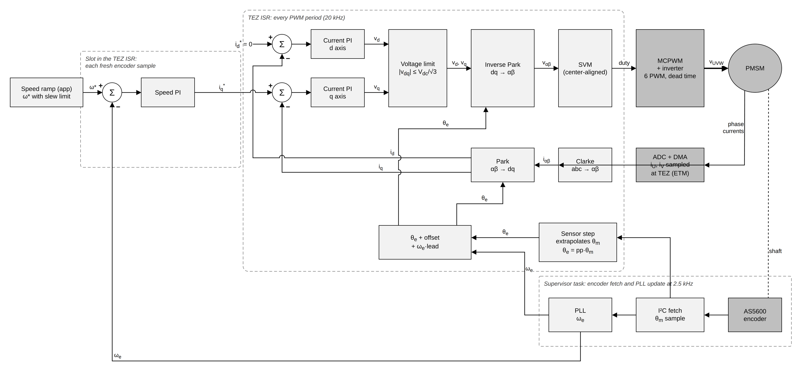
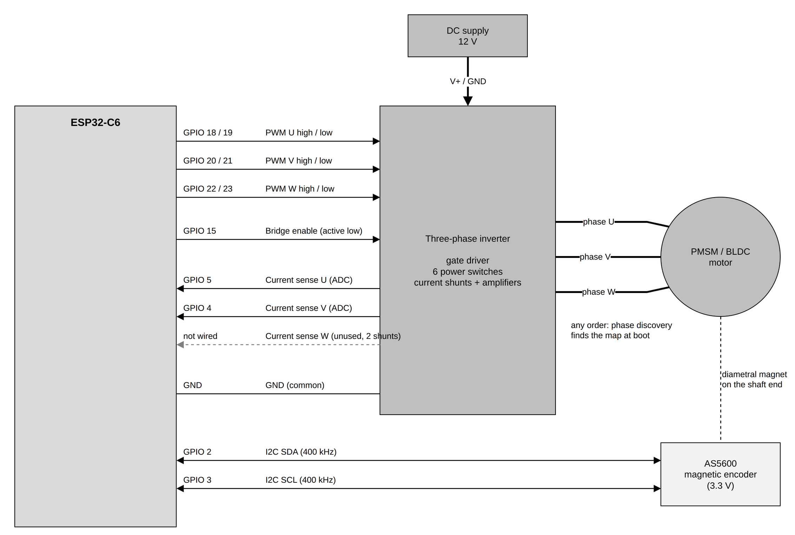

# foc_sensored_velocity

Field-oriented speed control of a PMSM/BLDC motor with an AS5600 magnetic
encoder on the shaft.

The example starts from nothing but the motor's pole pairs and the supply
voltage. On every boot it commissions the motor:

1. **Phase discovery** finds which bridge output drives which motor phase,
   zeroes the encoder on the rotor's magnetic axis and checks which way it
   counts. The motor leads can go in any order.
2. **Motor identification** measures phase resistance, inductance, flux
   linkage, acceleration per amp, and the encoder offset and delay. The
   current loop gains are designed from these numbers.

When the speed loop starts, the controller waits for the shaft to be at rest,
measures how noisy the encoder speed is, and picks the speed loop bandwidth
from that noise and the identified acceleration per amp.

Then it runs a speed cycle in one direction, forever or for a set number of
cycles:

| Phase        | What the controller does                               |
|--------------|--------------------------------------------------------|
| accelerating | the speed reference ramps from 0 to 2000 rpm in 1 s    |
| cruising     | 2000 rpm is held for 2 s                               |
| decelerating | the speed reference ramps back to 0 in 1 s             |
| stopped      | the speed loop holds the shaft at 0 rpm for 1 s        |

The speed loop drives the torque current and the controller limits that
current, so a load the motor cannot carry shows up as a speed error, not as an
over-current trip.

## Control loop



A cascade: an outer speed loop sets the torque current, an inner FoC current
loop makes it. The application only sets the speed reference.

- **Speed ramp (app)**: the example task sets the slew rate with
  `esp_foc_sensored_set_speed_slew()` and the target with
  `esp_foc_sensored_set_speed_ref_hz()`. The controller moves `ω*` toward the
  target at that rate, so each phase change becomes a 1 s ramp.
- **Speed PI**: compares `ω*` with the PLL speed `ω_e` and outputs the
  torque current reference `i_q*`, clamped to the controller's current limit.
  It runs in a slot of the PWM interrupt, once per fresh encoder sample
  (2.5 kHz), on the same speed the current loop just used. Its gains come
  from the identified acceleration per amp and the measured speed noise.
- **Clarke**: the ADC samples two phase currents `i_U`, `i_V` at the PWM
  counter zero (TEZ), triggered by hardware (ETM). Clarke turns them into the
  two-axis stator frame `i_αβ`.
- **Park**: rotates `i_αβ` by the electrical angle `θ_e` into the rotor frame:
  `i_d` along the magnet flux, `i_q` the torque current. Both are DC at steady
  state.
- **Current PI d / q**: one PI per axis turns the current errors into `v_d`,
  `v_q`, with gains designed from the identified resistance and inductance.
  `i_d* = 0`.
- **Voltage limit**: clamps `|v_dq| ≤ V_dc/√3` and tells the PIs, so they do
  not wind up.
- **Inverse Park**: rotates `v_dq` back into `v_αβ`, using the angle advanced
  by the PWM delay.
- **SVM**: space-vector modulation turns `v_αβ` into three center-aligned duty
  cycles.
- **MCPWM + inverter**: six complementary PWM outputs with dead time drive the
  bridge, which applies `v_UVW` to the motor.
- **Angle path**: the supervisor task reads the AS5600 over I²C at 2.5 kHz and
  updates a PLL, which gives the electrical speed `ω_e`; its bandwidth sets how
  much encoder noise reaches the speed PI. Between reads the encoder driver
  extrapolates its angle every PWM period (sensor step). Park takes
  `θ_e + offset + ω_e·lead`: the electrical angle `θ_e = pp·θ_m`, the
  identified encoder offset and a lead that cancels the encoder delay.

Everything inside the dashed **TEZ ISR** box runs in one interrupt per PWM
period (20 kHz), in Q16.16 fixed point; the speed slot runs inside the same
interrupt, decimated.

## Getting started

### Board interconnection



| Signal                         | ESP32-C6 GPIO | Direction        |
|--------------------------------|---------------|------------------|
| PWM phase U high / low side    | 18 / 19       | ESP32 → inverter |
| PWM phase V high / low side    | 20 / 21       | ESP32 → inverter |
| PWM phase W high / low side    | 22 / 23       | ESP32 → inverter |
| Bridge enable (active low)     | 15            | ESP32 → inverter |
| Current sense U (ADC)          | 5             | inverter → ESP32 |
| Current sense V (ADC)          | 4             | inverter → ESP32 |
| Current sense W                | not wired     | (two shunts)     |
| AS5600 SDA (I²C, 400 kHz)      | 2             | bidirectional    |
| AS5600 SCL                     | 3             | ESP32 → encoder  |
| GND                            | GND           | common to all    |

- The inverter takes a 12 V DC supply. The default current sense is a 10 mΩ
  shunt with a gain of 20, and the bridge trips at 4 A.
- The motor phases go to the bridge outputs in any order; phase discovery
  finds the map.
- The AS5600 sits on the shaft end, over a diametral magnet, powered at 3.3 V.
- Pins, dead time, shunt, gain, pole pairs, DC link, overspeed limit
  (2900 rpm) and the cycle are in `idf.py menuconfig` under
  **espFoC example: sensored velocity**.

### Build, flash and monitor

With ESP-IDF v5.5 installed:

```bash
. $IDF_PATH/export.sh
cd examples/foc_sensored_velocity
idf.py menuconfig                  # optional: pins, motor, cycle
idf.py -p /dev/ttyUSB0 flash monitor
```

The target (`esp32c6`) comes from `sdkconfig.defaults`. Replace
`/dev/ttyUSB0` with the board's serial port. Leave the monitor with `Ctrl+]`.

Keep the shaft free and keep hands off: commissioning spins the motor and
identification takes about 90 s. The cycle runs forever by default; set
**Cycles to run** (`EXAMPLE_CYCLE_COUNT`) to stop after a few and turn the
bridge off.

### Expected output

From an ESP32-C6 run with `EXAMPLE_CYCLE_COUNT=2`. The identified values
change slightly from boot to boot, and the phase map depends on how the motor
is wired. Driver warnings printed during phase discovery
(`W (...) foc_adc: ...`) are left out.

```text
          |_|   sensored velocity example

  Board
  +----------------------------+-----------------------+
  | Function                   | Pin / value           |
  +----------------------------+-----------------------+
  | PWM phase U high side      | GPIO 18               |
  ...
  | Encoder sample rate        | 2500 Hz               |
  +----------------------------+-----------------------+

  Phase discovery: finding the phase order and zeroing the encoder...

  Phase map
  +-------------+---------------+--------------+
  | Motor phase | Bridge output | Current sign |
  +-------------+---------------+--------------+
  | U           | W             |           -1 |
  | V           | V             |           -1 |
  | W           | U             |           -1 |
  +-------------+---------------+--------------+
  Attempts 1, encoder zeroed: yes, encoder direction: as mounted

  Motor identification: about 90 s, the shaft will spin...

  Motor
  +----------------------------+-----------------+------------+
  | Parameter                  | Value           | Source     |
  +----------------------------+-----------------+------------+
  | Pole pairs                 | 13              | Kconfig    |
  | DC link                    | 12.00 V         | Kconfig    |
  | Phase resistance           | 2.907 ohm       | identified |
  | Phase inductance           | 432 uH          | identified |
  | Flux linkage               | 1509 uWb        | identified |
  | Acceleration per amp       | 84857 rad/s2/A  | identified |
  | Rotor inertia              | 4.51e-06 kg m2  | identified |
  | Encoder angle offset       | -7.41 deg el    | identified |
  | Encoder delay              | 196.0 us        | identified |
  +----------------------------+-----------------+------------+

  Controller (designed from the identified motor)
  +----------------------------+-----------------+
  | Current loop Kp            | 0.0221          |
  | Current loop Ki            | 147.5           |
  | Speed noise at rest        | 3.620 rad/s el  |
  | Speed loop bandwidth       | 7.8 Hz          |
  | Speed feedback filter      | 18.0 Hz         |
  | Speed loop Kp [A/(rad/s)]  | 1.33e-03        |
  | Speed loop Ki              | 2.85e-02        |
  | Cruise speed               | 2000 rpm        |
  +----------------------------+-----------------+

  cycle 1    accelerating       0 rpm
  cycle 1    cruising        1912 rpm
  cycle 1    decelerating    1947 rpm
  cycle 1    stopped          -14 rpm
  cycle 2    accelerating      -1 rpm
  cycle 2    cruising        1961 rpm
  cycle 2    decelerating    1977 rpm
  cycle 2    stopped          -16 rpm
  Done: 2 cycles, bridge off.
```

`Speed feedback filter` prints the tuning field `speed_fc_hz`, the speed
loop's crossover `2·ζ·bandwidth`. There is no separate speed filter; the PLL
bandwidth does that job.

Each cycle line prints the shaft speed when that phase starts. If something
goes wrong the example says so and stops:

- `Encoder setup failed (check SDA/SCL and the AS5600 supply)`: the AS5600
  does not answer on I²C.
- `Phase discovery failed` / `Motor identification failed at '<step>'`:
  commissioning could not finish; check the motor leads, the supply and that
  the shaft is free.
- `Controller tripped: abort '<reason>', fault '<reason>'. Bridge is off.`:
  a controller guard fired while running and turned the bridge off.
