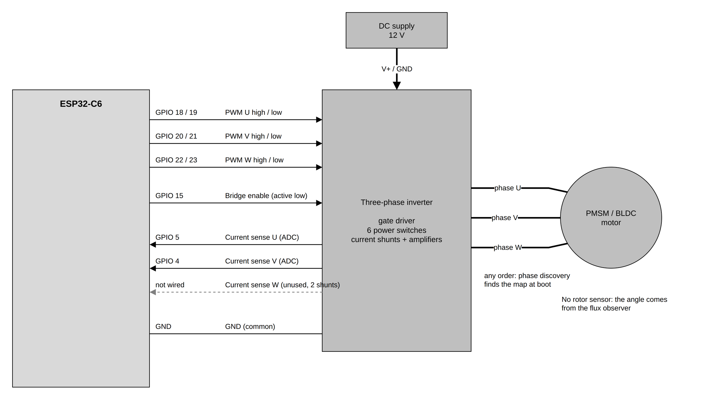

# foc_sensorless_torque

Field-oriented torque control of a PMSM/BLDC motor with no rotor sensor: a
flux observer estimates the rotor angle from the phase currents and voltages.

The example starts from the motor's pole pairs, rated speed and supply
voltage. On every boot it commissions the motor:

1. **Phase discovery** finds which bridge output drives which motor phase, so
   the motor leads can go in any order.
2. **Motor identification** measures phase resistance, inductance and flux
   linkage. The current loop and the observer are designed from them.

Then it runs a torque cycle in one direction, forever or for a set number of
cycles. The controller reports each start-up step through its event callback,
and the example prints them under the `starting` line:

| Phase        | What the controller does                                        |
|--------------|-----------------------------------------------------------------|
| starting     | 0.20 A is asked for; the controller aligns the rotor, spins it up open loop until the observer locks, then hands control over to the observer angle |
| accelerating | q-axis current ramps from 0.20 A to 0.35 A in 1 s               |
| cruising     | 0.35 A is held for 2 s                                          |
| decelerating | the current ramps back to 0.20 A in 1 s                         |
| slow hold    | 0.20 A is held for 2 s                                          |
| stopped      | the request goes to 0; the controller turns the bridge off and the shaft coasts for 1 s |

The observer only sees the rotor while it spins fast enough to make back EMF,
so a sensorless motor never runs at zero current or zero speed: below the
minimum the controller stops it, and every cycle starts again from rest. The
controller keeps the bridge off for at least 5 s before a new start
(`CONFIG_ESP_FOC_SL_COAST_MS`), so the shaft has stopped when it aligns again.

In torque mode the controller regulates current, not speed: with a free shaft
the motor keeps speeding up while a current is held.

## Control loop


The textbook FoC current loop, with the angle coming from a flux observer
instead of a sensor, and an open-loop start-up to get the rotor fast enough
for the observer.

- **Torque ramp (app)**: the example task writes `i_q*` with
  `esp_foc_sensorless_set_iq()`. A request above the start threshold (50 mA)
  starts the motor; a request of 0 stops it. `i_d*` is set by the stack: after
  the handoff it holds `CONFIG_ESP_FOC_SL_ID_RUN_MA` (450 mA by default).
- **Clarke**: the ADC samples two phase currents `i_U`, `i_V` at the PWM
  counter zero (TEZ), triggered by hardware (ETM), through a 4 kHz current
  filter. Clarke turns them into the two-axis stator frame `i_αβ`.
- **Park**: rotates `i_αβ` by the electrical angle `θ_e` into the rotor frame:
  `i_d` along the magnet flux, `i_q` the torque current. Both are DC at steady
  state, so a PI can regulate them.
- **Current PI d / q**: one PI per axis turns the current errors into `v_d`,
  `v_q`, with gains designed from the identified resistance and inductance.
- **Voltage limit**: clamps `|v_dq| ≤ V_dc/√3` and tells the PIs, so they do
  not wind up.
- **Inverse Park / SVM / MCPWM**: rotate `v_dq` back into `v_αβ`, turn it into
  three center-aligned duty cycles and drive the bridge with six
  complementary PWM outputs and dead time.
- **Flux observer**: integrates the stator voltage minus the resistive drop
  and removes the inductive part, `ψ_s = ∫(v − R·i) dt − L·i`. What is left is
  the magnet flux `ψ_αβ`, which points along the rotor. It uses the voltage
  commanded in the previous period and the measured `i_αβ`.
- **PLL**: tracks the angle of `ψ_αβ` and gives a clean `θ_obs` and speed
  `ω_obs`.
- **I-f start-up**: at rest there is no back EMF to observe. The stack aligns
  the rotor with a DC current, then rotates the current vector open loop,
  `θ_ol` growing by `2π·f_ol` per PWM period while `f_ol` ramps up.
- **Angle select**: Park uses `θ_ol` during the start-up. Once the observer
  has locked onto the spinning rotor, a 10 ms blend moves Park from `θ_ol` to
  `θ_obs`; from then on the loop runs on the observer angle only.
- **Supervisor task**: runs the start-up sequence (align, I-f lock-in, PLL
  acquire, handoff, catch, running) and the guards (overspeed at 125% of the
  rated speed, lock loss, back-EMF checks). A guard that fires turns the bridge
  off and reports why.

Everything inside the dashed **TEZ ISR** box runs in one interrupt per PWM
period (20 kHz), in Q16.16 fixed point.

## Getting started

### Board interconnection



| Signal                         | ESP32-C6 GPIO | Direction        |
|--------------------------------|---------------|------------------|
| PWM phase U high / low side    | 18 / 19       | ESP32 → inverter |
| PWM phase V high / low side    | 20 / 21       | ESP32 → inverter |
| PWM phase W high / low side    | 22 / 23       | ESP32 → inverter |
| Bridge enable (active low)     | 15            | ESP32 → inverter |
| Current sense U (ADC)          | 5             | inverter → ESP32 |
| Current sense V (ADC)          | 4             | inverter → ESP32 |
| Current sense W                | not wired     | (two shunts)     |
| GND                            | GND           | common to all    |

- The inverter takes a 12 V DC supply. The default current sense is a 10 mΩ
  shunt with a gain of 20, and the bridge trips at 6 A.
- The motor phases go to the bridge outputs in any order; phase discovery
  finds the map.
- No rotor sensor is wired or read. If the motor has one, leave it
  disconnected.
- Pins, dead time, shunt, gain, current filter, pole pairs, DC link, rated
  speed (2300 rpm) and the cycle are in `idf.py menuconfig` under
  **espFoC example: sensorless torque**.

### Build, flash and monitor

With ESP-IDF v5.5 installed:

```bash
. $IDF_PATH/export.sh
cd examples/foc_sensorless_torque
idf.py menuconfig                  # optional: pins, motor, cycle
idf.py -p /dev/ttyUSB0 flash monitor
```

The target (`esp32c6`) comes from `sdkconfig.defaults`. Replace
`/dev/ttyUSB0` with the board's serial port. Leave the monitor with `Ctrl+]`.

Keep the shaft free and keep hands off: commissioning and every start-up spin
the motor. The cycle runs forever by default; set **Cycles to run**
(`EXAMPLE_CYCLE_COUNT`) to stop after a few and turn the bridge off.

### Expected output

From an ESP32-C6 run with `EXAMPLE_CYCLE_COUNT=2`. The identified values and
the start-up speeds change from boot to boot, and the phase map depends on how
the motor is wired. Driver warnings printed during phase discovery
(`W (...) foc_adc: ...`) are left out.

```text
          |_|   sensorless torque example

  Board
  +----------------------------+-----------------------+
  | Function                   | Pin / value           |
  +----------------------------+-----------------------+
  | PWM phase U high side      | GPIO 18               |
  ...
  | Rotor sensor               | none (flux observer)  |
  ...
  +----------------------------+-----------------------+

  Phase discovery: finding the phase order...

  Phase map
  +-------------+---------------+--------------+
  | Motor phase | Bridge output | Current sign |
  +-------------+---------------+--------------+
  | U           | W             |           -1 |
  | V           | V             |           -1 |
  | W           | U             |           -1 |
  +-------------+---------------+--------------+
  Attempts 1

  Motor identification: the shaft will spin...

  Motor
  +----------------------------+-----------------+------------+
  | Parameter                  | Value           | Source     |
  +----------------------------+-----------------+------------+
  | Pole pairs                 | 13              | Kconfig    |
  | DC link                    | 12.00 V         | Kconfig    |
  | Rated speed                | 2300 rpm        | Kconfig    |
  | Phase resistance           | 2.908 ohm       | identified |
  | Phase inductance           | 460 uH          | identified |
  | Flux linkage               | 1221 uWb        | identified |
  +----------------------------+-----------------+------------+

  Controller (designed from the identified motor)
  +----------------------------+-----------------+
  | Current loop Kp            | 0.2084          |
  | Current loop Ki            | 1306.6          |
  | Observer tracking band     | 19.2 Hz         |
  | Start / slow-hold current  | 0.20 A          |
  | Cruise torque current      | 0.35 A          |
  +----------------------------+-----------------+

  cycle 1    starting      0.20 A
               aligning the rotor, spinning it up open loop
               observer locked at 196 rpm
               handoff at 584 rpm: control on the observer angle
               start-up done, running
  cycle 1    accelerating     657 rpm
  cycle 1    cruising        1903 rpm
  cycle 1    decelerating    2402 rpm
  cycle 1    slow hold       1882 rpm
  cycle 1    stopped         1461 rpm
               bridge off, coasting
  cycle 2    starting      0.20 A
               aligning the rotor, spinning it up open loop
               observer locked at 274 rpm
               handoff at 456 rpm: control on the observer angle
               start-up done, running
  cycle 2    accelerating     445 rpm
  cycle 2    cruising        1885 rpm
  cycle 2    decelerating    2344 rpm
  cycle 2    slow hold       1976 rpm
  cycle 2    stopped         1474 rpm
               bridge off, coasting
  Done: 2 cycles, bridge off.
```

The `starting` line prints the requested current; the other cycle lines print
the estimated shaft speed when that phase starts. The indented lines are the
controller events. If something goes wrong the example says so
and stops:

- `Phase discovery failed` / `Motor identification failed at '<step>'`:
  commissioning could not finish; check the motor leads, the supply and that
  the shaft is free.
- `Controller tripped: start-up '<reason>', abort '<reason>', fault '<reason>'. Bridge is off.`:
  the start-up did not reach the running state, or a guard fired while
  running. The bridge is off.
